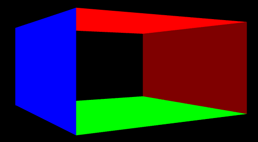

- [Introduce](#introduce)
- [Common Initialization](#common-initialization)
	- [1. Member Variables](#1-member-variables)
	- [2. Initialize()](#2-initialize)
		- [2.1. AppBase::Initialize()](#21-appbaseinitialize)
		- [2.2. AppBase::InitMainWindow()](#22-appbaseinitmainwindow)
		- [3.3. AppBase::InitDirect3D()](#33-appbaseinitdirect3d)
		- [2.3. AppBase::InitGUI()](#23-appbaseinitgui)
- [Rendering Apps Initialization](#rendering-apps-initialization)
	- [1. MakeBox()](#1-makebox)
		- [1.1. 정육면체 pixel( vertices ) 정보 세팅](#11-정육면체-pixel-vertices--정보-세팅)
		- [1.2. 정육면체 indices 정보 세팅](#12-정육면체-indices-정보-세팅)
		- [1.3. vertex의 index 정보를 공유하는 경우 발생하는 문제점](#13-vertex의-index-정보를-공유하는-경우-발생하는-문제점)

# Introduce
객체 지향적 설계를 위한 Initialization을 살펴본다.   

# Common Initialization
**AppBase을 상속 받는 다양한 Apps는 Common Initialization을 기본으로 호출한 뒤, 각자에게 맞는 초기화를 진행**한다.   
## 1. Member Variables
```cpp
class AppBase {

public:
	// windows
	int m_screenWidth;
	int m_screenHeight;
	HWND m_mainWindow;

	ComPtr<ID3D11Device> m_device;
	ComPtr<ID3D11DeviceContext> m_devcon;
	ComPtr<IDXGISwapChain> m_swapChain;
	ComPtr<ID3D11RenderTargetView> m_renderTargetView;
	ComPtr<ID3D11RasterizerState> m_rasterizerState;

	ComPtr<ID3D11Texture2D> m_depthStencilBuffer;
	ComPtr<ID3D11DepthStencilView> m_depthStencilView;
	ComPtr<ID3D11DepthStencilState> m_depthStencilState;

	D3D11_VIEWPORT m_viewport;
};
```
모든 App에서 사용할 변수를 관리한다.   

## 2. Initialize()
```cpp
class AppBase {

public:
	AppBase ();
	virtual ~AppBase ();

	virtual bool Initialize ();

	virtual LRESULT CALLBACK MsgProc ( HWND hwnd , UINT msg , WPARAM wParam , LPARAM lParam );

protected:
	bool InitMainWindow ();
	bool InitDirect3D ();
	bool InitGUI ();

};
```
window, Direct3D, imGUI를 초기화하는 기능이다.   
생성자와 소멸자, MsgProc()는 window를 위한 기능이 존재한다.   

### 2.1. AppBase::Initialize()
```cpp
bool AppBase::Initialize () {
	if ( !InitMainWindow () ) {
		return false;
	}

	if ( !InitDirect3D () ) {
		return false;
	}

	if ( !InitGUI () ) {
		return false;
	}

	return true;
}
```
순서대로 초기화를 진행한다.   
**`AppBase`를 상속 받는 자식 Apps는 해당 함수를 Init 단계에서 호출**한다.   

### 2.2. AppBase::InitMainWindow()
```cpp
AppBase* g_appBase = nullptr;

LRESULT CALLBACK WndProc ( HWND hwnd , UINT msg , WPARAM wParam , LPARAM lParam ) {
	return g_appBase->MsgProc (hwnd, msg, wParam, lParam);
}

// ...

LRESULT CALLBACK AppBase::MsgProc ( HWND hwnd , UINT msg , WPARAM wParam , LPARAM lParam ) {
	switch ( msg ) {
	case WM_SYSCOMMAND:
		if ( ( wParam & 0xfff0 ) == SC_KEYMENU ) // Disable ALT application menu
			return 0;
	case WM_DESTROY:
		::PostQuitMessage ( 0 );
		return 0;
	}

	return DefWindowProc ( hwnd , msg , wParam , lParam );
}
```
[window programming TIP](/Note/DevTips.md/#windows-programming-부모-클래스에서-해당-인스턴스의-포인터를-전역-변수로-선언하는-이유)에서 전역 변수와 함수를 사용하는 이유를 설명했다.   
```cpp
bool AppBase::InitMainWindow () {
	WNDCLASSEX wc;
	ZeroMemory ( &wc , sizeof ( WNDCLASSEX ) );
	wc.cbSize = sizeof ( WNDCLASSEX );
	wc.style = CS_CLASSDC;
	wc.lpfnWndProc = WndProc;
	wc.hCursor = LoadCursor ( NULL , IDC_ARROW );
	wc.lpszClassName = L"WindowClass1";
	if ( !RegisterClassEx ( &wc ) ) {
		cout << "RegisterClassEx() failed" << endl;
		return false;
	}

	RECT wr = { 0, 0, m_screenWidth, m_screenHeight };
	AdjustWindowRect ( &wr , WS_OVERLAPPEDWINDOW , FALSE );
	m_mainWindow = CreateWindowEx ( 
		NULL ,
		wc.lpszClassName , L"window1 title" , WS_OVERLAPPEDWINDOW ,
		0 , 0 , wr.right - wr.left , wr.bottom - wr.top ,
		NULL , NULL ,
		wc.hInstance ,
		NULL );

	if ( !m_mainWindow ) {
		cout << "CreateWindowEx() failed" << endl;
		return false;
	}

	ShowWindow ( m_mainWindow, SW_SHOWDEFAULT );
	UpdateWindow ( m_mainWindow );

	return true;
}
```
[WindowsFramework](/Note/WindowsFramework/)를 참고한다.   

### 3.3. AppBase::InitDirect3D()
```cpp
bool AppBase::InitDirect3D () {
	// Creating [ device, device_context, swap_chain, render_target_view, viewport, rasterizer_state ]
	// Creating [ depth_stencil_buffer, depth_stencil_view ]

	// D3D_DRIVER_TYPE_WARP( Driver 호환성 문제가 발생하면 )
	const D3D_DRIVER_TYPE driverType = D3D_DRIVER_TYPE_HARDWARE;

	UINT createDeviceFlags = 0;
#if defined(DEBUG) || defined(_DEBUG)
	createDeviceFlags |= D3D11_CREATE_DEVICE_DEBUG;
#endif

	const D3D_FEATURE_LEVEL featureLevels[ 2 ] = {
		D3D_FEATURE_LEVEL_11_0,
		D3D_FEATURE_LEVEL_9_3
	};

	ComPtr<ID3D11Device> device;
	ComPtr<ID3D11DeviceContext> devcon;
	D3D_FEATURE_LEVEL featureLevel;

	if ( FAILED ( D3D11CreateDevice (
		nullptr , driverType , 0 , createDeviceFlags ,
		featureLevels , ARRAYSIZE ( featureLevels ) ,
		D3D11_SDK_VERSION ,
		&device ,
		&featureLevel ,
		&devcon
	) ) ) {
		cout << "D3D11CreateDevice() failed" << endl;
		return false;
	}

	// version이 맞지 않으면 종료, 더 낮은 version으로 바꾸는 경우도 있음
	if ( featureLevel != D3D_FEATURE_LEVEL_11_0 ) {
		std::cout << "D3D Feature Level 11 unsupported" << std::endl;
		return false;
	}

	// DirectX에서 지원하는 MSAA를 hardware가 지원하나?
	// swap chain과 depth buffer에서 MSAA 설정을 이용한다. 
	UINT numQualityLevels;
	device->CheckMultisampleQualityLevels ( DXGI_FORMAT_R8G8B8A8_UNORM , 4 , &numQualityLevels );
	if ( numQualityLevels <= 0 ) {
		cout << "MSAA not supported" << endl;
	}

	if ( FAILED ( device.As ( &m_device ) ) ) {
		cout << "device.As() failed" << endl;
		return false;
	}
	if ( FAILED ( devcon.As ( &m_devcon ) ) ) {
		cout << "devcon.As() failed" << endl;
		return false;
	}

	DXGI_SWAP_CHAIN_DESC scd;
	ZeroMemory ( &scd , sizeof ( scd ) );
	scd.BufferCount = 2;
	scd.BufferDesc.Format = DXGI_FORMAT_R8G8B8A8_UNORM;
	scd.BufferDesc.Width = m_screenWidth;
	scd.BufferDesc.Height = m_screenHeight;
	scd.BufferDesc.RefreshRate.Numerator = 60;
	scd.BufferDesc.RefreshRate.Denominator = 1;
	scd.BufferUsage = DXGI_USAGE_RENDER_TARGET_OUTPUT;
	scd.OutputWindow = m_mainWindow;
	scd.Windowed = TRUE;
	scd.Flags = DXGI_SWAP_CHAIN_FLAG_ALLOW_MODE_SWITCH;
	scd.SwapEffect = DXGI_SWAP_EFFECT_DISCARD;
	if ( numQualityLevels > 0 ) {
		scd.SampleDesc.Count = 4;
		scd.SampleDesc.Quality = numQualityLevels - 1;
	}
	else {
		scd.SampleDesc.Count = 1;
		scd.SampleDesc.Quality = 0;
	}

	// 이전까지 device, devcon, swapchain은 모두 값이 할당됐다.
	// D3D11CreateDeviceAndSwapChain()를 수행하면 m_swapChain이 null이 된다.
	// mainWindow가 존재하면 에러가 발생하지 않는다.
	if ( FAILED ( D3D11CreateDeviceAndSwapChain (
		0, driverType, 0, createDeviceFlags,
		featureLevels,
		1,	// ARRAYSIZE(featureLevels)
		D3D11_SDK_VERSION,
		&scd,
		&m_swapChain, // out
		&m_device, // out
		&featureLevel, // out
		&m_devcon // out
		) ) ) {
		cout << "D3D11CreateDeviceAndSwapChain() failed" << endl;
		return false;
	}

	ZeroMemory ( &m_viewport , sizeof ( D3D11_VIEWPORT ) );
	m_viewport.TopLeftX = 0;
	m_viewport.TopLeftY = 0;
	m_viewport.Width = float ( m_screenWidth );
	m_viewport.Height = float ( m_screenHeight );
	// Depth Buffering을 사용하기 위한 options
	m_viewport.MinDepth = 0.0f;
	m_viewport.MaxDepth = 1.0f;

	D3D11_RASTERIZER_DESC rastDesc;
	ZeroMemory ( &rastDesc , sizeof ( D3D11_RASTERIZER_DESC ) );
	rastDesc.FillMode = D3D11_FILL_MODE::D3D11_FILL_SOLID;
	rastDesc.CullMode = D3D11_CULL_MODE::D3D11_CULL_NONE;
	rastDesc.FrontCounterClockwise = false;
	m_device->CreateRasterizerState ( &rastDesc , &m_rasterizerState );

	D3D11_TEXTURE2D_DESC depthStencilBufferDesc;
	depthStencilBufferDesc.Width = m_screenWidth;
	depthStencilBufferDesc.Height = m_screenHeight;
	depthStencilBufferDesc.MipLevels = 1;
	depthStencilBufferDesc.ArraySize = 1;
	// Depth: unsigned normalized int 24bit, Stencil: unsigned int 8bit
	depthStencilBufferDesc.Format = DXGI_FORMAT_D24_UNORM_S8_UINT;
	if ( numQualityLevels > 0 ) {
		depthStencilBufferDesc.SampleDesc.Count = 4;
		depthStencilBufferDesc.SampleDesc.Quality = numQualityLevels - 1;
	}
	else {
		depthStencilBufferDesc.SampleDesc.Count = 1;
		depthStencilBufferDesc.SampleDesc.Quality = 0;
	}
	depthStencilBufferDesc.Usage = D3D11_USAGE_DEFAULT; // texture memory를 어떻게 사용할 것인가?
	depthStencilBufferDesc.BindFlags = D3D11_BIND_DEPTH_STENCIL;
	depthStencilBufferDesc.CPUAccessFlags = 0;
	depthStencilBufferDesc.MiscFlags = 0;

	if ( FAILED ( m_device->CreateTexture2D ( &depthStencilBufferDesc , 0 , m_depthStencilBuffer.GetAddressOf() ) ) ) {
		cout << "CreateTexture2D() failed" << endl;
		return false;
	}
	// 이를 통해 생성한 DepthStencilView를 이용해서 DepthStencilBuffer를 사용한다.
	if ( FAILED ( m_device->CreateDepthStencilView ( m_depthStencilBuffer.Get() , 0 , &m_depthStencilView)) ) {
		cout << "CreateDepthStencilView() failed" << endl;
		return false;
	}

	// DepthStencilView를 어떤 상태로 사용하나?
	D3D11_DEPTH_STENCIL_DESC depthStencilDesc;
	ZeroMemory ( &depthStencilDesc , sizeof ( D3D11_DEPTH_STENCIL_DESC ) );
	depthStencilDesc.DepthEnable = true;
	depthStencilDesc.DepthWriteMask = D3D11_DEPTH_WRITE_MASK::D3D11_DEPTH_WRITE_MASK_ALL;
	depthStencilDesc.DepthFunc = D3D11_COMPARISON_FUNC::D3D11_COMPARISON_LESS_EQUAL; // depth 값이 더 작거나 같으면 화면에 그린다.
	if ( FAILED ( m_device->CreateDepthStencilState ( &depthStencilDesc , m_depthStencilState.GetAddressOf() ) ) ) {
		std::cout << "CreateDepthStencilState() failed" << std::endl;
		return false;
	}

	return true;
}
```
[InitD3DForClass.md - DirectXFramework](/Note/DirectXFramework/5_InitD3DForClass.md)를 참고한다.   

### 2.3. AppBase::InitGUI()
```cpp
bool AppBase::InitGUI () {
	IMGUI_CHECKVERSION ();
	ImGui::CreateContext ();
	ImGuiIO& io = ImGui::GetIO ();
	( void ) io;
	io.DisplaySize = ImVec2 ( float ( m_screenWidth ) , float ( m_screenHeight ) );
	ImGui::StyleColorsLight ();

	// setup platform/renderer backends
	if ( !ImGui_ImplDX11_Init ( m_device.Get() , m_devcon.Get()) ) {
		return false;
	}

	if ( !ImGui_ImplWin32_Init ( m_mainWindow ) ) {
		return false;
	}

	return true;
}
```
[1_InitializingGUI - ImGui](/Note/ImGUI/1_InitializingGUI.md)를 참고한다.   


# Rendering Apps Initialization
`AppBase`를 상속받는 자식 App 들은 자신만의 초기화 기능을 가진다.   
**Rendering 역할을 수행하는 자식 앱들의 초기화 구조**를 살펴본다.   
## 1. MakeBox()
정육면체를 나타내는 vertices와 indices를 반환하는 함수다.   
즉, **현재 App은 정육면체를 rendering 한 화면을 띄우기 위한 객체**다.   
```cpp
struct Vertex {
	Vector3 position;
	Vector3 color;
};

auto MakeBox () {
	std::vector<Vector3> positions;
	std::vector<Vector3> colors;
	std::vector<Vector3> normals;

	const float scale = 1.0f;

	// 윗면
	positions.push_back ( Vector3 ( -1.0f , 1.0f , -1.0f ) * scale );
	positions.push_back ( Vector3 ( -1.0f , 1.0f , 1.0f ) * scale );
	positions.push_back ( Vector3 ( 1.0f , 1.0f , 1.0f ) * scale );
	positions.push_back ( Vector3 ( 1.0f , 1.0f , -1.0f ) * scale );
	colors.push_back ( Vector3 ( 1.0f , 0.0f , 0.0f ) );
	colors.push_back ( Vector3 ( 1.0f , 0.0f , 0.0f ) );
	colors.push_back ( Vector3 ( 1.0f , 0.0f , 0.0f ) );
	colors.push_back ( Vector3 ( 1.0f , 0.0f , 0.0f ) );
	normals.push_back ( Vector3 ( 0.0f , 1.0f , 0.0f ) );
	normals.push_back ( Vector3 ( 0.0f , 1.0f , 0.0f ) );
	normals.push_back ( Vector3 ( 0.0f , 1.0f , 0.0f ) );
	normals.push_back ( Vector3 ( 0.0f , 1.0f , 0.0f ) );

	std::vector<Vertex> vertices;
	for ( size_t i = 0; i < positions.size (); ++i ) {
		Vertex v;
		v.position = positions[ i ];
		v.color = colors[ i ];
		vertices.push_back ( v );
	}

	std::vector<uint16_t> indices = {
		0, 1, 2, 0, 2, 3,		// 윗면
	};

	return tuple{ vertices, indices };
}
```
정육면체를 생성하려면 vertice와 indice 정보가 필요하다.   
**vertices에는 각 정점의 position과 color가 저장**되며, **indices에는 각 정점의 순서를 통해 삼각형을 그리는 방법을 저장**한다.   

### 1.1. 정육면체 pixel( vertices ) 정보 세팅
positions는 정점의 위치를, colors는 정점의 색깔을, normals는 정점의 normal vector를 저장한다.   

**positions는 각 면의 네 개의 꼭짓점을 표현**한다. **이 점들은 실제 화면 좌표가 아니라 정육면체를 modeling하는 model space( 모델 좌표 )다**. 이후, world space, view space, projection space로 변환되어 screen에 rendering 된다.   
colors는 각 정점마다 색상을 지정한다. 윗면을 예로 들면, 모든 정점이 `(1.0, 0.0, 0.0)` 즉, red를 할당했다.   
normals는 각 면이 어느 방향을 바라보고 있는지를 나타낸다. 윗면은 `(0, 1, 0)`인 y축 방향으로 설정했다.   

```cpp
// 윗면
positions.push_back(Vector3(-1.0f, 1.0f, -1.0f) * scale);
positions.push_back(Vector3(-1.0f, 1.0f, 1.0f) * scale);
positions.push_back(Vector3(1.0f, 1.0f, 1.0f) * scale);
positions.push_back(Vector3(1.0f, 1.0f, -1.0f) * scale);
colors.push_back(Vector3(1.0f, 0.0f, 0.0f));
colors.push_back(Vector3(1.0f, 0.0f, 0.0f));
colors.push_back(Vector3(1.0f, 0.0f, 0.0f));
colors.push_back(Vector3(1.0f, 0.0f, 0.0f));
normals.push_back(Vector3(0.0f, 1.0f, 0.0f));
normals.push_back(Vector3(0.0f, 1.0f, 0.0f));
normals.push_back(Vector3(0.0f, 1.0f, 0.0f));
normals.push_back(Vector3(0.0f, 1.0f, 0.0f));

// 아랫면
positions.push_back(Vector3(-1.0f, 0.0f, -1.0f) * scale);
positions.push_back(Vector3(-1.0f, 0.0f, 1.0f) * scale);
positions.push_back(Vector3(1.0f, 0.0f, 1.0f) * scale);
positions.push_back(Vector3(1.0f, 0.0f, -1.0f) * scale);
colors.push_back(Vector3(0.0f, 1.0f, 0.0f));
colors.push_back(Vector3(0.0f, 1.0f, 0.0f));
colors.push_back(Vector3(0.0f, 1.0f, 0.0f));
colors.push_back(Vector3(0.0f, 1.0f, 0.0f));
normals.push_back(Vector3(0.0f, -1.0f, 0.0f));
normals.push_back(Vector3(0.0f, -1.0f, 0.0f));
normals.push_back(Vector3(0.0f, -1.0f, 0.0f));
normals.push_back(Vector3(0.0f, -1.0f, 0.0f));
```
<div>
  
</div>

종이로 직접 그리면 정점 정보들을 쉽게 알 수 있다.   

### 1.2. 정육면체 indices 정보 세팅
**graphics pipeline에서 primitives를 triangle로 사용하기 때문에, 하나의 사각형을 두 개의 삼각형으로 나누어 표현**한다.   

예를 들면, 윗면을 rendering 하려면 두 개의 삼각형을 이루는 정점의 index를 담는다. `(0, 1, 2)`와 `(0, 2, 3)`으로 두 개의 삼각형을 정의했다.   
rasterizer state에서 `FrontCounterClockWise`를 `FALSE`로 설정하여 삼각형의 앞면을 판단했다.   
정점들이 clock-wise 방향으로 나열된다면, 앞면으로 간주한다.   


### 1.3. vertex의 index 정보를 공유하는 경우 발생하는 문제점
```cpp
vector<uint16_t> indices = {
    0,  1,  2,  0,  2,  3,  // 윗면
    4, 5, 6, 4, 6, 7, // 아랫면
    0, 3, 7, 0, 7, 4, // 앞면
    1, 2, 6, 1, 6, 5, // 뒷면
};
```
vertex의 index 정보를 공유하면 중복되는 정점을 줄여서 메모리 효율을 높일 수 있다.   

   

하지만 indices에서 정점들을 공유하고 있기 때문에, 윗면과 아랫면의 정점들에 대한 색상 정보가 저장된 후, 다른 면들의 색상 정보는 적용되지 않고 보간( interpolation )을 통해 표현된다.   
즉, **정점 index를 재사용함으로써 색상이 겹치는 문제가 발생**한다.   

   

```cpp
vector<uint16_t> indices = {
    0,  1,  2,  0,  2,  3,  // 윗면
    4, 5, 6, 4, 6, 7, // 아랫면
    8, 9, 10, 8, 10, 11, // 앞면
    12, 13, 14, 12, 14, 15, // 뒷면
};
```
각 면을 다른 색상으로 지정하려면, **각 면마다 정점을 별도로 지정하여 정점 공유를 피해야 한다**.   
