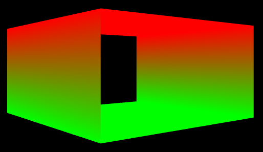

- [Introduce](#introduce)
- [Common Initialization](#common-initialization)
	- [1. Global Variables](#1-global-variables)
	- [2. Function Prototypes](#2-function-prototypes)
	- [3. main()](#3-main)
	- [4. InitMainWindow()](#4-initmainwindow)
	- [5. InitD3D()](#5-initd3d)
	- [InitGUI()](#initgui)
- [Rendering Apps Initialization](#rendering-apps-initialization)
	- [1. MakeBox()](#1-makebox)
		- [1.1. 정육면체 pixel( vertices ) 정보 세팅](#11-정육면체-pixel-vertices--정보-세팅)
		- [1.2. 정육면체 indices 정보 세팅](#12-정육면체-indices-정보-세팅)
		- [1.3. vertex의 index 정보를 공유하는 경우 발생하는 문제점](#13-vertex의-index-정보를-공유하는-경우-발생하는-문제점)

# Introduce
객체 지향적 설계를 위한 Initialization을 살펴본다.   

# Common Initialization
Base App의 초기화 부분을 알아본다. 지금은 객체 지향적으로 설계하기 전이므로 global variables를 사용한다.   
이때, **BaseApp을 상속 받는 다양한 Apps는 Common Initialization을 기본으로 호출한 뒤, 각자에게 맞는 초기화를 진행**한다.   
## 1. Global Variables
```cpp
#define SCREEN_WIDTH 1280
#define SCREEN_HEIGHT 960
HWND g_mainWindow;

ID3D11Device* g_device;
ID3D11DeviceContext* g_devcon;
IDXGISwapChain* g_swapChain;
ID3D11RenderTargetView* g_renderTargetView;
ID3D11RasterizerState* g_rasterizerState;

// depth buffer
ID3D11Texture2D* g_depthStencilBuffer;
ID3D11DepthStencilView* g_depthStencilView;
ID3D11DepthStencilState* g_depthStencilState;

D3D11_VIEWPORT g_viewport;
```
## 2. Function Prototypes
```cpp
bool InitMainWindow ();
bool InitD3D ();
bool InitGUI ();
```

## 3. main()
```cpp
int main ()
{
	if ( !InitMainWindow () ) {
		std::cout << "InitMainWindow() failed" << std::endl;
		return -1;
	}

	if ( !InitD3D () ) {
		std::cout << "InitD3D() failed." << std::endl;
		return -1;
	}

	if ( !InitGUI () ) {
		std::cout << "InitGUI() failed" << std::endl;
		return -1;
	}

	MSG msg = { 0 };
	while ( WM_QUIT != msg.message ) {
		if ( PeekMessage ( &msg , NULL , 0 , 0 , PM_REMOVE ) ) {
			TranslateMessage ( &msg );
			DispatchMessage ( &msg );
		}
		else {
			RenderFrame ();
		}
	}

	CleanD3D ();

	return 0;
}
```

## 4. InitMainWindow()
[WindowsFramework](/Note/WindowsFramework/)를 참고한다.   
```cpp
bool InitMainWindow () {
	WNDCLASSEX wc;
	ZeroMemory ( &wc , sizeof ( WNDCLASSEX ) );

	wc.cbSize = sizeof ( WNDCLASSEX );
	wc.style = CS_CLASSDC;
	wc.lpfnWndProc = WndProc;
	wc.hCursor = LoadCursor ( NULL , IDC_ARROW );
	wc.lpszClassName = L"WindowClass1";

	if ( !RegisterClassEx ( &wc ) ) {
		std::cout << "RegisterClassEx() failed." << std::endl;
		return false;
	}

	RECT wr = { 0, 0, SCREEN_WIDTH, SCREEN_HEIGHT };
	AdjustWindowRect ( &wr , WS_OVERLAPPEDWINDOW , FALSE );

	HWND mainWindow = CreateWindowEx (
		NULL ,
		wc.lpszClassName ,     // name of the window class
		L"window1 title" ,     // title of the window
		WS_OVERLAPPEDWINDOW ,  // window style
		0 ,                    // x-position of the window
		0 ,                    // y-position of the window
		wr.right - wr.left ,   // width of the window
		wr.bottom - wr.top ,   // height of the window
		NULL ,                 // we have no parent window
		NULL ,                 // we aren't using menus
		wc.hInstance ,         // apllication handle
		NULL // used with multiple windows
	);

	if ( !mainWindow ) {
		std::cout << "CreateWindow() failed." << std::endl;
		return false;
	}

	g_mainWindow = mainWindow;
	ShowWindow ( g_mainWindow , SW_SHOWDEFAULT );
	UpdateWindow ( g_mainWindow );

	return true;
}
```

## 5. InitD3D()
[InitD3DForClass.md - DirectXFramework](/Note/DirectXFramework/5_InitD3DForClass.md)를 참고한다.   
```cpp
bool InitD3D () {
	// Creating [ device, device_context, swap_chain, render_target_view, viewport, rasterizer_state ]
	// Creating [ depth_stencil_buffer, depth_stencil_view, 

	UINT createDeviceFlags = 0;
#if defined(DEBUG) || defined(_DEBUG)
	createDeviceFlags |= D3D11_CREATE_DEVICE_DEBUG;
#endif

	const D3D_DRIVER_TYPE driverType = D3D_DRIVER_TYPE_HARDWARE;	// D3D_DRIVER_TYPE_WARP( Driver 호환성 문제가 발생하면 )
	const D3D_FEATURE_LEVEL featureLevels[ 2 ] = {
		D3D_FEATURE_LEVEL_11_0,
		D3D_FEATURE_LEVEL_9_3
	};

	ID3D11Device* device; 
	ID3D11DeviceContext* devcon;
	D3D_FEATURE_LEVEL featureLevel;

	if ( FAILED ( D3D11CreateDevice (
		nullptr ,
		driverType ,
		0 ,
		createDeviceFlags ,
		featureLevels ,
		ARRAYSIZE ( featureLevels ) ,
		D3D11_SDK_VERSION ,
		&device ,					// out
		&featureLevel ,		// out
		&devcon						// out
	) ) ) {
		std::cout << "D3D11CreateDevice() failed" << std::endl;
		return false;
	}

	// version이 맞지 않으면 종료, 더 낮은 version으로 바꾸는 경우도 있음
	if ( featureLevel != D3D_FEATURE_LEVEL_11_0 ) {
		std::cout << "D3D Feature Level 11 unsupported" << std::endl;
		return false;
	}

	// ComPtr::AS()는 내부적으로 QueryInterface()를 호출해서 해당 interface로의 casting이 가능한지 여부를 HRESULT로 반환한다.
	// 이런 방식으로 device와 context에 문제가 없음을 알고 싶다면, QueryInterface()를 직접 호출한다.
	if ( FAILED ( device->QueryInterface ( __uuidof( ID3D11Device ) , ( void** ) &g_device ) ) ) {
		std::cout << "device->QueryInterface() failed" << std::endl;
		return false;
	}
	if ( FAILED ( devcon->QueryInterface ( __uuidof( ID3D11DeviceContext ) , ( void** ) &g_devcon ) ) ) {
		std::cout << "devcon->QueryInterface() failed" << std::endl;
		return false;
	}
	g_device = device;
	g_devcon = devcon;
	device->Release ();
	devcon->Release ();

	// DirectX에서 지원하는 MSAA를 hardware가 지원하나?
	// swap chain과 depth buffer에서 MSAA 설정을 이용한다. 
	UINT numQualityLevels;
	g_device->CheckMultisampleQualityLevels ( DXGI_FORMAT_R8G8B8A8_UNORM , 4 , &numQualityLevels );
	if ( numQualityLevels <= 0 ) {
		std::cout << "MSAA not supported" << std::endl;
	}

	DXGI_SWAP_CHAIN_DESC scd;
	ZeroMemory ( &scd , sizeof ( scd ) );
	scd.BufferCount = 2;
	scd.BufferDesc.Format = DXGI_FORMAT_R8G8B8A8_UNORM;
	scd.BufferDesc.Width = SCREEN_WIDTH;
	scd.BufferDesc.Height = SCREEN_HEIGHT;
	scd.BufferDesc.RefreshRate.Numerator = 60;
	scd.BufferDesc.RefreshRate.Denominator = 1;
	scd.BufferUsage = DXGI_USAGE_RENDER_TARGET_OUTPUT;
	scd.OutputWindow = g_mainWindow;
	scd.Windowed = TRUE;
	scd.Flags = DXGI_SWAP_CHAIN_FLAG_ALLOW_MODE_SWITCH;
	scd.SwapEffect = DXGI_SWAP_EFFECT_DISCARD;
	if ( numQualityLevels > 0 ) {
		scd.SampleDesc.Count = 4;
		scd.SampleDesc.Quality = numQualityLevels - 1;
	}
	else {
		scd.SampleDesc.Count = 1;
		scd.SampleDesc.Quality = 0;
	}

	if ( FAILED ( D3D11CreateDeviceAndSwapChain (
		0,
		driverType ,
		0 ,
		createDeviceFlags ,
		featureLevels ,
		1 ,
		D3D11_SDK_VERSION ,
		&scd ,
		&g_swapChain ,
		&g_device ,
		&featureLevel ,
		&g_devcon ) ) ) {
		std::cout << "D3D11CreateDeviceAndSwapChain() failed." << std::endl;
		return false;
	}

	// Set the render target
	ID3D11Texture2D* pBackBuffer;
	g_swapChain->GetBuffer ( 0 , IID_PPV_ARGS(&pBackBuffer ));
	if ( pBackBuffer ) {
		g_device->CreateRenderTargetView ( pBackBuffer , NULL , &g_renderTargetView );
		pBackBuffer->Release ();
	}
	else {
		std::cout << "CreateRenderTargetView() failed." << std::endl;
		return false;
	}
	

	// Set the viewport
	ZeroMemory ( &g_viewport , sizeof ( D3D11_VIEWPORT ) );
	g_viewport.TopLeftX = 0;
	g_viewport.TopLeftY = 0;
	g_viewport.Width = float(SCREEN_WIDTH);
	g_viewport.Height = float(SCREEN_HEIGHT);
	// Depth Buffering을 사용하기 위한 options
	g_viewport.MinDepth = 0.0f;
	g_viewport.MaxDepth = 1.0f;
	g_devcon->RSSetViewports ( 1 , &g_viewport );	// Rasterization Stage( 3D coordinates(world) -> 2D coordinates(screen) )

	// Create a rasterizer state
	D3D11_RASTERIZER_DESC rastDesc;
	ZeroMemory ( &rastDesc , sizeof ( D3D11_RASTERIZER_DESC ) );
	rastDesc.FillMode = D3D11_FILL_MODE::D3D11_FILL_SOLID;
	rastDesc.CullMode = D3D11_CULL_MODE::D3D11_CULL_NONE;
	rastDesc.FrontCounterClockwise = false;
	g_device->CreateRasterizerState ( &rastDesc , &g_rasterizerState );

	// Create Depth Buffer & Stencil Buffer
	// depth 값을 저장하는 buffer( memory )
	D3D11_TEXTURE2D_DESC depthStencilBufferDesc;
	depthStencilBufferDesc.Width = SCREEN_WIDTH;
	depthStencilBufferDesc.Height = SCREEN_HEIGHT;
	depthStencilBufferDesc.MipLevels = 1;
	depthStencilBufferDesc.ArraySize = 1;
	depthStencilBufferDesc.Format = DXGI_FORMAT_D24_UNORM_S8_UINT;	// Depth: unsigned normalized int 24bit, Stencil: unsigned int 8bit
	if ( numQualityLevels > 0 ) {
		depthStencilBufferDesc.SampleDesc.Count = 4;
		depthStencilBufferDesc.SampleDesc.Quality = numQualityLevels - 1;
	}
	else {
		depthStencilBufferDesc.SampleDesc.Count = 1;
		depthStencilBufferDesc.SampleDesc.Quality = 0;
	}
	depthStencilBufferDesc.Usage = D3D11_USAGE_DEFAULT;		// texture memory를 어떻게 사용할 것인가?
	depthStencilBufferDesc.BindFlags = D3D11_BIND_DEPTH_STENCIL;
	depthStencilBufferDesc.CPUAccessFlags = 0;
	depthStencilBufferDesc.MiscFlags = 0;

	if ( FAILED ( g_device->CreateTexture2D ( &depthStencilBufferDesc , 0 , &g_depthStencilBuffer ) ) ) {
		std::cout << "CreateTexture2D() failed" << std::endl;
	}
	// 이를 통해 생성한 DepthStencilView를 이용해서 DepthStencilBuffer를 사용한다.
	if ( FAILED ( g_device->CreateDepthStencilView ( g_depthStencilBuffer , 0 , &g_depthStencilView ) ) ) {
		std::cout << "CreateDepthStencilView() failed" << std::endl;
	}

	// DepthStencilView를 어떤 상태로 사용하나?
	D3D11_DEPTH_STENCIL_DESC depthStencilDesc;
	ZeroMemory ( &depthStencilDesc , sizeof ( D3D11_DEPTH_STENCIL_DESC ) );
	depthStencilDesc.DepthEnable = true;
	depthStencilDesc.DepthWriteMask = D3D11_DEPTH_WRITE_MASK::D3D11_DEPTH_WRITE_MASK_ALL;
	depthStencilDesc.DepthFunc = D3D11_COMPARISON_FUNC::D3D11_COMPARISON_LESS_EQUAL;	// depth 값이 더 작거나 같으면 화면에 그린다.
	if ( FAILED ( g_device->CreateDepthStencilState ( &depthStencilDesc , &g_depthStencilState ) ) ) {
		std::cout << "CreateDepthStencilState() failed" << std::endl;
	}

	InitPipeline ();
	InitGraphics ();

	return true;
}
```

## InitGUI()
[1_InitializingGUI - ImGui](/Note/ImGUI/1_InitializingGUI.md)를 참고한다.   
```cpp
bool InitGUI () {
	IMGUI_CHECKVERSION ();
	ImGui::CreateContext ();
	ImGuiIO& io = ImGui::GetIO ();
	( void ) io;
	io.DisplaySize = ImVec2 ( float ( SCREEN_WIDTH ) , float ( SCREEN_HEIGHT ) );
	ImGui::StyleColorsLight ();

	// setup platform/renderer backends
	if ( !ImGui_ImplDX11_Init ( g_device , g_devcon )) {
		return false;
	}

	if ( !ImGui_ImplWin32_Init ( g_mainWindow ) ) {
		return false;
	}

	return true;
}
```

# Rendering Apps Initialization
Base App을 상속받는 자식 App 들은 자신만의 초기화 기능을 가진다.   
**Rendering 역할을 수행하는 자식 앱들의 초기화 구조**를 살펴본다.   
## 1. MakeBox()
정육면체를 나타내는 vertices와 indices를 반환하는 함수다.   
즉, **현재 Apps는 화면에 정육면체를 rendering 하기 위한 객체**다.   
```cpp
struct Vertex {
	Vector3 position;
	Vector3 color;
};

auto MakeBox () {
	std::vector<Vector3> positions;
	std::vector<Vector3> colors;
	std::vector<Vector3> normals;

	const float scale = 1.0f;

	// 윗면
	positions.push_back ( Vector3 ( -1.0f , 1.0f , -1.0f ) * scale );
	positions.push_back ( Vector3 ( -1.0f , 1.0f , 1.0f ) * scale );
	positions.push_back ( Vector3 ( 1.0f , 1.0f , 1.0f ) * scale );
	positions.push_back ( Vector3 ( 1.0f , 1.0f , -1.0f ) * scale );
	colors.push_back ( Vector3 ( 1.0f , 0.0f , 0.0f ) );
	colors.push_back ( Vector3 ( 1.0f , 0.0f , 0.0f ) );
	colors.push_back ( Vector3 ( 1.0f , 0.0f , 0.0f ) );
	colors.push_back ( Vector3 ( 1.0f , 0.0f , 0.0f ) );
	normals.push_back ( Vector3 ( 0.0f , 1.0f , 0.0f ) );
	normals.push_back ( Vector3 ( 0.0f , 1.0f , 0.0f ) );
	normals.push_back ( Vector3 ( 0.0f , 1.0f , 0.0f ) );
	normals.push_back ( Vector3 ( 0.0f , 1.0f , 0.0f ) );

	std::vector<Vertex> vertices;
	for ( size_t i = 0; i < positions.size (); ++i ) {
		Vertex v;
		v.position = positions[ i ];
		v.color = colors[ i ];
		vertices.push_back ( v );
	}

	std::vector<uint16_t> indices = {
		0, 1, 2, 0, 2, 3,		// 윗면
	};

	return tuple{ vertices, indices };
}
```
정육면체를 생성하려면 vertice와 indice 정보가 필요하다.   
**vertices에는 각 정점의 position과 color가 저장**되며, **indices에는 각 정점의 순서를 통해 삼각형을 그리는 방법을 저장**한다.   

### 1.1. 정육면체 pixel( vertices ) 정보 세팅
positions는 정점의 위치를, colors는 정점의 색깔을, normals는 정점의 normal vector를 저장한다.   

**positions는 각 면의 네 개의 꼭짓점을 표현**한다. **이 점들은 실제 화면 좌표가 아니라 정육면체를 modeling하는 model space( 모델 좌표 )다**. 이후, world space, view space, projection space로 변환되어 screen에 rendering 된다.   
colors는 각 정점마다 색상을 지정한다. 윗면을 예로 들면, 모든 정점이 `(1.0, 0.0, 0.0)` 즉, red를 할당했다.   
normals는 각 면이 어느 방향을 바라보고 있는지를 나타낸다. 윗면은 `(0, 1, 0)`인 y축 방향으로 설정했다.   

```cpp
// 윗면
positions.push_back(Vector3(-1.0f, 1.0f, -1.0f) * scale);
positions.push_back(Vector3(-1.0f, 1.0f, 1.0f) * scale);
positions.push_back(Vector3(1.0f, 1.0f, 1.0f) * scale);
positions.push_back(Vector3(1.0f, 1.0f, -1.0f) * scale);
colors.push_back(Vector3(1.0f, 0.0f, 0.0f));
colors.push_back(Vector3(1.0f, 0.0f, 0.0f));
colors.push_back(Vector3(1.0f, 0.0f, 0.0f));
colors.push_back(Vector3(1.0f, 0.0f, 0.0f));
normals.push_back(Vector3(0.0f, 1.0f, 0.0f));
normals.push_back(Vector3(0.0f, 1.0f, 0.0f));
normals.push_back(Vector3(0.0f, 1.0f, 0.0f));
normals.push_back(Vector3(0.0f, 1.0f, 0.0f));

// 아랫면
positions.push_back(Vector3(-1.0f, 0.0f, -1.0f) * scale);
positions.push_back(Vector3(-1.0f, 0.0f, 1.0f) * scale);
positions.push_back(Vector3(1.0f, 0.0f, 1.0f) * scale);
positions.push_back(Vector3(1.0f, 0.0f, -1.0f) * scale);
colors.push_back(Vector3(0.0f, 1.0f, 0.0f));
colors.push_back(Vector3(0.0f, 1.0f, 0.0f));
colors.push_back(Vector3(0.0f, 1.0f, 0.0f));
colors.push_back(Vector3(0.0f, 1.0f, 0.0f));
normals.push_back(Vector3(0.0f, -1.0f, 0.0f));
normals.push_back(Vector3(0.0f, -1.0f, 0.0f));
normals.push_back(Vector3(0.0f, -1.0f, 0.0f));
normals.push_back(Vector3(0.0f, -1.0f, 0.0f));
```
<div>
  
</div>

종이로 직접 그리면 정점 정보들을 쉽게 알 수 있다.   

### 1.2. 정육면체 indices 정보 세팅
**graphics pipeline에서 primitives를 triangle로 사용하기 때문에, 하나의 사각형을 두 개의 삼각형으로 나누어 표현**한다.   

예를 들면, 윗면을 rendering 하려면 두 개의 삼각형을 이루는 정점의 index를 담는다. `(0, 1, 2)`와 `(0, 2, 3)`으로 두 개의 삼각형을 정의했다.   
rasterizer state에서 `FrontCounterClockWise`를 `FALSE`로 설정하여 삼각형의 앞면을 판단했다.   
정점들이 clock-wise 방향으로 나열된다면, 앞면으로 간주한다.   


### 1.3. vertex의 index 정보를 공유하는 경우 발생하는 문제점
```cpp
vector<uint16_t> indices = {
    0,  1,  2,  0,  2,  3,  // 윗면
    4, 5, 6, 4, 6, 7, // 아랫면
    0, 3, 7, 0, 7, 4, // 앞면
    1, 2, 6, 1, 6, 5, // 뒷면
};
```
vertex의 index 정보를 공유하면 중복되는 정점을 줄여서 메모리 효율을 높일 수 있다.   

   

하지만 indices에서 정점들을 공유하고 있기 때문에, 윗면과 아랫면의 정점들에 대한 색상 정보가 저장된 후, 다른 면들의 색상 정보는 적용되지 않고 보간( interpolation )을 통해 표현된다.   
즉, **정점 index를 재사용함으로써 색상이 겹치는 문제가 발생**한다.   

   

```cpp
vector<uint16_t> indices = {
    0,  1,  2,  0,  2,  3,  // 윗면
    4, 5, 6, 4, 6, 7, // 아랫면
    8, 9, 10, 8, 10, 11, // 앞면
    12, 13, 14, 12, 14, 15, // 뒷면
};
```
각 면을 다른 색상으로 지정하려면, **각 면마다 정점을 별도로 지정하여 정점 공유를 피해야 한다**.   
