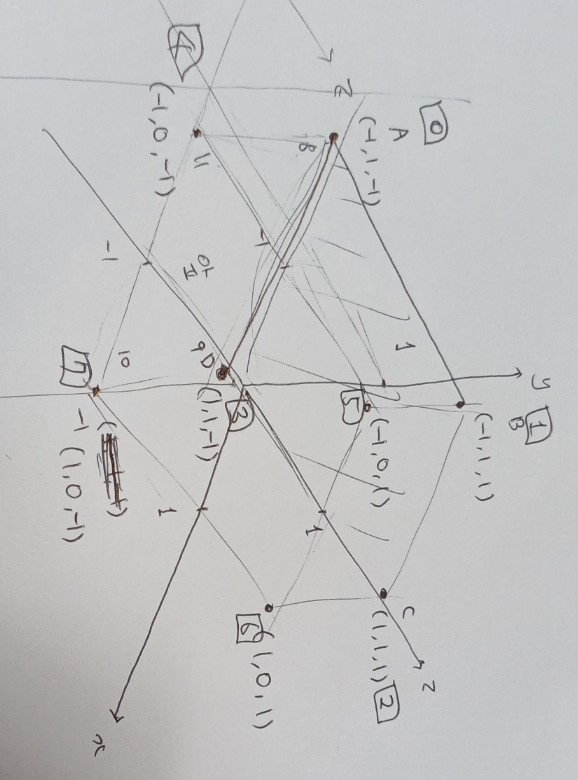
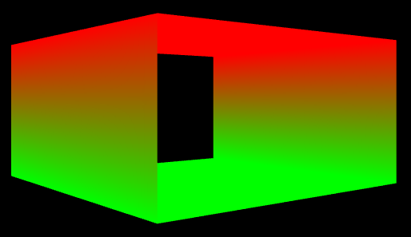
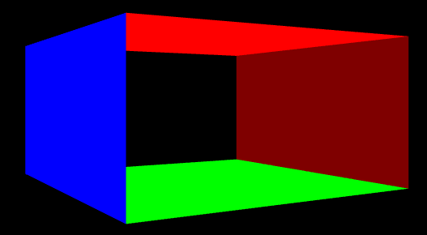
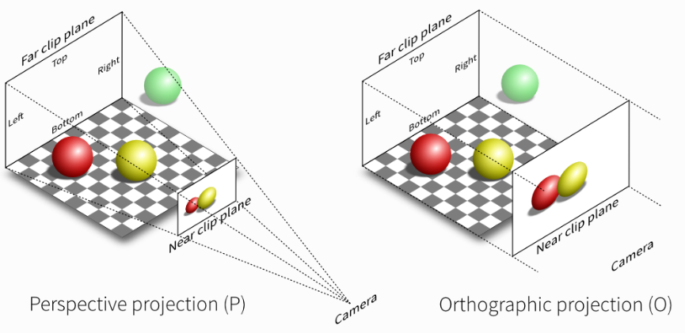

- [Introduce](#introduce)
- [CubeApp::Initialize()](#cubeappinitialize)
  - [1. MakeBox()](#1-makebox)
    - [1.1. 정육면체 pixel( vertices ) 정보 세팅](#11-정육면체-pixel-vertices--정보-세팅)
    - [1.2. 정육면체 indices 정보 세팅](#12-정육면체-indices-정보-세팅)
    - [1.3. vertex의 index 정보를 공유하는 경우 발생하는 문제점](#13-vertex의-index-정보를-공유하는-경우-발생하는-문제점)
- [AppBase::Run()](#appbaserun)
  - [1. CubeApp::Update()](#1-cubeappupdate)
    - [1.1. Model Transformation](#11-model-transformation)
    - [1.2. View Transformation](#12-view-transformation)
    - [1.3. Projection](#13-projection)
    - [1.4. CPU to GPU](#14-cpu-to-gpu)
  - [2. CubeApp::Render()](#2-cubeapprender)
- [Code](#code)
  - [CubeApp.h](#cubeapph)
  - [CubeApp.cpp](#cubeappcpp)

# Introduce
Cube를 rendering한 window 창을 띄우는 App.   
`Cube.h`와 `Cube.cpp`로 만든다.   

# CubeApp::Initialize()
```cpp
bool CubeApp::Initialize () {
  if ( !AppBase::Initialize () ) {
    return false;
  }

  auto [vertices , indices] = MakeBox ();

  // Creating Buffers
  AppBase::CreateVertexBuffer ( vertices , m_vertexBuffer );
  m_indexCount = UINT ( indices.size () );
  AppBase::CreateIndexBuffer ( indices , m_indexBuffer );
  m_constantBufferData.model = Matrix ();
  m_constantBufferData.view = Matrix ();
  m_constantBufferData.projection = Matrix ();
  AppBase::CreateConstantBuffer ( m_constantBufferData , m_constantBuffer );

  // Creating Shaders
  vector<D3D11_INPUT_ELEMENT_DESC> inputElements = {
    {"POSITION", 0, DXGI_FORMAT_R32G32B32_FLOAT, 0, 0, D3D11_INPUT_PER_VERTEX_DATA, 0},
    {"COLOR", 0, DXGI_FORMAT_R32G32B32_FLOAT, 0, 4 * 3, D3D11_INPUT_PER_VERTEX_DATA, 0},
  };
  AppBase::CreateVertexShaderAndInputLayout ( L"ColorVertexShader.hlsl" , inputElements , m_colorVertexShader , m_colorInputLayout );
  AppBase::CreatePixelShader ( L"ColorPixelShader.hlsl" , m_colorPixelShader );

  return true;
}
```
`MakeBox()` 함수로 Cube의 모든 vertex와 index에 대한 정보를 설정한다. 즉, **Cube의 Geometry Information을 컴퓨터가 이해할 수 있는 방식으로 세팅**한다.   
**Vertex, Index, Constant buffer를 생성**한다. Cube의 vertex와 index 정보로 buffer를 만들고, cube에 적용할 변환을 constant buffer에 저장한다.   
**vertex, pixel shader와 input layout을 생성**한다.   

## 1. MakeBox()
정육면체를 나타내는 vertices와 indices를 반환하는 함수다.   
즉, **현재 App은 정육면체를 rendering 한 화면을 띄우기 위한 객체**다.   
```cpp
struct Vertex {
	Vector3 position;
	Vector3 color;
};

auto MakeBox () {
	std::vector<Vector3> positions;
	std::vector<Vector3> colors;
	std::vector<Vector3> normals;

	const float scale = 1.0f;

	// 윗면
	positions.push_back ( Vector3 ( -1.0f , 1.0f , -1.0f ) * scale );
	positions.push_back ( Vector3 ( -1.0f , 1.0f , 1.0f ) * scale );
	positions.push_back ( Vector3 ( 1.0f , 1.0f , 1.0f ) * scale );
	positions.push_back ( Vector3 ( 1.0f , 1.0f , -1.0f ) * scale );
	colors.push_back ( Vector3 ( 1.0f , 0.0f , 0.0f ) );
	colors.push_back ( Vector3 ( 1.0f , 0.0f , 0.0f ) );
	colors.push_back ( Vector3 ( 1.0f , 0.0f , 0.0f ) );
	colors.push_back ( Vector3 ( 1.0f , 0.0f , 0.0f ) );
	normals.push_back ( Vector3 ( 0.0f , 1.0f , 0.0f ) );
	normals.push_back ( Vector3 ( 0.0f , 1.0f , 0.0f ) );
	normals.push_back ( Vector3 ( 0.0f , 1.0f , 0.0f ) );
	normals.push_back ( Vector3 ( 0.0f , 1.0f , 0.0f ) );

	std::vector<Vertex> vertices;
	for ( size_t i = 0; i < positions.size (); ++i ) {
		Vertex v;
		v.position = positions[ i ];
		v.color = colors[ i ];
		vertices.push_back ( v );
	}

	std::vector<uint16_t> indices = {
		0, 1, 2, 0, 2, 3,		// 윗면
	};

	return tuple{ vertices, indices };
}
```
정육면체를 생성하려면 vertice와 indice 정보가 필요하다.   
**vertices에는 각 정점의 position과 color가 저장**되며, **indices에는 각 정점의 순서를 통해 삼각형을 그리는 방법을 저장**한다.   

### 1.1. 정육면체 pixel( vertices ) 정보 세팅
positions는 정점의 위치를, colors는 정점의 색깔을, normals는 정점의 normal vector를 저장한다.   

**positions는 각 면의 네 개의 꼭짓점을 표현**한다. **이 점들은 실제 화면 좌표가 아니라 정육면체를 modeling하는 model space( 모델 좌표 )다**. 이후, world space, view space, projection space로 변환되어 screen에 rendering 된다.   
colors는 각 정점마다 색상을 지정한다. 윗면을 예로 들면, 모든 정점이 `(1.0, 0.0, 0.0)` 즉, red를 할당했다.   
normals는 각 면이 어느 방향을 바라보고 있는지를 나타낸다. 윗면은 `(0, 1, 0)`인 y축 방향으로 설정했다.   

```cpp
// 윗면
positions.push_back(Vector3(-1.0f, 1.0f, -1.0f) * scale);
positions.push_back(Vector3(-1.0f, 1.0f, 1.0f) * scale);
positions.push_back(Vector3(1.0f, 1.0f, 1.0f) * scale);
positions.push_back(Vector3(1.0f, 1.0f, -1.0f) * scale);
colors.push_back(Vector3(1.0f, 0.0f, 0.0f));
colors.push_back(Vector3(1.0f, 0.0f, 0.0f));
colors.push_back(Vector3(1.0f, 0.0f, 0.0f));
colors.push_back(Vector3(1.0f, 0.0f, 0.0f));
normals.push_back(Vector3(0.0f, 1.0f, 0.0f));
normals.push_back(Vector3(0.0f, 1.0f, 0.0f));
normals.push_back(Vector3(0.0f, 1.0f, 0.0f));
normals.push_back(Vector3(0.0f, 1.0f, 0.0f));

// 아랫면
positions.push_back(Vector3(-1.0f, 0.0f, -1.0f) * scale);
positions.push_back(Vector3(-1.0f, 0.0f, 1.0f) * scale);
positions.push_back(Vector3(1.0f, 0.0f, 1.0f) * scale);
positions.push_back(Vector3(1.0f, 0.0f, -1.0f) * scale);
colors.push_back(Vector3(0.0f, 1.0f, 0.0f));
colors.push_back(Vector3(0.0f, 1.0f, 0.0f));
colors.push_back(Vector3(0.0f, 1.0f, 0.0f));
colors.push_back(Vector3(0.0f, 1.0f, 0.0f));
normals.push_back(Vector3(0.0f, -1.0f, 0.0f));
normals.push_back(Vector3(0.0f, -1.0f, 0.0f));
normals.push_back(Vector3(0.0f, -1.0f, 0.0f));
normals.push_back(Vector3(0.0f, -1.0f, 0.0f));
```
<div>
  
</div>

종이로 직접 그리면 정점 정보들을 쉽게 알 수 있다.   

### 1.2. 정육면체 indices 정보 세팅
**graphics pipeline에서 primitives를 triangle로 사용하기 때문에, 하나의 사각형을 두 개의 삼각형으로 나누어 표현**한다.   

예를 들면, 윗면을 rendering 하려면 두 개의 삼각형을 이루는 정점의 index를 담는다. `(0, 1, 2)`와 `(0, 2, 3)`으로 두 개의 삼각형을 정의했다.   
rasterizer state에서 `FrontCounterClockWise`를 `FALSE`로 설정하여 삼각형의 앞면을 판단했다.   
정점들이 clock-wise 방향으로 나열된다면, 앞면으로 간주한다.   


### 1.3. vertex의 index 정보를 공유하는 경우 발생하는 문제점
```cpp
vector<uint16_t> indices = {
    0,  1,  2,  0,  2,  3,  // 윗면
    4, 5, 6, 4, 6, 7, // 아랫면
    0, 3, 7, 0, 7, 4, // 앞면
    1, 2, 6, 1, 6, 5, // 뒷면
};
```
vertex의 index 정보를 공유하면 중복되는 정점을 줄여서 메모리 효율을 높일 수 있다.   

   

하지만 indices에서 정점들을 공유하고 있기 때문에, 윗면과 아랫면의 정점들에 대한 색상 정보가 저장된 후, 다른 면들의 색상 정보는 적용되지 않고 보간( interpolation )을 통해 표현된다.   
즉, **정점 index를 재사용함으로써 색상이 겹치는 문제가 발생**한다.   

   

```cpp
vector<uint16_t> indices = {
    0,  1,  2,  0,  2,  3,  // 윗면
    4, 5, 6, 4, 6, 7, // 아랫면
    8, 9, 10, 8, 10, 11, // 앞면
    12, 13, 14, 12, 14, 15, // 뒷면
};
```
각 면을 다른 색상으로 지정하려면, **각 면마다 정점을 별도로 지정하여 정점 공유를 피해야 한다**.   


# AppBase::Run()
모든 자식 Apps는 해당 함수에 맞춰서 구현해야 한다.   
`UpdateGUI()`, `Update()`, `Render()`는 자식 App에서 구현한다.   

`UpdateGUI()`는 [MainLoop.md](/Note/AppFramework/2_MainLoop.md/#21-imgui)를 참고한다.   

## 1. CubeApp::Update()
매 프레임마다 model이 어떻게 변하는지 구현한다.   
constant buffer는 dynamic으로 세팅했기 때문에 매 프레임마다 변하는 내용을 CPU에서 GPU로 넘겨줄 수 있도록 준비했다.   
**일반적으로 물체가 어떻게 움직일지는 CPU에서 계산하고, 변환과 관련된 행렬들을 constant buffer로 GPU에게 보낸다**.   
GPU에는 Shader Program이 존재하고, 이러한 program이 constant buffer를 이용하여 물체를 변환시킨다.   
```cpp
void CubeApp::Update ( float dt ) {
  static float rot = 0.0f;
  rot += dt;

  // model 및 view 변환
  m_constantBufferData.model = Matrix::CreateScale ( 0.5f ) * Matrix::CreateRotationY ( rot ) *
    Matrix::CreateTranslation ( Vector3 ( 0.0f , -0.3f , 1.0f ) );
  m_constantBufferData.model = m_constantBufferData.model.Transpose ();

  using namespace DirectX;
  m_constantBufferData.view = XMMatrixLookAtLH ( { 0.0f, 0.0f, -1.0f } , { 0.0f, 0.0f, 1.0f } , { 0.0f, 1.0f, 0.0f } );
  m_constantBufferData.view = m_constantBufferData.view.Transpose ();

  // projection
  const float aspect = AppBase::GetAspectRatio ();
  if ( m_usePerspectiveProjection ) {
    const float fovAngleY = 70.0f * XM_PI / 180.0f;
    m_constantBufferData.projection = XMMatrixPerspectiveFovLH ( fovAngleY , aspect , 0.01f , 100.0f );
  }
  else {
    m_constantBufferData.projection = XMMatrixOrthographicOffCenterLH ( -aspect , aspect , -1.0f , 1.0f , 0.1f , 10.0f );
  }
  m_constantBufferData.projection = m_constantBufferData.projection.Transpose ();

  // constant를 CPU에서 GPU로 복사
  AppBase::UpdateBuffer ( m_constantBufferData , m_constantBuffer );
}
```
매 프레임마다 Cube가 y축을 기준으로 회전한다.   
**GPU는 Shader Program( hlsl )을 사용하기 때문에 SimpleMath의 Matrix 결과를 `Transpose()`로 변환**해야 한다.   

### 1.1. Model Transformation
**DirectX는 Left-Coordinates를 채택하고, DirectXSimpleMath는 Row-major Matrix를 사용**한다.   
따라서 `Matrix::Create{  }`를 사용하면 row-major matrix를 생성한다.   
**하지만 HLSL Shader는 Column-major Matrix를 사용**하기 때문에 SimpleMath의 결과를 GPU로 보내기 전에 `Transpose()`로 변환한다. **Shader는 GPU에서 동작하는 프로그램임을 명심**하자.   

### 1.2. View Transformation
view( 시점 )를 변환하는 TIP이 있다.   
model이 왼쪽으로 한 걸음 움직인다는 것은 나머지 세상이 오른쪽으로 살짝 이동한다는 것과 같다.   
실제 세상에선 지구를 움직일 수 없지만, 가상 세계에선 가능하다.   
여기서 `XMMatrixLookAtLH()`를 이용해서 현재 시점을 지정한다.   

### 1.3. Projection
[projection image](https://glumpy.readthedocs.io/en/latest/tutorial/cube-ugly.html)   

   

```cpp
// Cube.h
protected:
  bool m_usePerspectiveProjection = true;
```
**perspective projection과 orthographic projection을 사용할 때의 projection을 결정**한다.   

### 1.4. CPU to GPU
앞에서 생성한 constant buffer와 관련된 데이터를 GPU로 보낸다.   

## 2. CubeApp::Render()
Graphics Pipeline을 이용하기 위해 rendering 관련 세팅을 준비한다.   
```cpp
void CubeApp::Render () {
  // Graphics Pipeline을 이용하여 Rendering한다.
  // IA, VS, PS, RS, OM stage가 존재한다.
  // 함수 실행 순서와 Pipeline 순서와 동일하지 않다.
  
  // RS: Rasterization Stage( 3D coordinates(world) -> 2D coordinates(screen) )
  m_devcon->RSSetViewports ( 1 , &m_viewport );

  // 매 프레임마다 이전 프레임을 지운다.
  // render target은 2차원 배열( 화면 )값이므로 이를 clear color 값으로 채운다.
  float clearColor[ 4 ] = { 0.0f, 0.0f, 0.0f, 1.0f };
  m_devcon->ClearRenderTargetView ( m_renderTargetView.Get () , clearColor );
  m_devcon->ClearDepthStencilView ( m_depthStencilView.Get () ,
    D3D11_CLEAR_DEPTH | D3D11_CLEAR_STENCIL , 1.0f , 0 );

  // OM: Output-Merger Stage
  // m_devcon->OMSetRenderTargets ( 1 , m_renderTargetView.GetAddressOf () , nullptr ); DepthBuffer 사용X
  m_devcon->OMSetRenderTargets ( 1 , m_renderTargetView.GetAddressOf () , m_depthStencilView.Get () );
  m_devcon->OMSetDepthStencilState ( m_depthStencilState.Get () , 0 );

  // 어떤 shader를 사용할지
  m_devcon->VSSetShader ( m_colorVertexShader.Get () , 0 , 0 );
  m_devcon->VSSetConstantBuffers ( 0 , 1 , m_constantBuffer.GetAddressOf () ); // VS에서 사용할 cb를 선택
  m_devcon->PSSetShader ( m_colorPixelShader.Get () , 0 , 0 );

  // RS에서 어떤 state를 사용할지
  m_devcon->RSSetState ( m_rasterizerState.Get () );

  // vertex, index buffer 설정
  UINT stride = sizeof ( Vertex );
  UINT offset = 0;
  m_devcon->IASetInputLayout ( m_colorInputLayout.Get () );
  m_devcon->IASetVertexBuffers ( 0 , 1 , m_vertexBuffer.GetAddressOf () , &stride , &offset );
  m_devcon->IASetIndexBuffer ( m_indexBuffer.Get () , DXGI_FORMAT_R16_UINT , 0 );
  m_devcon->IASetPrimitiveTopology ( D3D11_PRIMITIVE_TOPOLOGY_TRIANGLELIST );

  // Rendering 준비가 완료되면, GPU가 Rendering을 시작
  m_devcon->DrawIndexed ( m_indexCount , 0 , 0 );
}
```

# Code
## CubeApp.h
```cpp
#pragma once

#include <algorithm>
#include <directxtk/SimpleMath.h>
#include <iostream>
#include <memory>
#include <vector>

#include "AppBase.h"

namespace pt {

using DirectX::SimpleMath::Matrix;
using DirectX::SimpleMath::Vector3;

struct Vertex {
	Vector3 position;
	Vector3 color;
};

// ConstantBuffer로 보낼 데이터
struct ModelViewProjectionConstantBuffer {
	Matrix model;
	Matrix view;
	Matrix projection;
};

class CubeApp : public AppBase {
public:
	CubeApp ();

	virtual bool Initialize () override;
	virtual void UpdateGUI () override;
	virtual void Update ( float dt ) override;
	virtual void Render () override;

protected:
	ComPtr<ID3D11VertexShader> m_colorVertexShader;
	ComPtr<ID3D11PixelShader> m_colorPixelShader;
	ComPtr<ID3D11InputLayout> m_colorInputLayout;

	ComPtr<ID3D11Buffer> m_vertexBuffer;
	ComPtr<ID3D11Buffer> m_indexBuffer;
	ComPtr<ID3D11Buffer> m_constantBuffer;
	UINT m_indexCount;

	ModelViewProjectionConstantBuffer m_constantBufferData;

	bool m_usePerspectiveProjection = true;
};
}	// namespace pt
```
## CubeApp.cpp
```cpp
#include "CubeApp.h"

#include <tuple>

namespace pt {

using namespace std;

auto MakeBox () {

  vector<Vector3> positions;
  vector<Vector3> colors;
  vector<Vector3> normals;

  const float scale = 1.0f;

  // 윗면
  positions.push_back ( Vector3 ( -1.0f , 1.0f , -1.0f ) * scale );
  positions.push_back ( Vector3 ( -1.0f , 1.0f , 1.0f ) * scale );
  positions.push_back ( Vector3 ( 1.0f , 1.0f , 1.0f ) * scale );
  positions.push_back ( Vector3 ( 1.0f , 1.0f , -1.0f ) * scale );
  colors.push_back ( Vector3 ( 1.0f , 0.0f , 0.0f ) );
  colors.push_back ( Vector3 ( 1.0f , 0.0f , 0.0f ) );
  colors.push_back ( Vector3 ( 1.0f , 0.0f , 0.0f ) );
  colors.push_back ( Vector3 ( 1.0f , 0.0f , 0.0f ) );
  normals.push_back ( Vector3 ( 0.0f , 1.0f , 0.0f ) );
  normals.push_back ( Vector3 ( 0.0f , 1.0f , 0.0f ) );
  normals.push_back ( Vector3 ( 0.0f , 1.0f , 0.0f ) );
  normals.push_back ( Vector3 ( 0.0f , 1.0f , 0.0f ) );

  // 아랫면
  positions.push_back ( Vector3 ( -1.0f , 0.0f , -1.0f ) * scale );
  positions.push_back ( Vector3 ( -1.0f , 0.0f , 1.0f ) * scale );
  positions.push_back ( Vector3 ( 1.0f , 0.0f , 1.0f ) * scale );
  positions.push_back ( Vector3 ( 1.0f , 0.0f , -1.0f ) * scale );
  colors.push_back ( Vector3 ( 0.0f , 1.0f , 0.0f ) );
  colors.push_back ( Vector3 ( 0.0f , 1.0f , 0.0f ) );
  colors.push_back ( Vector3 ( 0.0f , 1.0f , 0.0f ) );
  colors.push_back ( Vector3 ( 0.0f , 1.0f , 0.0f ) );
  normals.push_back ( Vector3 ( 0.0f , -1.0f , 0.0f ) );
  normals.push_back ( Vector3 ( 0.0f , -1.0f , 0.0f ) );
  normals.push_back ( Vector3 ( 0.0f , -1.0f , 0.0f ) );
  normals.push_back ( Vector3 ( 0.0f , -1.0f , 0.0f ) );

  // 앞면
  positions.push_back ( Vector3 ( -1.0f , 1.0f , -1.0f ) * scale );
  positions.push_back ( Vector3 ( 1.0f , 1.0f , -1.0f ) * scale );
  positions.push_back ( Vector3 ( 1.0f , 0.0f , -1.0f ) * scale );
  positions.push_back ( Vector3 ( -1.0f , 0.0f , -1.0f ) * scale );
  colors.push_back ( Vector3 ( 0.0f , 0.0f , 1.0f ) );
  colors.push_back ( Vector3 ( 0.0f , 0.0f , 1.0f ) );
  colors.push_back ( Vector3 ( 0.0f , 0.0f , 1.0f ) );
  colors.push_back ( Vector3 ( 0.0f , 0.0f , 1.0f ) );
  normals.push_back ( Vector3 ( 0.0f , 0.0f , -1.0f ) );
  normals.push_back ( Vector3 ( 0.0f , 0.0f , -1.0f ) );
  normals.push_back ( Vector3 ( 0.0f , 0.0f , -1.0f ) );
  normals.push_back ( Vector3 ( 0.0f , 0.0f , -1.0f ) );


  // 뒷면
  positions.push_back ( Vector3 ( -1.0f , 1.0f , 1.0f ) * scale );
  positions.push_back ( Vector3 ( 1.0f , 1.0f , 1.0f ) * scale );
  positions.push_back ( Vector3 ( 1.0f , 0.0f , 1.0f ) * scale );
  positions.push_back ( Vector3 ( -1.0f , 0.0f , 1.0f ) * scale );
  colors.push_back ( Vector3 ( 0.5f , 0.0f , 0.0f ) );
  colors.push_back ( Vector3 ( 0.5f , 0.0f , 0.0f ) );
  colors.push_back ( Vector3 ( 0.5f , 0.0f , 0.0f ) );
  colors.push_back ( Vector3 ( 0.5f , 0.0f , 0.0f ) );
  normals.push_back ( Vector3 ( 0.0f , 0.0f , 1.0f ) );
  normals.push_back ( Vector3 ( 0.0f , 0.0f , 1.0f ) );
  normals.push_back ( Vector3 ( 0.0f , 0.0f , 1.0f ) );
  normals.push_back ( Vector3 ( 0.0f , 0.0f , 1.0f ) );

  // 왼쪽
  positions.push_back ( Vector3 ( 1.0f , 1.0f , -1.0f ) * scale );
  positions.push_back ( Vector3 ( 1.0f , 1.0f , 1.0f ) * scale );
  positions.push_back ( Vector3 ( 1.0f , 0.0f , 1.0f ) * scale );
  positions.push_back ( Vector3 ( 1.0f , 0.0f , -1.0f ) * scale );
  colors.push_back ( Vector3 ( 0.0f , 0.5f , 0.25f ) );
  colors.push_back ( Vector3 ( 0.0f , 0.5f , 0.25f ) );
  colors.push_back ( Vector3 ( 0.0f , 0.5f , 0.25f ) );
  colors.push_back ( Vector3 ( 0.0f , 0.5f , 0.25f ) );
  normals.push_back ( Vector3 ( 1.0f , 0.0f , 0.0f ) );
  normals.push_back ( Vector3 ( 1.0f , 0.0f , 0.0f ) );
  normals.push_back ( Vector3 ( 1.0f , 0.0f , 0.0f ) );
  normals.push_back ( Vector3 ( 1.0f , 0.0f , 0.0f ) );

  // 오른쪽
  positions.push_back ( Vector3 ( -1.0f , 1.0f , 1.0f ) * scale );
  positions.push_back ( Vector3 ( -1.0f , 1.0f , -1.0f ) * scale );
  positions.push_back ( Vector3 ( -1.0f , 0.0f , -1.0f ) * scale );
  positions.push_back ( Vector3 ( -1.0f , 0.0f , 1.0f ) * scale );
  colors.push_back ( Vector3 ( 0.0f , 0.0f , 0.25f ) );
  colors.push_back ( Vector3 ( 0.0f , 0.0f , 0.25f ) );
  colors.push_back ( Vector3 ( 0.0f , 0.0f , 0.25f ) );
  colors.push_back ( Vector3 ( 0.0f , 0.0f , 0.25f ) );
  normals.push_back ( Vector3 ( -1.0f , 0.0f , 0.0f ) );
  normals.push_back ( Vector3 ( -1.0f , 0.0f , 0.0f ) );
  normals.push_back ( Vector3 ( -1.0f , 0.0f , 0.0f ) );
  normals.push_back ( Vector3 ( -1.0f , 0.0f , 0.0f ) );

  vector<Vertex> vertices;
  for ( size_t i = 0; i < positions.size (); i++ ) {
    Vertex v;
    v.position = positions[ i ];
    v.color = colors[ i ];
    vertices.push_back ( v );
  }

  vector<uint16_t> indices = {
      0,  1,  2,  0,  2,  3,  // 윗면
      4, 5, 6, 4, 6, 7, // 아랫면
      8, 9, 10, 8, 10, 11, // 앞면
      12, 13, 14, 12, 14, 15, // 뒷면
      16, 17, 18, 16, 18, 19, // 왼쪽
      20, 21, 22, 20, 22, 23, // 오른쪽
  };

  return tuple{ vertices, indices };
}

CubeApp::CubeApp () : AppBase () , m_indexCount ( 0 ) {}

bool CubeApp::Initialize () {
  if ( !AppBase::Initialize () ) {
    return false;
  }

  auto [vertices , indices] = MakeBox ();

  // Creating Buffers
  AppBase::CreateVertexBuffer ( vertices , m_vertexBuffer );
  m_indexCount = UINT ( indices.size () );
  AppBase::CreateIndexBuffer ( indices , m_indexBuffer );
  m_constantBufferData.model = Matrix ();
  m_constantBufferData.view = Matrix ();
  m_constantBufferData.projection = Matrix ();
  AppBase::CreateConstantBuffer ( m_constantBufferData , m_constantBuffer );

  // Creating Shaders
  vector<D3D11_INPUT_ELEMENT_DESC> inputElements = {
    {"POSITION", 0, DXGI_FORMAT_R32G32B32_FLOAT, 0, 0, D3D11_INPUT_PER_VERTEX_DATA, 0},
    {"COLOR", 0, DXGI_FORMAT_R32G32B32_FLOAT, 0, 4 * 3, D3D11_INPUT_PER_VERTEX_DATA, 0},
  };
  AppBase::CreateVertexShaderAndInputLayout ( L"ColorVertexShader.hlsl" , inputElements , m_colorVertexShader , m_colorInputLayout );
  AppBase::CreatePixelShader ( L"ColorPixelShader.hlsl" , m_colorPixelShader );

  return true;
}

void CubeApp::UpdateGUI () {
  ImGui::Checkbox ( "usePerspectiveProjection" , &m_usePerspectiveProjection );
}

void CubeApp::Update ( float dt )
{
  // 시간이 흐르면서 Cube를 회전시킨다.
  static float rot = 0.0f;
  rot += dt;

  // model 및 view 변환
  m_constantBufferData.model = Matrix::CreateScale ( 0.5f ) * Matrix::CreateRotationY ( rot ) *
    Matrix::CreateTranslation ( Vector3 ( 0.0f , -0.3f , 1.0f ) );
  m_constantBufferData.model = m_constantBufferData.model.Transpose ();

  using namespace DirectX;
  m_constantBufferData.view = XMMatrixLookAtLH ( { 0.0f, 1.0f, -1.0f } , { 0.0f, 0.0f, 1.0f } , { 0.0f, 1.0f, 0.0f } );
  m_constantBufferData.view = m_constantBufferData.view.Transpose ();

  // projection
  const float aspect = AppBase::GetAspectRatio ();
  if ( m_usePerspectiveProjection ) {
    const float fovAngleY = 70.0f * XM_PI / 180.0f;
    m_constantBufferData.projection = XMMatrixPerspectiveFovLH ( fovAngleY , aspect , 0.01f , 100.0f );
  }
  else {
    m_constantBufferData.projection = XMMatrixOrthographicOffCenterLH ( -aspect , aspect , -1.0f , 1.0f , 0.1f , 10.0f );
  }
  m_constantBufferData.projection = m_constantBufferData.projection.Transpose ();

  // constant를 CPU에서 GPU로 복사
  AppBase::UpdateBuffer ( m_constantBufferData , m_constantBuffer );
}

void CubeApp::Render ()
{
  // Graphics Pipeline을 이용하여 Rendering한다.
  // IA, VS, PS, RS, OM stage가 존재한다.
  // 함수 실행 순서와 Pipeline 순서와 동일하지 않다.
  
  // RS: Rasterization Stage( 3D coordinates(world) -> 2D coordinates(screen) )
  m_devcon->RSSetViewports ( 1 , &m_viewport );

  // 매 프레임마다 이전 프레임을 지운다.
  // render target은 2차원 배열( 화면 )값이므로 이를 clear color 값으로 채운다.
  float clearColor[ 4 ] = { 0.0f, 0.0f, 0.0f, 1.0f };
  m_devcon->ClearRenderTargetView ( m_renderTargetView.Get () , clearColor );
  m_devcon->ClearDepthStencilView ( m_depthStencilView.Get () ,
    D3D11_CLEAR_DEPTH | D3D11_CLEAR_STENCIL , 1.0f , 0 );

  // OM: Output-Merger Stage
  // m_devcon->OMSetRenderTargets ( 1 , m_renderTargetView.GetAddressOf () , nullptr ); DepthBuffer 사용X
  m_devcon->OMSetRenderTargets ( 1 , m_renderTargetView.GetAddressOf () , m_depthStencilView.Get () );
  m_devcon->OMSetDepthStencilState ( m_depthStencilState.Get () , 0 );

  // 어떤 shader를 사용할지
  m_devcon->VSSetShader ( m_colorVertexShader.Get () , 0 , 0 );
  m_devcon->VSSetConstantBuffers ( 0 , 1 , m_constantBuffer.GetAddressOf () ); // VS에서 사용할 cb를 선택
  m_devcon->PSSetShader ( m_colorPixelShader.Get () , 0 , 0 );

  // RS에서 어떤 state를 사용할지
  m_devcon->RSSetState ( m_rasterizerState.Get () );

  // vertex, index buffer 설정
  UINT stride = sizeof ( Vertex );
  UINT offset = 0;
  m_devcon->IASetInputLayout ( m_colorInputLayout.Get () );
  m_devcon->IASetVertexBuffers ( 0 , 1 , m_vertexBuffer.GetAddressOf () , &stride , &offset );
  m_devcon->IASetIndexBuffer ( m_indexBuffer.Get () , DXGI_FORMAT_R16_UINT , 0 );
  m_devcon->IASetPrimitiveTopology ( D3D11_PRIMITIVE_TOPOLOGY_TRIANGLELIST );

  // Rendering 준비가 완료되면, GPU가 Rendering을 시작
  m_devcon->DrawIndexed ( m_indexCount , 0 , 0 );
}

}	// namespace pt
```