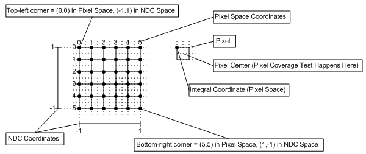
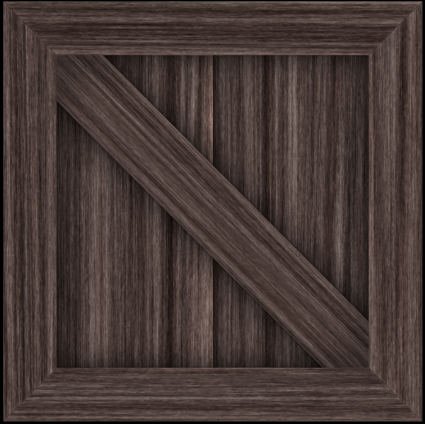
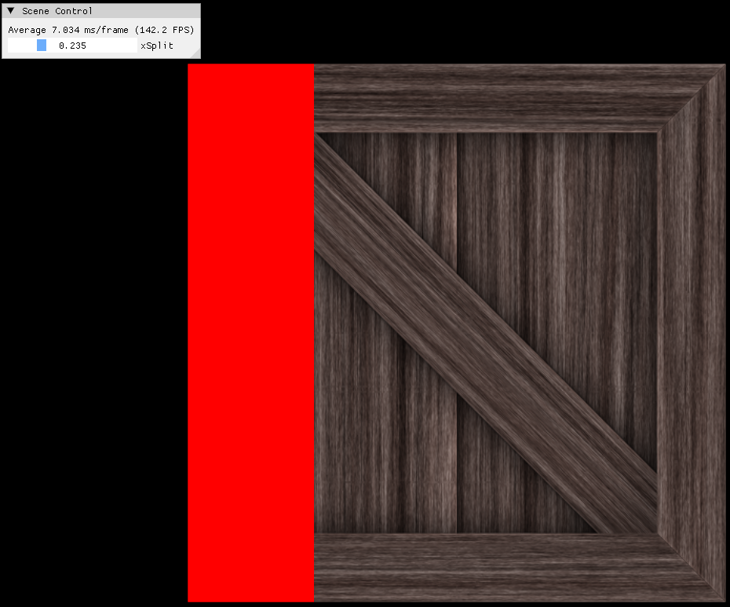
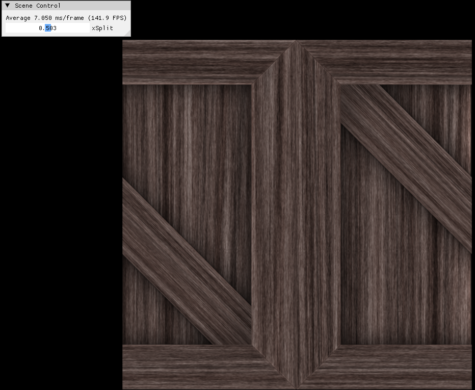
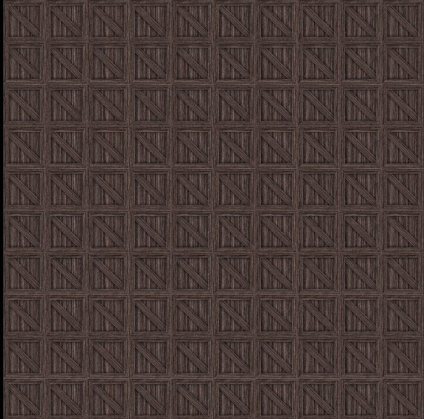
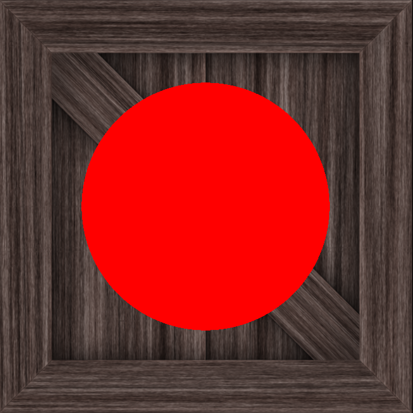
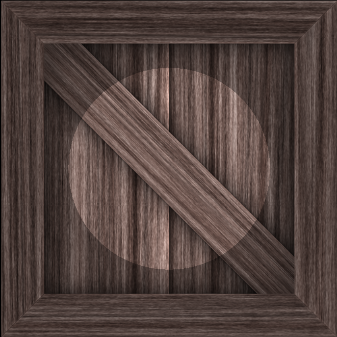
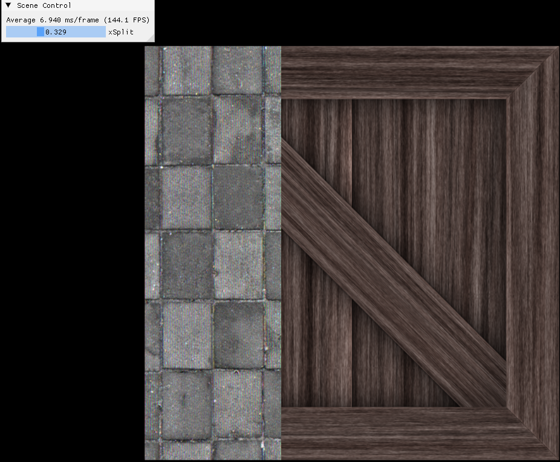

- [Introduce](#introduce)
- [SquareApp::Initialize()](#squareappinitialize)
	- [1. MakeSquare()](#1-makesquare)
		- [1.1. Pixel과 UV의 매핑 방법](#11-pixel과-uv의-매핑-방법)
	- [2. ShaderResourceView, SamplerState](#2-shaderresourceview-samplerstate)
		- [2.1. ID3D11ShaderResourceView](#21-id3d11shaderresourceview)
		- [2.2. ID3D11SamplerState](#22-id3d11samplerstate)
	- [3. AppBase::CreateTexture()](#3-appbasecreatetexture)
		- [3.1. image( 2D )의 data type이 uint8\_t인 이유](#31-image-2d-의-data-type이-uint8_t인-이유)
		- [3.2. D3D11\_SUBRESOURCE\_DATA](#32-d3d11_subresource_data)
			- [3.2.1. mip-map이란](#321-mip-map이란)
			- [3.2.2. member variables](#322-member-variables)
- [Square::UpdateGUI()](#squareupdategui)
	- [1. Texturing and Sampling in pixel shader](#1-texturing-and-sampling-in-pixel-shader)
		- [1.1. slide bar를 이용하여 다른 color 값으로 덮어씌우기](#11-slide-bar를-이용하여-다른-color-값으로-덮어씌우기)
		- [1.2. Basic Texturing](#12-basic-texturing)
		- [1.3. Texture Tiling( Wrap )](#13-texture-tiling-wrap-)
		- [1.4. Spot Light Effect](#14-spot-light-effect)
		- [1.5. 2개 이상의 Texture Image 활용](#15-2개-이상의-texture-image-활용)
- [AppBase::Run()](#appbaserun)
	- [1. Square::Update()](#1-squareupdate)
	- [2. Square::Render()](#2-squarerender)
- [SquareApp.h](#squareapph)
- [SquareApp.cpp](#squareappcpp)
- [SquareVertexShader.hlsl](#squarevertexshaderhlsl)
- [SquarePixelShader.hlsl](#squarepixelshaderhlsl)

# Introduce
Square를 Rendering한 화면을 띄우는 App.   
GUI를 이용하여 Square의 color 또는 texture를 실시간으로 수정할 수 있다.   
이러한 방식으로 Square에 다양한 효과를 적용할 수 있다.   

이를 구현하기 위해서 [Texture Coordinates](https://learn.microsoft.com/en-us/windows/win32/direct3d9/texture-coordinates)를 활용한다.   
[pixel과 texel coordinate system](https://learn.microsoft.com/en-us/windows/win32/direct3d10/d3d10-graphics-programming-guide-resources-coordinates)을 살펴보는 것도 추천한다.   

# SquareApp::Initialize()
```cpp
bool Square::Initialize () {
	if ( !AppBase::Initialize () ) {
		return false;
		}

	// Create Texture, ShaderResourceView, SamplerState
	AppBase::CreateTexture ( "crate2_diffuse.png" , m_texture , m_textureResourceView );
	AppBase::CreateTexture ( "wall.jpg" , m_texture2 , m_textureResourceView2 );
	D3D11_SAMPLER_DESC sampDesc;
	ZeroMemory ( &sampDesc , sizeof ( sampDesc ) );
	sampDesc.Filter = D3D11_FILTER_MIN_MAG_MIP_LINEAR;	// 일반적으로 사용: POINT, LINEAR interpolation
	sampDesc.AddressU = D3D11_TEXTURE_ADDRESS_WRAP;	// CLAMP, MIRROR
	sampDesc.AddressV = D3D11_TEXTURE_ADDRESS_WRAP;
	sampDesc.AddressW = D3D11_TEXTURE_ADDRESS_WRAP;
	sampDesc.ComparisonFunc = D3D11_COMPARISON_NEVER;
	sampDesc.MinLOD = 0;
	sampDesc.MaxLOD = D3D11_FLOAT32_MAX;
	m_device->CreateSamplerState ( &sampDesc , m_samplerState.GetAddressOf () );

	auto [vertices , indices] = MakeSqure ();

	AppBase::CreateVertexBuffer ( vertices , m_vertexBuffer );
	m_indexCount = UINT ( indices.size () );
	AppBase::CreateIndexBuffer ( indices , m_indexBuffer );
	m_constantBufferData.model = Matrix ();
	m_constantBufferData.view = Matrix ();
	m_constantBufferData.projection = Matrix ();
	AppBase::CreateConstantBuffer ( m_constantBufferData , m_constantBuffer );
	AppBase::CreateConstantBuffer ( m_pixelShaderConstantBufferData , m_pixelShaderConstantBuffer );

	// input layout은 Vertex struct의 순서와 형식에 맞추면 된다.
	vector<D3D11_INPUT_ELEMENT_DESC> inputElements = {
		{"POSITION", 0, DXGI_FORMAT_R32G32B32_FLOAT, 0, 0, D3D11_INPUT_PER_VERTEX_DATA, 0},
		{"COLOR", 0, DXGI_FORMAT_R32G32B32_FLOAT, 0, 4 * 3, D3D11_INPUT_PER_VERTEX_DATA, 0},
		{"TEXCOORD", 0, DXGI_FORMAT_R32G32_FLOAT, 0, 4 * 3 + 4 * 3, D3D11_INPUT_PER_VERTEX_DATA, 0},
	};
	AppBase::CreateVertexShaderAndInputLayout ( L"SquareVertexShader.hlsl" , inputElements , m_colorVertexShader , m_colorInputLayout );
	AppBase::CreatePixelShader ( L"SquarePixelShader.hlsl" , m_colorPixelShader );

	return true;
}
```
`MakeSquare()`로 2D 정사각형에 대한 정보( vertices, indices )를 세팅한다.   
VertexBuffer, IndexBuffer, ConstantBuffer를 생성한다. **CubeApp과 다른 점은 PixelShader의 ConstantBuffer도 추가로 생성**했다.   
Vertex Struct 구조에 맞게 Input Layout을 설정하고, Shader를 생성한다.   

## 1. MakeSquare()
```cpp
auto MakeSqure () {
	vector<Vector3> positions;
	vector<Vector3> colors;
	vector<Vector3> normals;
	vector<Vector2> texcoords;

	const float scale = 1.0f;

	positions.push_back ( Vector3 ( -1.0f , 1.0f , 0.0f ) * scale );
	positions.push_back ( Vector3 ( 1.0f , 1.0f , 0.0f ) * scale );
	positions.push_back ( Vector3 ( 1.0f , -1.0f , 0.0f ) * scale );
	positions.push_back ( Vector3 ( -1.0f , -1.0f , 0.0f ) * scale );
	colors.push_back ( Vector3 ( 0.0f , 0.0f , 1.0f ) );
	colors.push_back ( Vector3 ( 0.0f , 0.0f , 1.0f ) );
	colors.push_back ( Vector3 ( 0.0f , 0.0f , 1.0f ) );
	colors.push_back ( Vector3 ( 0.0f , 0.0f , 1.0f ) );
	normals.push_back ( Vector3 ( 0.0f , 0.0f , -1.0f ) );
	normals.push_back ( Vector3 ( 0.0f , 0.0f , -1.0f ) );
	normals.push_back ( Vector3 ( 0.0f , 0.0f , -1.0f ) );
	normals.push_back ( Vector3 ( 0.0f , 0.0f , -1.0f ) );

	// 사각형의 각 vertex와 texel 좌표를 올바른 UV에 배정한다.
	texcoords.push_back ( Vector2 ( 0.0f , 0.0f ) );
	texcoords.push_back ( Vector2 ( 1.0f , 0.0f ) );
	texcoords.push_back ( Vector2 ( 1.0f , 1.0f ) );
	texcoords.push_back ( Vector2 ( 0.0f , 1.0f ) );

	vector<Vertex> vertices;
	for ( size_t i = 0; i < positions.size (); i++ ) {
		Vertex v;
		v.position = positions[ i ];
		v.color = colors[ i ];
		v.texcoord = texcoords[ i ];
		vertices.push_back ( v );
	}
	vector<uint16_t> indices = {
			0, 1, 2, 0, 2, 3,
	};

	return tuple{ vertices, indices };
}
```
vertices에 texcoord 좌표를 저장한다.   
**vertex shader에 texcoord 좌표를 넘겨야 pixel shader에도 texcoord 좌표가 입력**된다.   

### 1.1. Pixel과 UV의 매핑 방법
[Pixel와 UV매핑에 대한 설명 - MSLearn](https://learn.microsoft.com/en-us/windows/win32/direct3d10/d3d10-graphics-programming-guide-resources-coordinates)   

`texcoords`에 각 UV 좌표를 세팅한다.   

**중요한 점은 각 UV 좌표를 의도한 vertex에 mapping 해야 한다**.   

   

pixel( screen ) 좌표에 맞춰서 UV 좌표를 매핑하는데, **screen의 왼쪽위(0, 0)에 UV의 왼쪽위(0, 0)을 매핑하는 방식**으로 올바른 위치에 배정한다.   

**vertex shader에서 반환한 좌표를 pipeline에서 NDC 좌표계로 변환 후, NDC 좌표계 $\rightarrow$ Viewport Transformation으로 Screen 좌표계로 배치하고, Rasterization을 수행**하여 pixel이 object에 포함됐는지 파악한 후, 각 pixel이 pixel shader를 호출한다.   

## 2. ShaderResourceView, SamplerState
```cpp
// Square.h
ComPtr<ID3D11Texture2D> m_texture;
ComPtr<ID3D11Texture2D> m_texture2;
ComPtr<ID3D11ShaderResourceView> m_textureResourceView;
ComPtr<ID3D11ShaderResourceView> m_textureResourceView2;
ComPtr<ID3D11SamplerState> m_samplerState;
```

### 2.1. ID3D11ShaderResourceView
**resource 자체는 단순히 pixel data나 vertex data 등의 원시( raw ) 정보만 담고 있지만, 이 데이터를 어떻게 사용할 것인지를 pipeline에게 알려주는 역할을 하는 것이 `View`이다**.   

[ID3D11ShaderResourceView interface - MSLearn](https://learn.microsoft.com/en-us/windows/win32/api/d3d11/nn-d3d11-id3d11shaderresourceview)   

**`ID3D11ShaderResourceView`는 Rendering 중에 shader가 access 할 수 있는 sub-resource를 지정**한다.   
이러한 sub-resources에는 constant buffer, texture buffer, texture가 존재하며, 여기선 `Texture2D`를 지정한다.   
Texture2D를 Resource로 사용하기 위해서 View( meta data )가 필요하다. Shader에서 Render Target으로 사용할 때에도 View를 이용한다.   

즉, **Shader가 사용할 Resource를 Binding 할 때, ShaderResourceView가 필요**하다.   

### 2.2. ID3D11SamplerState
[ID3D11SamplerState interface - MSLearn](https://learn.microsoft.com/en-us/windows/win32/api/d3d11/nn-d3d11-id3d11samplerstate)   

pipeline의 shader 단계에서 Texture를 Sampling하기 위해 Binding 할 수 있는 Sampler State에 대한 설명을 가지는 interface다.   

## 3. AppBase::CreateTexture()
**image file을 이용해서 texture와 texture resource view를 만드는 함수**다.   
```cpp
// error LNK2019: unresolved external sybol stbi_load 해결법
#define STB_IMAGE_IMPLEMENTATION
#include "stb_image.h"

void AppBase::CreateTexture(const std::string filename, ComPtr<ID3D11Texture2D>& texture, ComPtr<ID3D11ShaderResourceView>& textureResourceView) {
	int width, height, channels;

	// load image
	unsigned char* img = stbi_load(filename.c_str(), &width, &height, &channels, 0);

	vector<uint8_t> image;
	image.resize(width * height * channels);
	memcpy(image.data(), img, image.size() * sizeof(uint8_t));

	// Create Texture
	D3D11_TEXTURE2D_DESC txtDesc = {};
	txtDesc.Width = width;
	txtDesc.Height = height;
	txtDesc.MipLevels = txtDesc.ArraySize = 1;
	txtDesc.Format = DXGI_FORMAT_R8G8B8A8_UNORM;
	txtDesc.SampleDesc.Count = 1;
	txtDesc.Usage = D3D11_USAGE_IMMUTABLE;
	txtDesc.BindFlags = D3D11_BIND_SHADER_RESOURCE;

	// Fill in the sub-resource data
	D3D11_SUBRESOURCE_DATA initData;
	initData.pSysMem = image.data();
	initData.SysMemPitch = txtDesc.Width * sizeof(uint8_t) * channels;

	m_device->CreateTexture2D(&txtDesc, &initData, texture.GetAddressOf());
	m_device->CreateShaderResourceView(texture.Get(), nullptr, textureResourceView.GetAddressOf());
}
```
**DirectX에서는 DDS 형식의 image를 사용**한다. 인터넷에서 다양한 image를 texture로 사용하고 싶지만, 연습 단계에서 image를 매번 DDS 형식으로 변환하는 것은 비효율적이다.   
그래서 **.png .jpg 형식의 image를 읽어들여서 texture와 texture resource view를 만드는 기능**을 추가했다.   

### 3.1. image( 2D )의 data type이 uint8_t인 이유
**image( 2차원 배열 )는 일반적으로 `uint8_t(unsigned char, 8 bit)` 자료형을 사용**한다.   
image를 구성하는 각 channel은 0 ~ 255로 표현되며, 이는 8 bit 범위다.   
이러한 **channel은 하나의 pixel에 존재하는 color, transparency( 투명도 ) 정보를 저장하는 data unit을 의미**한다.   
또한 **하나의 pixel을 표현하기 위해 4개의 channel이 사용되고, 각 channel은 8bit를 차지**한다.   
RGBA image는 red channel, blue channel, green channel, alpha channel로 나뉘며, 각 channel마다 0 ~ 255 값을 할당하여 pixel의 color를 표현한다.   

`texDesc.Format`이 `DXGI_FORMAT_R8G8B8A8_UNORM`인 이유도 각 channel이 8bit씩 사용하기 때문이다.   

### 3.2. D3D11_SUBRESOURCE_DATA
**single mip-map level surface**이다.   
해당 데이터는 buffer( `CreateBuffer()` ) 또는 texture( `CreateTexture()` )를 만드는데 사용된다.   

#### 3.2.1. mip-map이란
**Mip-Map은 texture의 원본 이미지를 여러 단계의 resolution으로 축소해 놓은 일련의 image set을 의미**한다.   
예를 들면, 원본 이미지가 1024 x 1024 크기라면, 다음 단계는 512 x 512, 그 다음은 256 x 256이며, 이런 식으로 resolution이 절반씩 줄어든 이미지들이 계층적으로 존재한다.   
**texture를 여러 resolution으로 준비하면, 3D scene을 rendering 할 때, object의 거리에 따라 적절한 resolution texture를 사용함으로써 성능과 품질을 얻을 수 있**다.   

따라서 **single mip-map level surface란, texture가 여러 level로 축소 저장된 mip-map 중에서 하나의 resolution 단계를 나타내는 하나의 surface라는 뜻**이다.   

#### 3.2.2. member variables
**`pSysMem`는 초기화 데이터에 대한 pointer**를 나타낸다.   
**`SysMemPitch`는 texture의 한 줄( row ) 시작부터 다음 줄까지의 거리( byte )를** 나타낸다. 오직 2D, 3D texture data에만 사용된다. 따라서 한 줄의 pixel 수 x pixel size로 각 row의 거리를 나타낼 수 있다.   
**`SysMemSlicePitch`는 3D texture에서 하나의 2D slice의 첫 번째 pixel로부터, 다음 2D slice의 첫 번째 pixel까지의 거리를 byte 단위로 지정**한다.   


# Square::UpdateGUI()
```cpp
void Square::UpdateGUI () {
	ImGui::SliderFloat ( "xSplit" , &m_pixelShaderConstantBufferData.xSplit , 0.0f , 1.0f );
}
```
GUI의 slider bar를 이용하여 square의 색깔을 변경하기 위함이다.   
slider bar를 이용하여 `PixelShaderConstantBuffer`의 `xSplit`값을 0.0 ~ 1.0f로 변경한다.   
이렇게 변경한 값을 이용하여 pixel shader에서 square의 color 또는 texture를 변경시킨다.   

## 1. Texturing and Sampling in pixel shader
vertex shader에서는 texcoord 값을 수정하지 않고 그대로 pixel shader에 넘긴다.   
**texturing과 Sampling은 pixel shader에서 수행**한다.   
```cpp
// PixelShader
Texture2D g_texture0 : register(b0);
Texture2D g_texture1 : register(b1);
SamplerState g_sampler : register(s0);

cbuffer PixelShaderConstantBuffer : register(b0) { float xSplit; };

struct PixelInput {
    float4 pos : SV_POSITION;
    float3 color : COLOR;
    float2 texcoord : TEXCOORD;
};

// main
```
사용하고 싶은 image를 GPU에서 `Texture2D`로 받아온다.   
여기선 2가지 texture image를 가져왔다.   

**texturing은 texture image를 이용해서 model에 질감( 나무결, 타일, 금속 등 )을 mapping 하는 작업**이다.   
받아온 **texture image의 원하는 위치로부터 color 값을 가져오는 것을 sampling**이라 한다.   

### 1.1. slide bar를 이용하여 다른 color 값으로 덮어씌우기
```cpp
float4 main(PixelInput input) : SV_TARGET {
    // blue or red
    return input.texcoord.x > xSplit ? float4(0.0, 0.0, 1.0, 1.0) : float4(1.0, 0.0, 0.0, 1.0f);
}
```
`main`에서 `texcoord.x` 값이 `xSplit`보다 크면 blue를 아니면 red로 square를 색칠한다.   
즉, `x = 0 ~ 1` 함수를 기준으로 square를 잘라서 양쪽의 색깔을 다르게 표현한다.   

### 1.2. Basic Texturing
```cpp
float4 main(PixelInput input) : SV_TARGET {
	// left result
	return g_texture0.Sample(g_sampler, input.texcoord);

	// right result
	return input.texcoord.x > xSplit ? 
	g_texture0.Sample(g_sampler, input.texcoord) 
	: float4(1.0, 0.0, 0.0, 1.0);
}
```
   
   

[Sample (DirectX HLSL Texture Object) - MSLearn](https://learn.microsoft.com/en-us/windows/win32/direct3dhlsl/dx-graphics-hlsl-to-sample)   
Texture Sampling은 Texel 위치를 사용해서 Texel 값을 조회하기 때문에 `input.texcoord`를 인자로 받는다.   

### 1.3. Texture Tiling( Wrap )
**Tiling이란, 3D model의 UV 좌표를 벗어나도 동일한 texture image가 끊임없이 반복되어 표시하는 기법**이다.   
slider bar를 이용해서 image의 x좌표가 texture UV 좌표를 벗어나면 texture image가 반복되도록 설정했다.   
```cpp
// Square::Initialize()
sampDesc.AddressU = D3D11_TEXTURE_ADDRESS_WRAP; // repeat
sampDesc.AddressV = D3D11_TEXTURE_ADDRESS_WRAP;
sampDesc.AddressW = D3D11_TEXTURE_ADDRESS_WRAP; // 3D texture data
```
**texture tiling을 하려면, UV 좌표가 `WRAP`으로 세팅**한다.   
texture 좌표가 1.0을 초과하거나 0.0미만인 부분에서 자동으로 좌표가 0 ~ 1 사이로 mapping되어 tiling 된다.   
즉, **Wrap mode에서는 UV 좌표를 넘어간 부분을 `좌표 % 1.0` 같은 방식으로 0 ~ 1 범위로 되돌린다**.
```cpp
// pixel shader main
return g_texture0.Sample(g_sampler, input.texcoord + float2(xSplit, 0.0));
```
   
   

일반적으로 texture sampling을 할 때는 0 ~ 1 범위의 UV 좌표를 사용한다.   
**`input.texcoord + float2(xSplit, 0.0)`는 `xSplit`만큼 U좌표를 이동시키는 [offset](/Note/GraphicsTheory/Technical_Terms.md/#3-offset) 연산**이다.   
`xSplit`이 0.5라면, UV 좌표가 0.5만큼 오른쪽으로 밀리고, 1.0 초과 부분은 다시 0.0 근처부터 반복되어 이어 붙여진( tiled ) 것처럼 보인다.   

오른쪽 이미지는 `input.texcoord * 10.0f`해서 각 UV 좌표에 10을 곱하여 총 100개의 texture image를 Wrap했다.   

### 1.4. Spot Light Effect
**2D square에 spot light를 비춰본다**.
```cpp
// pixel shader main
float x = input.texcoord.x;
float y = input.texcoord.y;

float f = (x - 0.5) * (x - 0.5) + (y - 0.5) * (y - 0.5) - 0.3 * 0.3;

if (f < 0.0)
    return float4(1.0, 0.0, 0.0, 1.0);
else
    return g_texture0.Sample(g_sampler, input.texcoord);
```
   
   

먼저 원의 방정식을 이용해서 원의 내부는 빨간색, 바깥쪽은 texture image를 보여준다.   
```cpp
float4 color = g_texture0.Sample(g_sampler, input.texcoord);

if (f < 0.0)
    return color * 1.5;
else
    return color;
```
그 다음에 해당 원 내부에 조명 효과를 넣기 위해서 texture image의 color 값에 1.5를 곱한다.   

### 1.5. 2개 이상의 Texture Image 활용
pixel shader에서 2개 이상의 texture image를 활용하는 방법을 알아본다.   
```cpp
// SquareApp.h
ComPtr<ID3D11Texture2D> m_texture;
ComPtr<ID3D11Texture2D> m_texture2;
ComPtr<ID3D11ShaderResourceView> m_textureResourceView;
ComPtr<ID3D11ShaderResourceView> m_textureResourceView2;
ComPtr<ID3D11SamplerState> m_samplerState;
```
2개의 texture image와 각 texture에 대한 view를 관리하고, sampler는 공유한다.   

```cpp
// SquareApp::Initialize()
AppBase::CreateTexture ( "crate2_diffuse.png" , m_texture , m_textureResourceView );
AppBase::CreateTexture ( "wall.jpg" , m_texture2 , m_textureResourceView2 );
// create SamplerState
```
2개의 view를 생성한다.   
```cpp
// Square::Render()
ID3D11ShaderResourceView* pixelResources[ 2 ] = { m_textureResourceView.Get (), m_textureResourceView2.Get() };
m_devcon->PSSetShaderResources ( 0 , 2 , pixelResources );
```
pixel shader에 보낼 2개의 resource를 설정한다.   



slider bar를 이용하여 `g_texture0` 위에 `g_texture1`으로 덮어씌우는 기능을 구현했다.   

# AppBase::Run()

## 1. Square::Update()
```cpp
void Square::Update ( float dt ) {
	using namespace DirectX;

	// model transformation
	m_constantBufferData.model = Matrix::CreateScale ( 1.5f ) * Matrix::CreateTranslation ( Vector3 ( 0.0f , 0.0f , 1.0f ) );
	m_constantBufferData.model = m_constantBufferData.model.Transpose ();

	// view transformation
	const Vector3 viewEyePos = { 0.0f, 0.0f, -2.0f };
	const Vector3 viewEyeDir = { 0.0f, 0.0f, 1.0f };
	const Vector3 viewUp = { 0.0f, 1.0f, 0.0f };
	m_constantBufferData.view = XMMatrixLookToLH ( viewEyePos , viewEyeDir , viewUp );
	m_constantBufferData.view = m_constantBufferData.view.Transpose ();

	// projection
	const float aspect = AppBase::GetAspectRatio ();
	const float projFovAngleY = 70.0f;
	const float nearZ = 0.01f;
	const float farZ = 100.0f;
	if ( m_usePerspectiveProjection ) {
		m_constantBufferData.projection = XMMatrixPerspectiveFovLH (
			XMConvertToRadians ( projFovAngleY ) ,
			aspect , nearZ , farZ );
	}
	else {
		m_constantBufferData.projection = XMMatrixOrthographicOffCenterLH (
			-aspect , aspect , -1.0f , 1.0f , nearZ , farZ );
	}
	m_constantBufferData.projection = m_constantBufferData.projection.Transpose ();

	// shader에서 사용할 constant buffer를 CPU to GPU
	AppBase::UpdateBuffer ( m_constantBufferData , m_constantBuffer );
	AppBase::UpdateBuffer ( m_pixelShaderConstantBufferData , m_pixelShaderConstantBuffer );
}
```
CubeApp과 다른 점은 PixelShader에서 사용할 ConstantBuffer를 GPU에 넘겨준 것이다.   

## 2. Square::Render()
```cpp
void Square::Render () {
	m_devcon->RSSetViewports ( 1 , &m_viewport );

	float clearColor[ 4 ] = { 0.0f, 0.0f, 0.0f, 1.0f };
	m_devcon->ClearRenderTargetView ( m_renderTargetView.Get () , clearColor );
	m_devcon->ClearDepthStencilView ( m_depthStencilView.Get () ,
		D3D11_CLEAR_DEPTH | D3D11_CLEAR_STENCIL , 1.0f , 0 );

	m_devcon->OMSetRenderTargets ( 1 , m_renderTargetView.GetAddressOf () , m_depthStencilView.Get () );
	m_devcon->OMSetDepthStencilState ( m_depthStencilState.Get () , 0 );

	// Set Shader
	m_devcon->VSSetShader ( m_colorVertexShader.Get () , 0 , 0 );
	m_devcon->VSSetConstantBuffers ( 0 , 1 , m_constantBuffer.GetAddressOf () );

	ID3D11ShaderResourceView* pixelResources[ 2 ] = { m_textureResourceView.Get (), m_textureResourceView2.Get() };
	m_devcon->PSSetShaderResources ( 0 , 2 , pixelResources );
	m_devcon->PSSetSamplers ( 0 , 1 , m_samplerState.GetAddressOf () );
	m_devcon->PSSetConstantBuffers ( 0 , 1 , m_pixelShaderConstantBuffer.GetAddressOf () );
	m_devcon->PSSetShader ( m_colorPixelShader.Get () , 0 , 0 );

	m_devcon->RSSetState ( m_rasterizerState.Get () );

	UINT stride = sizeof ( Vertex );
	UINT offset = 0;
	m_devcon->IASetInputLayout ( m_colorInputLayout.Get () );
	m_devcon->IASetVertexBuffers ( 0 , 1 , m_vertexBuffer.GetAddressOf () , &stride , &offset );
	m_devcon->IASetIndexBuffer ( m_indexBuffer.Get () , DXGI_FORMAT_R16_UINT , 0 );
	m_devcon->IASetPrimitiveTopology ( D3D11_PRIMITIVE_TOPOLOGY_TRIANGLELIST );
	m_devcon->DrawIndexed ( m_indexCount , 0 , 0 );
}
```
PixelShader에서 사용할 ShaderResources, Sampler와 Constant Buffer를 세팅한다.   

# SquareApp.h
```cpp
#pragma once

#include "AppBase.h"

namespace pt {

// pixel에 다양한 효과를 주는 constant buffer
struct PixelShaderConstantBuffer {
	float xSplit;       // 4 bytes
	float padding[ 3 ]; // 12 bytes
};

static_assert( ( sizeof ( PixelShaderConstantBuffer ) % 16 == 0 ) ,
	"[PS] Constant Buffer size must be 16-bytes aligend" );

class Square : public AppBase {
public:
	Square ();

	virtual bool Initialize () override;
	virtual void UpdateGUI () override;
	virtual void Update ( float dt ) override;
	virtual void Render () override;

protected:
	ComPtr<ID3D11VertexShader> m_colorVertexShader;
	ComPtr<ID3D11PixelShader> m_colorPixelShader;
	ComPtr<ID3D11InputLayout> m_colorInputLayout;

	ComPtr<ID3D11Buffer> m_vertexBuffer;
	ComPtr<ID3D11Buffer> m_indexBuffer;
	ComPtr<ID3D11Buffer> m_constantBuffer;
	ComPtr<ID3D11Buffer> m_pixelShaderConstantBuffer;
	UINT m_indexCount;

	// Texturing
	ComPtr<ID3D11Texture2D> m_texture;
	ComPtr<ID3D11Texture2D> m_texture2;
	ComPtr<ID3D11ShaderResourceView> m_textureResourceView;
	ComPtr<ID3D11ShaderResourceView> m_textureResourceView2;
	ComPtr<ID3D11SamplerState> m_samplerState;

	ModelViewProjectionConstantBuffer m_constantBufferData;
	PixelShaderConstantBuffer m_pixelShaderConstantBufferData;

	bool m_usePerspectiveProjection = true;
};

} // namespace pt
```
# SquareApp.cpp
```cpp
#include "SquareApp.h"

#include <tuple>

namespace pt {

using namespace std;

auto MakeSqure () {
	vector<Vector3> positions;
	vector<Vector3> colors;
	vector<Vector3> normals;
	vector<Vector2> texcoords;

	const float scale = 1.0f;

	positions.push_back ( Vector3 ( -1.0f , 1.0f , 0.0f ) * scale );
	positions.push_back ( Vector3 ( 1.0f , 1.0f , 0.0f ) * scale );
	positions.push_back ( Vector3 ( 1.0f , -1.0f , 0.0f ) * scale );
	positions.push_back ( Vector3 ( -1.0f , -1.0f , 0.0f ) * scale );
	colors.push_back ( Vector3 ( 0.0f , 0.0f , 1.0f ) );
	colors.push_back ( Vector3 ( 0.0f , 0.0f , 1.0f ) );
	colors.push_back ( Vector3 ( 0.0f , 0.0f , 1.0f ) );
	colors.push_back ( Vector3 ( 0.0f , 0.0f , 1.0f ) );
	normals.push_back ( Vector3 ( 0.0f , 0.0f , -1.0f ) );
	normals.push_back ( Vector3 ( 0.0f , 0.0f , -1.0f ) );
	normals.push_back ( Vector3 ( 0.0f , 0.0f , -1.0f ) );
	normals.push_back ( Vector3 ( 0.0f , 0.0f , -1.0f ) );

	texcoords.push_back ( Vector2 ( 0.0f , 0.0f ) );
	texcoords.push_back ( Vector2 ( 1.0f , 0.0f ) );
	texcoords.push_back ( Vector2 ( 1.0f , 1.0f ) );
	texcoords.push_back ( Vector2 ( 0.0f , 1.0f ) );

	vector<Vertex> vertices;
	for ( size_t i = 0; i < positions.size (); i++ ) {
		Vertex v;
		v.position = positions[ i ];
		v.color = colors[ i ];
		v.texcoord = texcoords[ i ];
		vertices.push_back ( v );
	}
	vector<uint16_t> indices = {
			0, 1, 2, 0, 2, 3,
	};

	return tuple{ vertices, indices };
}

Square::Square () : AppBase(), m_indexCount(0) {}

bool Square::Initialize () {
	if ( !AppBase::Initialize () ) {
		return false;
	}

	// Create Texture, ShaderResourceView, SamplerState
	AppBase::CreateTexture ( "crate2_diffuse.png" , m_texture , m_textureResourceView );
	AppBase::CreateTexture ( "wall.jpg" , m_texture2 , m_textureResourceView2 );
	D3D11_SAMPLER_DESC sampDesc;
	ZeroMemory ( &sampDesc , sizeof ( sampDesc ) );
	sampDesc.Filter = D3D11_FILTER_MIN_MAG_MIP_LINEAR;	// 일반적으로 사용: POINT, LINEAR interpolation
	sampDesc.AddressU = D3D11_TEXTURE_ADDRESS_WRAP;	// CLAMP, 
	sampDesc.AddressV = D3D11_TEXTURE_ADDRESS_WRAP;
	sampDesc.AddressW = D3D11_TEXTURE_ADDRESS_WRAP;
	sampDesc.ComparisonFunc = D3D11_COMPARISON_NEVER;
	sampDesc.MinLOD = 0;
	sampDesc.MaxLOD = D3D11_FLOAT32_MAX;
	m_device->CreateSamplerState ( &sampDesc , m_samplerState.GetAddressOf () );

	auto [vertices , indices] = MakeSqure ();

	AppBase::CreateVertexBuffer ( vertices , m_vertexBuffer );
	m_indexCount = UINT ( indices.size () );
	AppBase::CreateIndexBuffer ( indices , m_indexBuffer );
	m_constantBufferData.model = Matrix ();
	m_constantBufferData.view = Matrix ();
	m_constantBufferData.projection = Matrix ();
	AppBase::CreateConstantBuffer ( m_constantBufferData , m_constantBuffer );
	AppBase::CreateConstantBuffer ( m_pixelShaderConstantBufferData , m_pixelShaderConstantBuffer );
	
	// input layout은 Vertex struct의 순서와 형식에 맞추면 된다.
	vector<D3D11_INPUT_ELEMENT_DESC> inputElements = {
		{"POSITION", 0, DXGI_FORMAT_R32G32B32_FLOAT, 0, 0, D3D11_INPUT_PER_VERTEX_DATA, 0},
		{"COLOR", 0, DXGI_FORMAT_R32G32B32_FLOAT, 0, 4 * 3, D3D11_INPUT_PER_VERTEX_DATA, 0},
		{"TEXCOORD", 0, DXGI_FORMAT_R32G32_FLOAT, 0, 4 * 3 + 4 * 3, D3D11_INPUT_PER_VERTEX_DATA, 0},
	};
	AppBase::CreateVertexShaderAndInputLayout ( L"SquareVertexShader.hlsl" , inputElements , m_colorVertexShader , m_colorInputLayout );
	AppBase::CreatePixelShader ( L"SquarePixelShader.hlsl" , m_colorPixelShader );

	return true;
}

void Square::UpdateGUI () {
	ImGui::SliderFloat ( "xSplit" , &m_pixelShaderConstantBufferData.xSplit , 0.0f , 1.0f );
}

void Square::Update ( float dt ) {
	using namespace DirectX;

	// model transformation
	m_constantBufferData.model = Matrix::CreateScale ( 1.5f ) * Matrix::CreateTranslation ( Vector3 ( 0.0f , 0.0f , 1.0f ) );
	m_constantBufferData.model = m_constantBufferData.model.Transpose ();

	// view transformation
	const Vector3 viewEyePos = { 0.0f, 0.0f, -2.0f };
	const Vector3 viewEyeDir = { 0.0f, 0.0f, 1.0f };
	const Vector3 viewUp = { 0.0f, 1.0f, 0.0f };
	m_constantBufferData.view = XMMatrixLookToLH ( viewEyePos , viewEyeDir , viewUp );
	m_constantBufferData.view = m_constantBufferData.view.Transpose ();

	// projection
	const float aspect = AppBase::GetAspectRatio ();
	const float projFovAngleY = 70.0f;
	const float nearZ = 0.01f;
	const float farZ = 100.0f;
	if ( m_usePerspectiveProjection ) {
		m_constantBufferData.projection = XMMatrixPerspectiveFovLH (
			XMConvertToRadians ( projFovAngleY ) ,
			aspect , nearZ , farZ );
	}
	else {
		m_constantBufferData.projection = XMMatrixOrthographicOffCenterLH (
			-aspect , aspect , -1.0f , 1.0f , nearZ , farZ );
	}
	m_constantBufferData.projection = m_constantBufferData.projection.Transpose ();

	// shader에서 사용할 constant buffer를 CPU to GPU
	AppBase::UpdateBuffer ( m_constantBufferData , m_constantBuffer );
	AppBase::UpdateBuffer ( m_pixelShaderConstantBufferData , m_pixelShaderConstantBuffer );
}

void Square::Render () {
	m_devcon->RSSetViewports ( 1 , &m_viewport );

	float clearColor[ 4 ] = { 0.0f, 0.0f, 0.0f, 1.0f };
	m_devcon->ClearRenderTargetView ( m_renderTargetView.Get () , clearColor );
	m_devcon->ClearDepthStencilView ( m_depthStencilView.Get () ,
		D3D11_CLEAR_DEPTH | D3D11_CLEAR_STENCIL , 1.0f , 0 );

	m_devcon->OMSetRenderTargets ( 1 , m_renderTargetView.GetAddressOf () , m_depthStencilView.Get () );
	m_devcon->OMSetDepthStencilState ( m_depthStencilState.Get () , 0 );

	// Set Shader
	m_devcon->VSSetShader ( m_colorVertexShader.Get () , 0 , 0 );
	m_devcon->VSSetConstantBuffers ( 0 , 1 , m_constantBuffer.GetAddressOf () );

	ID3D11ShaderResourceView* pixelResources[ 2 ] = { m_textureResourceView.Get (), m_textureResourceView2.Get() };
	m_devcon->PSSetShaderResources ( 0 , 2 , pixelResources );
	m_devcon->PSSetSamplers ( 0 , 1 , m_samplerState.GetAddressOf () );
	m_devcon->PSSetConstantBuffers ( 0 , 1 , m_pixelShaderConstantBuffer.GetAddressOf () );
	m_devcon->PSSetShader ( m_colorPixelShader.Get () , 0 , 0 );

	m_devcon->RSSetState ( m_rasterizerState.Get () );

	UINT stride = sizeof ( Vertex );
	UINT offset = 0;
	m_devcon->IASetInputLayout ( m_colorInputLayout.Get () );
	m_devcon->IASetVertexBuffers ( 0 , 1 , m_vertexBuffer.GetAddressOf () , &stride , &offset );
	m_devcon->IASetIndexBuffer ( m_indexBuffer.Get () , DXGI_FORMAT_R16_UINT , 0 );
	m_devcon->IASetPrimitiveTopology ( D3D11_PRIMITIVE_TOPOLOGY_TRIANGLELIST );
	m_devcon->DrawIndexed ( m_indexCount , 0 , 0 );
}

} // namespace pt
```
# SquareVertexShader.hlsl
```cpp
cbuffer ModelViewProjectionConstantBuffer : register(b0)
{
    matrix model;
    matrix view;
    matrix projection;
};

struct VertexInput
{
    float3 pos : POSITION;
    float3 color : COLOR0;
    float2 texcoord : TEXCOORD0; // pixel shader로 넘겨주기 위해서 vertex shader에서 texcoord를 받는다.
};

struct PixelInput
{
    float4 pos : SV_POSITION;
    float3 color : COLOR;
    float2 texcoord : TEXCOORD;
};

PixelInput main(VertexInput input)
{
    PixelInput output;
    float4 pos = float4(input.pos, 1.0f);
    
    pos = mul(pos, model);
    pos = mul(pos, view);
    pos = mul(pos, projection);

    output.pos = pos;
    output.color = input.color;
    output.texcoord = input.texcoord;
    
    return output;
}
```
# SquarePixelShader.hlsl
```cpp
Texture2D g_texture0 : register(t0); // wood box
Texture2D g_texture1 : register(t1); // stone
SamplerState g_sampler : register(s0);

cbuffer PixelShaderConstantBuffer : register(b0)
{
    float xSplit;
};

struct PixelInput
{
    float4 pos : SV_POSITION;
    float3 color : COLOR;
    float2 texcoord : TEXCOORD;
};

float4 main(PixelInput input) : SV_TARGET
{
    return input.texcoord.x > xSplit ?
    g_texture0.Sample(g_sampler, input.texcoord)
    : g_texture1.Sample(g_sampler, input.texcoord);
}
```