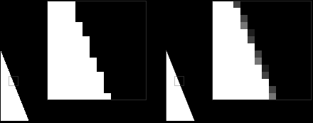

- [Introduce](#introduce)
- [Direct3D Headers \& Global Variables](#direct3d-headers--global-variables)
	- [Device와 Device Context](#device와-device-context)
- [Launching Direct3D](#launching-direct3d)
	- [이중 포인터의 이해](#이중-포인터의-이해)
	- [D3D11CreateDeviceAndSwapChain() error LNK2019](#d3d11createdeviceandswapchain-error-lnk2019)
- [Closing Direct3D](#closing-direct3d)
- [Final Code](#final-code)

[Initializing Direct3D - DirectXTutorial](http://www.directxtutorial.com/Lesson.aspx?lessonid=11-4-2)   

# Introduce
Direct3D program으로 "Hello World"처럼 기본적인 화면을 띄워본다.   

# Direct3D Headers & Global Variables
아래 메모는 `d3dx11.h`를 사용하지 않음으로써 잠시 주석처리한다.   
*`d3dx11.h`는 Graphic library에는 필요하지 않지만, 게임이나 기타 그래픽 프로그램을 작성할 때 유용하게 사용할 수 있는 Direct3D의 확장 기능을 포함한다.   
이러한 header files는 모든 compiler가 인지하지 않는다. 특히 visual studio는 `d3dx11.h`를 찾지 못한다. 이러한 error를 고치기 위해서 **DirectX SDK를 포함하고 있는 folder 경로를 visual studio project에 포함하도록 설정**해야 한다.*   
```cpp
// include the basic windows header files and the Direct3D header files
#include <d3d11.h>
#include <d3dcompiler.h>

// include the Direct3D Library file
#pragma comment (lib, "d3d11.lib")
#pragma comment (lib, "d3dcompiler.lib")

// global declarations
IDXGISwapChain* swapChain;      // the pointer to the swap chain interface
ID3D11Device* dev;              // the pointer to our Direct3D device interface
ID3D11DeviceContext* devcon;    // the pointer to our Direct3D device context interface

// function prototypes
void InitD3D( HWND hWnd );      // sets up and initializes Direct3D
void CleanD3D( void );          // closes Direct3D and releases memory
```
`d3d11.h`는 Direct3D의 핵심 header files를 포함한다.   

`ID3D11Device* dev`는 device에 대한 pointer이다. **device는 Direct3D에서 video adapter( graphics device )를 추상화하여 제어하고 관리하는 역할을 하는 COM 객체**다.   
**video adapter는 컴퓨터에 장착된 graphic card 혹은 GPU와 같은 그래픽 연산 hardware를 말한다**.   
즉, `ID3D11Device`는 실제 video adapter에 접근하지 않고도 graphic resources를 생성하고, rendering pipeline을 설정하며, GPU 연산을 관리할 수 있게 해주는 Handle 역할을 수행하는 추상화된 interface object라 할 수 있다.   

여기서 중요한 점은 **COM 객체를 직접 생성하거나 다루는 것이 아니라, COM 객체를 가리키는 pointer를 통해 접근한다는 점**이다.   
COM에서는 객체의 실제 구현을 감추고, interface를 통해서만 접근하도록 설계 원칙을 정했기 때문이다.   

`ID3D11DeviceContext* devcon`는 device처럼 pointer로 device context 객체에 간접적으로 접근한다.   
이러한 **Device Context는 GPU 연산을 실제로 실행**하며, 이를 나타내는 interface object가 `ID3D11DeviceContext`이다.   

[ GraphicsConcepts.md - The Swap Chain ](/Note/GraphicsTheory/GraphicsConcpets.md/#the-swap-chain)   
`IDXGISwapChain`는 DXGI를 통해 관리되는 swap chain을 제어하기 위한 interface object이다.   
swap chian은 보통 하나 이상의 front buffer와 back buffer를 포함하고, rendering 한 결과를 화면에 표시하기 위해 각 buffer를 swap하는 기능을 제공한다.   
즉, `IDXGISwapChain`는 GPU가 관리하는 front/back buffer를 app에서 제어할 수 있게 하는 interface이다.   

## Device와 Device Context
**`ID3D11Device`는 GPU와 관련된 resources를 관리하고 생성하는 역할**이다.   
이를 통해 buffer, texture, shader와 같은 graphic resources를 할당하거나, 다양한 render states( rasterizer, blend, depth-stencil, sampler states )를 정의할 수 있다.   
**`ID3D11DeviceContext`는 이렇게 준비된 resources를 실제로 GPU command queue에 전달하고, rendering pipeline을 설정 및 실행하는 역할**이다.   
즉, rendering command를 기록하고 발행( issue )해서 GPU가 화면에 그림을 그리도록 하는 interface이다.   


다시 정리하면, **Device( `ID3D11Device` )가 hardware와 resources를 축상화해 놓은 플랫폼**이라면, **Device Context( `ID3D11DeviceContext` )는 그 플랫폼 위에서 실제 rendering commands( 명령 )과 state 설정을 수행하고, 그 결과를 GPU가 실행하도록 지시하는 작업 현장**이다.   
즉, `ID3D11DeviceContext`는 `ID3D11Device`가 제공하는 자원과 기능을 실제 rendering에 활용하기 위해 GPU에 명령을 전달하는 interface이다.   

**Device는 video adapter를 추상화하여 제어하고 관리하는 역할**을 하며, 이를 나타내는 interface object가 `ID3D11Device`이다.   
**Device Context는 GPU 연산을 실제로 실행**하며, 이를 나타내는 interface object가 `ID3D11DeviceContext`이다.   
실제로 코드에서는 이러한 COM object를 직접 다루지 않기 때문에 pointer로 주소를 받아서 간접적으로 제어한다.   


# Launching Direct3D
**첫 단계는 3가지 COM object( ID3D11Device, ID3D11DeviceContext, IDXGISwapChain )을 생성하고 초기화**하는 것이다. 이 작업은 하나의 function과 graphics device information이 포함된 struct로 수행한다.   
```cpp
// this function initializes and prepares Direct3D for use
bool InitD3D( HWND hWnd ) {
  // create a struct to hold information about the swap chain
  DXGI_SWAP_CHAIN_DESC scd;

  // clear out the struct for use
  ZeroMemory( &scd, sizeof(scd) );

  // fill the swap chain description struct
  scd.BufferCount = 1;                                  // one back buffer
  scd.BufferDesc.Format = DXGI_FORMAT_R8G8B8A8_UNORM;   // use 32-bit color
  scd.BufferUsage = DXGI_USAGE_RENDER_TARGET_OUTPUT;    // how swap chain is to be used
  scd.OutputWindow = hWnd;                              // the window to be used
  scd.SampleDesc.Count = 4;                             // how many multisamples
  scd.Windowed = TRUE;                                  // windowed/full-screen mode

  // create a device, device context and swap chain using the information in the scd struct
  if ( FAILED( D3D11CreateDeviceAndSwapChain( NULL,
                                              D3D_DRIVER_TYPE_HARDWARE,
                                              NULL,
                                              NULL,
                                              NULL,
                                              NULL,
                                              D3D11_SDK_VERSION,
                                              &scd,
                                              &swapchain,
                                              &dev,
                                              NULL,
                                              &devcon

  ) ) {
    std::cout << "D3D11CreateDeviceAndSwapChain() failed." << std::endl;
    return false;
  }
  return true;
}
```
게임 프로그래밍에서는 처음부터 어떠한 정보를 Direct3D에 입력한다. 이러한 정보를 살펴본다.   

`DXGI_SWAP_CHAIN_DESC scd`는 swap chain에 대한 description을 멤버로 포함하는 `struct`이다.   
`scd.BufferCount = 1`은 swap chain에서 사용할 back buffer의 수를 포함한다. 여기서는 1개의 back buffer와 1개의 front buffer를 사용한다.   
`scd.BufferDesc.Format`는 color format을 설정한다. 두 buffer에 있는 각 pixel은 color로 저장되며, 이러한 color data가 저장되는 형식을 결정한다. `DXGI_FORMAT_R8G8B8A8_UNORM`는 format을 나타내는 flag이다. RGBA를 각 8bit로 저장하여 총 32bit로 color를 표현한다.   
`scd.BufferUsage`는 swap chain을 어떻게 사용할 것인지 설정한다. `DXGI_USAGE_RENDER_TARGET_OUTPUT`는 graphic을 back buffer에 그리는 경우에 사용한다.   
`scd.OutputWindow`는 Direct3D가 그려지는 window handle을 설정한다.   
   
`scd.SampleDesc.Count = 4`는 Direct3D에게 multisample anti-aliased( MSAA ) rendering을 어떻게 사용할 것인지 알려줄 때 사용한다. 이 값은 Direct3D가 anti-aliased에게 얼마나 많은 detail을 넣어야 하는지 알려주며, 숫자( 1 ~ 4 )가 높을수록 좋다.   
**anti-aliasing은 shapes의 가장자리를 각 pixel의 주변 pixels를 약간 섞음으로써 부드럽게 만든다**.   
`scd.Windowed` 값이 `TRUE`라면 windowed( 창 ) mode이고, `FALSE`라면 full-screen mode이다.   

`D3D11CreateDeviceAndSwapChain()`에서 세팅한 대부분의 인자들은 아마 모든 게임에서 같게 작성될 것이다. 이 함수는 device, device context, swap chain을 생성한다.   
```cpp
HRESULT D3D11CreateDeviceAndSwapChain(
  IDXGIAdapter* pAdapter,
  D3D_DRIVER_TYPE DriverType,
  HMODULE Software,
  UINT Flags,
  D3D_FEATURE_LEVEL* pFeatureLevels,
  UINT FeatureLevels,
  UINT SDKVersion,
  DXGI_SWAP_CHAIN_DESC* pSwapChainDesc,
  IDXGISwapChain** ppSwapChain,         // Returns the DXGI swap chain created
  ID3D11Device** ppDevice,              // Returns the Driect3D device created.
  D3D_FEATURE_LEVEL* pFeatureLevel,     // Returns feature level of device created.
  ID3D11DeviceContext** ppDeviceContext // Returns the device immediate context.
);
```
`IDXGIAdapter*`는 Direct3D가 사용하는 graphics adapter가 무엇인지를 나타낸다. **대부분의 경우 GPU가 하나만 있기 때문에 DXGI가 알아서 처리( default adapter )하도록 `NULL` 값으로 설정**한다.   

`D3D_DRIVER_TYPE`은 Direct3D가 rendering에 hardware를 사용할지, software를 사용할지 결정한다.   
```
D3D_DRIVER_TYPE_HARDWARE
D3D_DRIVER_TYPE_WARP
```
`HARDWARE` Flag는 가장 좋은 선택지다. rendering을 위해 GPU를 사용하기 때문이다.   
`WARP` Flag는 오래된 Direct3D 기능을 수행하기 위한 높은 성느의 software engine이다.   

`HMODULE`를 세팅하지 않은 이유는 `D3D_DRIVER_TYPE_SOFTWARE` flag와 함께 사용하기 때문이다. 이 옵션은 매우 느리기 때문에 `NULL`로 지정한다.   

`Flags`는 Direct3D의 실행 방식을 변경할 수 있는 flag다.   
```
D3D11_CREATE_DEVICE_DEBUG
```
Debugging을 허용한다. compiler의 출력창에 debug message가 표시된다. 이 flag를 사용한다면, DirectX 제어판에서도 app debugging을 활성화해야 할 수 있다.   

```cpp
const D3D_FEATURE_LEVEL featureLevels[2] = {
  D3D_FEATURE_LEVEL_11_0,   // 더 높은 버전이 먼저 온다.
  D3D_FEATURE_LEVEL_9_3,
};
```
`D3D_FEATURE_LEVEL*`는 프로그램이 hardware에게 요구하는 Direct3D의 버전을 지정한다. `NULL`로 지정하면 기본값( Direct11 )으로 간주한다. **프로그램이 지원하는 DirectX feature level의 배열에 대한 포인터를 넘겨준다**.   
`FeatureLevels`는 `D3D_FEATURE_LEVEL` 배열의 요소 개수를 지정한다.   

`SDKVersion`는 항상 `D3D11_SDK_VERSION`로 지정하여 SDK를 정한다.   

`DXGI_SWAP_CHAIN_DESC*`는 swap chain description struct를 가리킨다. `DXGI_SWAP_CHAIN_DESC`로 생성했다.   


이전에 말했듯이 **COM 객체를 직접 생성하거나 다루는 것이 아니라, COM 객체를 가리키는 pointer를 통해 접근한다는 점**을 생각하고 다음 파라미터를 살펴본다.   
`IDXGISwapChain**`는 swap chain의 주소를 가리키는 pointer로 초기화한다. 이 함수가 생성하는 object의 주소를 pointer로 저장한다. `IDXGISwapChain* swapChain`의 주소를 넘겨줬다.   
`ID3D11Device**`는 이 함수가 생성하는 device의 주소를 pointer로 초기화한다.   
`D3D_FEATURE_LEVEL*`는 feature level variable을 가리킨다. 이 함수가 완료되면 발견된 가장 높은 feature level flag로 초기화된다. 여기선 `D3D_FEATURE_LEVEL_11_0`가 가장 높은 version이다.   
`ID3D11DeviceContext**`는 device context object에 대한 주소를 가리키는 pointer를 초기화한다.   

## 이중 포인터의 이해
C/C++ 함수에서 object나 interface를 생성하고, 그 결과를 호출자에게 반환할 때 흔히 사용된다.   
`D3D11CreateDeviceAndSwapChain` 함수는 내부적으로 device, device context, swap chain 객체를 생성한 뒤, 호출자가 전달한 이중 포인터를 이용해 그 객체의 주소를 반환한다.   

`IDXGISwapChain**`는 `IDXGISwapChain*`를 가리키는 포인터다. 즉, `ppSwapChain`을 통해 함수 외부의 `IDXGISwapChain*` 변수에 간접적으로 접근할 수 있다.   
참고로 함수 인자로 받는 포인터( * )는 "value"로 복사되기 때문에 `IDXGISwapChain* pSwapChain` 같은 형태로 인자를 받으면, 함수 내부에서 `pSwapChain`에 값을 할당해도 호출자 쪽의 `pSwapChain` 변수 자체는 변경되지 않는다.   
하지만 이중 포인터로 받으면, 함수는 `ppSwapChain`을 통해 호출자의 `ppSwapChain` 변수에 직접 접근할 수 있다.   

즉, **이중 포인터는 함수가 호출자에게 동적으로 생성된 object나 interface의 주소를 돌려주기 위해 사용되는 기법**이다.   

## D3D11CreateDeviceAndSwapChain() error LNK2019
```
error LNK2019: unresolved external symbol
```
해당 메시지는 linker가 특정 함수의 정의를 찾지 못했을 때 발생한다.   
`D3D11CreateDeviceAndSwapChain()` 함수에 대한 참조가 해결되지 않았으며, 이는 필요한 library가 project에 제대로 link되지 않았을 때 발생한다.   

```cpp
#include <d3d11.h>
#pragma comment (lib, "d3d11.lib")
```
header file은 선언을 포함하기 때문에 함수의 시그니처를 알 수 있다. 하지만 실제 구현은 포함하지 않는다. 따라서 compile 단계는 문제 없지만, link 단계에서는 실제 함수의 구현을 찾지 못하면 `LNK2019` 오류가 발생한다.   
`.lib` 파일은 함수의 실제 구현을 포함한다. `d3d11.lib`는 Direct3D 11 관련 함수들의 구현을 포함하기 때문에 linker가 함수 호출을 올바르게 연결한다.   

`#pragma comment` 지시자의 첫 인자로 `lib`를 지정하면, project에 library 파일을 추가할 것을 나타낸다. 두 번째 인자는 어떤 `.lib` 파일을 지정할지 명확히 알려준다.   

# Closing Direct3D
Direct3D는 생성될 때마다 종료해야 한다.   
```cpp
// this is the function that cleans up Direct3D and COM
void CleanD3D() {
  // close and release all existing COM objects
  swapChain->Release();
  dev->Release();
  devcon->Release();
}
```
생성한 interface( ID3D11Device, ID3D11DeviceContext, IDXGISwapChain )에 대해 각각 Release() 함수를 호출한다.   
**COM objects를 생성하고 이를 close하지 않으면, program을 종료하더라도 컴퓨터를 재부팅할 때까지 계속 background에 존재**한다.   

# Final Code
```cpp
#include "pch.h"

#pragma comment (lib, "d3d11.lib")

IDXGISwapChain* swapChain;      // the pointer to the swap chain interface
ID3D11Device* dev;              // the pointer to our Direct3D device interface
ID3D11DeviceContext* devcon;    // the pointer to our Direct3D device context

bool InitD3D ( HWND hWnd );
void CleanD3D ( void );
LRESULT CALLBACK WndProc ( HWND hwnd , UINT msg , WPARAM wParam , LPARAM lParam );

int main ()
{
	WNDCLASSEX wc;
	ZeroMemory ( &wc , sizeof ( WNDCLASSEX ) );

	wc.cbSize = sizeof ( WNDCLASSEX );
	wc.style = CS_CLASSDC;
	wc.lpfnWndProc = WndProc;
	wc.hCursor = LoadCursor ( NULL , IDC_ARROW );
	wc.hbrBackground = ( HBRUSH ) COLOR_WINDOW;
	wc.lpszClassName = L"WindowClass1";

	if ( !RegisterClassEx ( &wc ) ) {
		std::cout << "RegisterClassEx() failed." << std::endl;
		return -1;
	}

	int screenWidth = 1280;
	int screenHeight = 960;
	RECT wr = { 0, 0, screenWidth, screenHeight };
	AdjustWindowRect ( &wr , WS_OVERLAPPEDWINDOW , FALSE );

	HWND mainWindow = CreateWindowEx ( 
		NULL ,
		wc.lpszClassName ,     // name of the window class
		L"window1 title" ,     // title of the window
		WS_OVERLAPPEDWINDOW ,  // window style
		0 ,                    // x-position of the window
		0 ,                    // y-position of the window
		wr.right - wr.left ,   // width of the window
		wr.bottom - wr.top ,   // height of the window
		NULL ,                 // we have no parent window
		NULL ,                 // we aren't using menus
		wc.hInstance ,         // apllication handle
		NULL									 // used with multiple windows
	);

	if ( !mainWindow ) {
		std::cout << "CreateWindow() failed." << std::endl;
		return -1;
	}

	ShowWindow ( mainWindow , SW_SHOWDEFAULT );
	UpdateWindow ( mainWindow );

	if ( !InitD3D ( mainWindow ) ) {
		std::cout << "InitD3D() failed." << std::endl;
		return -1;
	}

	MSG msg = { 0 };
	// check to see if it is time to quit
	while ( WM_QUIT != msg.message ) {
		// check to see if any messages are waiting in the queue
		if ( PeekMessage ( &msg , NULL , 0 , 0 , PM_REMOVE ) ) {
			TranslateMessage ( &msg );
			DispatchMessage ( &msg );
		}
		else {
			std::cout << "Rendering..." << std::endl;
		}
	}

	CleanD3D ();

	return 0;
}

bool InitD3D ( HWND hWnd ) {

	DXGI_SWAP_CHAIN_DESC scd;
	ZeroMemory ( &scd , sizeof ( scd ) );
	scd.BufferCount = 1;
	scd.BufferDesc.Format = DXGI_FORMAT_R8G8B8A8_UNORM;
	scd.BufferUsage = DXGI_USAGE_RENDER_TARGET_OUTPUT;
	scd.OutputWindow = hWnd;
	scd.SampleDesc.Count = 4;
	scd.Windowed = TRUE;

	if ( FAILED ( D3D11CreateDeviceAndSwapChain ( NULL ,
		D3D_DRIVER_TYPE_HARDWARE ,
		NULL ,
		NULL ,
		NULL ,
		NULL ,
		D3D11_SDK_VERSION ,
		&scd ,
		&swapChain ,
		&dev ,
		NULL ,
		&devcon ) ) ) {
		std::cout << "D3D11CreateDeviceAndSwapChain() failed." << std::endl;
		return false;
	}

	return true;
}

void CleanD3D () {
	swapChain->Release ();
	dev->Release ();
	devcon->Release ();
}

LRESULT CALLBACK WndProc ( HWND hwnd , UINT msg , WPARAM wParam , LPARAM lParam ) {
	switch ( msg ) {
	case WM_SIZE:
		// Reset and resize swapchain
		break;
	case WM_SYSCOMMAND:
		if ( ( wParam & 0xfff0 ) == SC_KEYMENU ) // Disable ALT application menu
			return 0;
		break;
	case WM_MOUSEMOVE:
		// cout << "Mouse " << LOWORD(lParam) << " " << HIWORD(lParam) << endl;
		break;
	case WM_LBUTTONUP:
		// cout << "WM_LBUTTONUP Left mouse button" << endl;
		break;
	case WM_RBUTTONUP:
		// cout << "WM_RBUTTONUP Right mouse button" << endl;
		break;
	case WM_KEYDOWN:
		// cout << "WM_KEYDOWN " << (int)wParam << endl;
		break;
	case WM_DESTROY:
		::PostQuitMessage ( 0 );
		return 0;
	}

	return DefWindowProc ( hwnd , msg , wParam , lParam );
}
```
