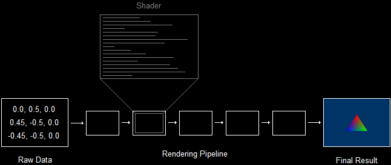
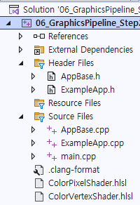

[Drawing a Triangle - DirectXTutorial](http://www.directxtutorial.com/Lesson.aspx?lessonid=11-4-5)   
[How To: Compile a Shader - MS Learn](https://learn.microsoft.com/en-us/windows/win32/direct3d11/how-to--compile-a-shader)   
[ID3DBlob interface - MS Learn](https://learn.microsoft.com/en-us/previous-versions/windows/desktop/legacy/ff728743(v=vs.85))   

# Introduce
screen에 triangle을 그리는 방법을 알아본다. 일련의 vertices를 만들고, 이를 화면에 그리도록 하여 삼각형을 만든다.   
```
1. Geometry를 rendering하는 방법을 GPU에게 알려준다.
2. 삼각형을 위한 세 개의 vertices를 생성한다.
3. video memory에 2번 과정에서 만든 vertices를 저장한다.
4. GPU에게 저장된 vertices를 읽는 방법에 대해 알려준다.
5. 삼각형을 rendering 한다.
```

# Using Shaders
첫 단계는 GPU에게 삼각형을 rendering하는 방법에 대해 알려주면서 시작한다.   
rendering 절차는 rendering pipeline에 의해 결정된다. 이러한 rendering pipeline은 rendered image를 생성하는 일련의 단계를 의미한다.   
하지만 그 pipeline은 알아서 무엇을 rendering 하는지 알지 못한다.   
따라서 **무엇을 rendering 할 것인지를 반드시 첫 번째로 "shaders"를 이용하여 프로그래밍 해야 한다**.   

   
shader라는 용어는 오해의 요지가 있다. 이는 shade( 음영 )를 만드는 것이 아니기 때문이다.   
**shader는 pipeline의 한 단계를 제어하는 mini-program**이다.   
이러한 shaders는 여러 TYPE이 있으며, rendering 중에 여러 번 실행된다. 예를 들면, **vertex shader는 rendering되는 각 vertex에 대해 한 번씩 실행**되는 프로그램인 반면에, **pixel shader는 각 pixel에 대해 실행**된다.   

**삼각형을 rendering 하기 위해서 특정 shaders를 GPU에게 load 해야만 한다**.   
shaders를 load 하기 위해선 3단계를 거친다.   
```
1. .shader file에서 2개의 shahders를 load 하고 compile 한다.
2. 두 shaders를 shader object로 캡슐화한다.
3. 두 shaders를 모두 active shader로 설정한다.
```

## 1. Load and compile the two shaders from the .shader file( .hlsl )
먼저, **rendering에 필요한 vertex shader와 pixel shader를 compile 한다**.   
하나의 shader를 load 하고 compile 하기 위해서 `D3DCompileFromFile()` 함수를 사용한다.   
[D3DCompileFromFile Function - MS Learn](https://learn.microsoft.com/en-us/windows/win32/api/d3dcompiler/nf-d3dcompiler-d3dcompilefromfile)   
```cpp
#include <d3dcompiler.h>

HRESULT D3DCompileFromFile(
  [in]            LPCWSTR                pFileName,       // HLSL code가 포함된 파일의 경로를 지정하는 문자열
  [in, optional]  const D3D_SHADER_MACRO *pDefines,       // 0
  [in, optional]  ID3DInclude            *pInclude,       // 0
  [in]            LPCSTR                 pEntrypoint,     // shader의 entry point 함수 이름을 지정하는 문자열, 일반적으로 "main"
  [in]            LPCSTR                 pTarget,         // shader target( pixel, vertex, ... )을 지정하는 문자열
  [in]            UINT                   Flags1,          // 0
  [in]            UINT                   Flags2,          // 0
  [out]           ID3DBlob               **ppCode,        // compiled shader binary가 저장될 ID3DBlob 객체의 이중 포인터
  [out, optional] ID3DBlob               **ppErrorMsgs    // compile 과정에서 발생한 오류나 경고 메시지가 저장될 ID3DBlob 객체의 이중 포인터
);
```
이 함수는 **HLSL( High Level Shader Language ) code를 compile** 한다.   

`pFileName`은 컴파일할 HLSL shader code가 포함된 파일의 경로를 지정하는 `LPCWSTR`이다.   
```cpp
func1 (const wstring &filename) {
  D3DCompileFromFile(filename.c_str(), ... );   // L"filename.hlsl"
}
```
   
이러한 shader file은 project 내부에 존재한다. 

**`pEntryPoint`는 shader entry point function의 이름을 저장**한다. **해당 함수에서 shader execution이 시작**한다.   
여기서는 `VShader`와 `PShader`다. 일반적으로 `"main"` 함수가 사용되지만, 다른 이름을 사용할 수도 있다.   

`pTarget`은 compile 할 shader의 대상 profile을 지정하는 문자열이다. **shader profile**은 compiler에게 우리가 compile할 shader 유형과 version을 의미한다.   
vertex shader는 `"vs_5_0"`이고, pixel shader는 `"ps_5_0"`이다. "vs"는 vertex shader를 의미하고, "_5_0"은 HLSL version 5.0을 의미한다.   

`**ppCode`는 compiled code에 접근하는데 사용하는 `ID3DBlob` interface에 대한 pointer를 받는 변수에 대한 pointer이다.   
`ID3DBlob` interface는 임의의 길이의 데이터를 반환하는 데 사용한다. 여기선 **shader의 compiled code를 넘겨준다**.   

`**ppErrorMsgs`는 compiler error messages에 접근하는 데 사용할 수 있는 `ID3DBlob` interface에 대한 pointer를 받는 변수에 대한 pointer이다.   
optional pointer이기 때문에 error가 발생하지 않으면 `NULL`이다.   
```cpp
void InitPipeline (const std::wstring& VSFilename, const std::wstring& PSFilename) {
	// load and compile the two shaders
	ID3DBlob* VS , * PS;
	ID3DBlob* VSErrorBlob, * PSErrorBlob;
	HRESULT vsHr = D3DCompileFromFile ( VSFilename.c_str () , 0 , 0 , "main" , "vs_5_0" , 0 , 0 , &VS , &VSErrorBlob );
	HRESULT psHr = D3DCompileFromFile ( PSFilename.c_str () , 0 , 0 , "main" , "ps_5_0" , 0 , 0 , &VS , &PSErrorBlob );
}
```
vertex shader의 경우, `{VSFilename}.hlsl` 파일을 load 한 후, 여기서 "main" 함수를 찾아 HLSL version 5.0으로 compile 한 후 결과를 `ID3DBlob`인 `VS`에 저장한다.   

### error handling
```cpp
void CheckResult ( HRESULT hr , ID3DBlob* errorBlob ) {
	if ( FAILED ( hr ) ) {
		// not exist file
		if ( ( hr & D3D11_ERROR_FILE_NOT_FOUND ) != 0 ) {
			std::cout << "File not found" << std::endl;
		}

		// output error message if exist error message
		if ( errorBlob ) {
			std::cout << "Shader compile error\n" << ( char* ) errorBlob->GetBufferPointer () << std::endl;
		}
	}
}

// void InitPipeline()
// load and compile the two shaders
// ...

// check error
CheckReulst(vsHr, VSErrorBlob);
CheckReulst(psHr, PSErrorBlob);
```

## 2. Encapsulate both shaders into shader objects
```cpp
// global
ID3D11VertexShader* pVS;      // the vertex shader
ID3D11PixelShader* pPS;       // the pixel shader
```
각 shader는 자신만의 COM object인 `ID3D11__Shader`에 저장된다.   
```cpp
// load and compile the two shaders
// ...

// check error
// ...

// encapsulate both shaders into shader objects
dev->CreateVertexShader(VS->GetBufferPointer(), VS->GetBufferSize(), NULL, &pVS);
dev->CreatePixelShader(PS->GetBufferPointer(), PS->GetBufferSize(), NULL, &pPS);
```
shader pointer가 준비되면, shader object를 `device->Create__Shader()`를 사용해서 생성한다.   
이 함수는 **compiled shader로부터 Shader COM object를 생성**한다.   

[ID3DBlob interface - MS Learn](https://learn.microsoft.com/en-us/previous-versions/windows/desktop/legacy/ff728743(v=vs.85))   
vertex shader COM object를 생성하고 간접적으로 접근하는 방법으로 위 함수를 알아본다.   
`VS( blob's data )`에 compiled shader code가 저장됐는데, 해당 COM object의 주소를 첫 인자로 넘긴다.   
두 번째 인자는 `VS`에 대한 크기를 넘긴다. 네 번째 인자는 shader COM object에 대한 주소를 넘긴다.   

이러면 `ID3D11VertexShader`와 `ID3D11PixelShader`에 compiled shader에 대한 주소를 통해 COM interface에 간접적으로 접근할 수 있다.   