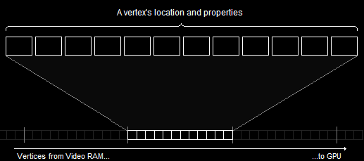
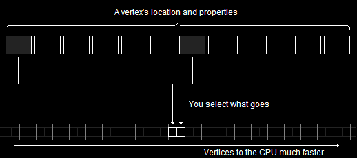
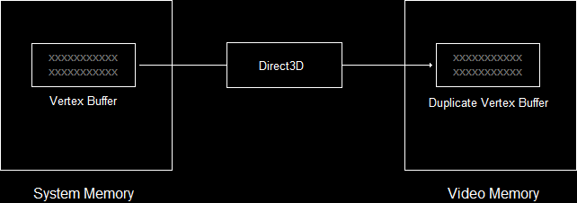

- [Introduce](#introduce)
- [Using Shaders](#using-shaders)
	- [1. Load and compile the two shaders from the .shader file( .hlsl )](#1-load-and-compile-the-two-shaders-from-the-shader-file-hlsl-)
		- [error handling](#error-handling)
	- [2. Encapsulate both shaders into shader objects](#2-encapsulate-both-shaders-into-shader-objects)
	- [3. Set both shaders to be the active shaders](#3-set-both-shaders-to-be-the-active-shaders)
	- [4. Release COM objects](#4-release-com-objects)
- [Vertex Buffers](#vertex-buffers)
	- [1. Creating Vertices](#1-creating-vertices)
	- [2. Creating a Vertex Buffer](#2-creating-a-vertex-buffer)
	- [3. Filling the Vertex Buffer](#3-filling-the-vertex-buffer)
- [Verifying the Input Layout](#verifying-the-input-layout)
	- [1. InputLayout?](#1-inputlayout)
	- [2. Create the Input Elements](#2-create-the-input-elements)
	- [3. Create the Input Layout Object](#3-create-the-input-layout-object)
- [Drawing the Primitive](#drawing-the-primitive)
	- [1. `IASetVertexBuffers()`](#1-iasetvertexbuffers)
	- [2. `IASetPrimitiveTopology()`](#2-iasetprimitivetopology)
	- [3. Draw()](#3-draw)
- [A Quick Review](#a-quick-review)
	- [1. Using Shaders](#1-using-shaders)
	- [2. Vertex Buffer](#2-vertex-buffer)
	- [3. Verifying the Input Layout](#3-verifying-the-input-layout)
	- [4. Drawing the Primitive](#4-drawing-the-primitive)
- [Final Code](#final-code)

<br><br>

[Drawing a Triangle - DirectXTutorial](http://www.directxtutorial.com/Lesson.aspx?lessonid=11-4-5)   
[How To: Compile a Shader - MS Learn](https://learn.microsoft.com/en-us/windows/win32/direct3d11/how-to--compile-a-shader)   
[ID3DBlob interface - MS Learn](https://learn.microsoft.com/en-us/previous-versions/windows/desktop/legacy/ff728743(v=vs.85))   

# Introduce
screen에 triangle을 그리는 방법을 알아본다. 일련의 vertices를 만들고, 이를 화면에 그리도록 하여 삼각형을 만든다.   
```
1. Geometry를 rendering하는 방법을 GPU에게 알려준다.
2. 삼각형을 위한 세 개의 vertices를 생성한다.
3. video memory에 2번 과정에서 만든 vertices를 저장한다.
4. GPU에게 저장된 vertices를 읽는 방법에 대해 알려준다.
5. 삼각형을 rendering 한다.
```

# Using Shaders
첫 단계는 GPU에게 삼각형을 rendering하는 방법에 대해 알려주면서 시작한다.   
rendering 절차는 rendering pipeline에 의해 결정된다. 이러한 rendering pipeline은 rendered image를 생성하는 일련의 단계를 의미한다.   
하지만 그 pipeline은 알아서 무엇을 rendering 하는지 알지 못한다.   
따라서 **무엇을 rendering 할 것인지를 반드시 첫 번째로 "shaders"를 이용하여 프로그래밍 해야 한다**.   

   
shader라는 용어는 오해의 요지가 있다. 이는 shade( 음영 )를 만드는 것이 아니기 때문이다.   
**shader는 pipeline의 한 단계를 제어하는 mini-program**이다.   
이러한 shaders는 여러 TYPE이 있으며, rendering 중에 여러 번 실행된다. 예를 들면, **vertex shader는 rendering되는 각 vertex에 대해 한 번씩 실행**되는 프로그램인 반면에, **pixel shader는 각 pixel에 대해 실행**된다.   

**삼각형을 rendering 하기 위해서 특정 shaders를 GPU에게 load 해야만 한다**.   
shaders를 load 하기 위해선 3단계를 거친다.   
```
1. .shader file에서 2개의 shahders를 load 하고 compile 한다.
2. 두 shaders를 shader object로 캡슐화한다.
3. 두 shaders를 모두 active shader로 설정한다.
```

## 1. Load and compile the two shaders from the .shader file( .hlsl )
먼저, **rendering에 필요한 vertex shader와 pixel shader를 compile 한다**.   
하나의 shader를 load 하고 compile 하기 위해서 `D3DCompileFromFile()` 함수를 사용한다.   
[D3DCompileFromFile Function - MS Learn](https://learn.microsoft.com/en-us/windows/win32/api/d3dcompiler/nf-d3dcompiler-d3dcompilefromfile)   
```cpp
#include <d3dcompiler.h>

HRESULT D3DCompileFromFile(
  [in]            LPCWSTR                pFileName,       // HLSL code가 포함된 파일의 경로를 지정하는 문자열
  [in, optional]  const D3D_SHADER_MACRO *pDefines,       // 0
  [in, optional]  ID3DInclude            *pInclude,       // 0
  [in]            LPCSTR                 pEntrypoint,     // shader의 entry point 함수 이름을 지정하는 문자열, 일반적으로 "main"
  [in]            LPCSTR                 pTarget,         // shader target( pixel, vertex, ... )을 지정하는 문자열
  [in]            UINT                   Flags1,          // 0
  [in]            UINT                   Flags2,          // 0
  [out]           ID3DBlob               **ppCode,        // compiled shader binary가 저장될 ID3DBlob 객체의 이중 포인터
  [out, optional] ID3DBlob               **ppErrorMsgs    // compile 과정에서 발생한 오류나 경고 메시지가 저장될 ID3DBlob 객체의 이중 포인터
);
```
이 함수는 **HLSL( High Level Shader Language ) code를 compile** 한다.   

`pFileName`은 컴파일할 HLSL shader code가 포함된 파일의 경로를 지정하는 `LPCWSTR`이다.   
```cpp
func1 (const wstring &filename) {
  D3DCompileFromFile(filename.c_str(), ... );   // L"filename.hlsl"
}
```
   
이러한 shader file은 project 내부에 존재한다. 

**`pEntryPoint`는 shader entry point function의 이름을 저장**한다. **해당 함수에서 shader execution이 시작**한다.   
여기서는 `VShader`와 `PShader`다. 일반적으로 `"main"` 함수가 사용되지만, 다른 이름을 사용할 수도 있다.   
이러한 **이름은 shader file 내부에 cpp의 entrypoint인 `main()`와 같은 이름을 지정하는 것**이다.   

`pTarget`은 compile 할 shader의 대상 profile을 지정하는 문자열이다. **shader profile**은 compiler에게 우리가 compile할 shader 유형과 version을 의미한다.   
vertex shader는 `"vs_5_0"`이고, pixel shader는 `"ps_5_0"`이다. "vs"는 vertex shader를 의미하고, "_5_0"은 HLSL version 5.0을 의미한다.   

`**ppCode`는 compiled code에 접근하는데 사용하는 `ID3DBlob` interface에 대한 pointer를 받는 변수에 대한 pointer이다.   
`ID3DBlob` interface는 임의의 길이의 데이터를 반환하는 데 사용한다. 여기선 **shader의 compiled code를 넘겨준다**.   

`**ppErrorMsgs`는 compiler error messages에 접근하는 데 사용할 수 있는 `ID3DBlob` interface에 대한 pointer를 받는 변수에 대한 pointer이다.   
optional pointer이기 때문에 error가 발생하지 않으면 `NULL`이다.   
```cpp
void InitPipeline () {
	// load and compile the two shaders
	ID3DBlob* VS , * PS;
	ID3DBlob* VSErrorBlob, * PSErrorBlob;
	HRESULT vsHr = D3DCompileFromFile ( L"Shader.hlsl" , 0 , 0 , "VShader" , "vs_5_0" , 0 , 0 , &VS , &VSErrorBlob );
	HRESULT psHr = D3DCompileFromFile ( L"Shader.hlsl" , 0 , 0 , "PShader" , "ps_5_0" , 0 , 0 , &VS , &PSErrorBlob );
}
```
vertex shader의 경우, `{VSFilename}.hlsl` 파일을 load 한 후, 여기서 "VShader" 함수를 찾아 HLSL version 5.0으로 compile 한 후 결과를 `ID3DBlob`인 `VS`에 저장한다.   

### error handling
```cpp
void CheckResult ( HRESULT hr , ID3DBlob* errorBlob ) {
	if ( FAILED ( hr ) ) {
		// not exist file
		if ( ( hr & D3D11_ERROR_FILE_NOT_FOUND ) != 0 ) {
			std::cout << "File not found" << std::endl;
		}

		// output error message if exist error message
		if ( errorBlob ) {
			std::cout << "Shader compile error\n" << ( char* ) errorBlob->GetBufferPointer () << std::endl;
		}
	}
}

// void InitPipeline()
// load and compile the two shaders
// ...

// check error
CheckReulst(vsHr, VSErrorBlob);
CheckReulst(psHr, PSErrorBlob);
```

## 2. Encapsulate both shaders into shader objects
```cpp
// global
ID3D11VertexShader* pVS;      // the vertex shader
ID3D11PixelShader* pPS;       // the pixel shader
```
각 shader는 자신만의 COM object인 `ID3D11{ }Shader`에 저장된다.   
```cpp
// load and compile the two shaders
// ...

// check error
// ...

// encapsulate both shaders into shader objects
dev->CreateVertexShader(VS->GetBufferPointer(), VS->GetBufferSize(), NULL, &pVS);
dev->CreatePixelShader(PS->GetBufferPointer(), PS->GetBufferSize(), NULL, &pPS);
```
shader pointer가 준비되면, shader object를 `device->Create{ }Shader()`를 사용해서 생성한다.    
이 함수는 **compiled shader로부터 Shader COM object를 생성**한다.   

[ID3DBlob interface - MS Learn](https://learn.microsoft.com/en-us/previous-versions/windows/desktop/legacy/ff728743(v=vs.85))   
vertex shader COM object를 생성하고 간접적으로 접근하는 방법으로 위 함수를 알아본다.   
`VS( blob's data )`에 compiled shader code가 저장됐는데, 해당 COM object의 주소를 첫 인자로 넘긴다.   
두 번째 인자는 `VS`에 대한 크기를 넘긴다. 네 번째 인자는 shader COM object에 대한 주소를 넘긴다.   

이러면 `ID3D11VertexShader`와 `ID3D11PixelShader`에 compiled shader에 대한 주소를 통해 COM interface에 간접적으로 접근할 수 있다.   

## 3. Set both shaders to be the active shaders
```cpp
// encapsulate both shaders into shader objects
// ...

// set the shader objects
devcon->VSSetShader(pVS, 0, 0);
devcon->PSSetShader(pPS, 0, 0);
```
`{ }SetShader()` 함수의 첫 인자는 설정할 shader object의 주소를 넘겨준다. 나머지는 나중에 살펴본다.   

## 4. Release COM objects
```cpp
// CleanD3D()
pVS->Release();
pPS->Release();
```
세 단계를 거쳐서 GPU는 정점들을 rendered image로 변환하는 데 필요한 모든 지침을 받았다.   
이제 삼각형을 위한 정점을 생성한다.   

# Vertex Buffers
[Input-Assembler Stage - MSLearn](https://learn.microsoft.com/ko-kr/windows/win32/direct3d11/d3d10-graphics-programming-guide-input-assembler-stage-getting-started)   

**vertex란, 3D space에서 하나의 정확한 point에 대한 location과 properties를 정의**한다.   
location은 세 개의 숫자로 구성되고, properties 또한 숫자 값으로 정의된다.   

Direct3D는 **input layout**이라고 불리는 것을 사용한다. input layout은 **vertex의 location과 properties를 포함하는 layout of the data**이다. 이러한 layout은 우리의 필요에 의해 수정하고 설정할 수 있는 format of data이다.   

하나의 vertex는 struct로 만들어지며, 이러한 구조체는 생성된 3D image에 관련된 데이터를 포함한다.   
이러한 **image를 보여주기 위해서 GPU에게 모든 정보를 복사한 다음, Direct3D에 데이터를 back buffer에 rendering 하도록 명령**한다.   

만약 하나의 vertex에 대해 필요한 모든 정보들을 보내야 한다면 어떻게 될까?   
   
여기서는 어떠한 문제가 발생하는지 바로 알 수 없다.   
이러한 **vertex information 중 두 개의 data block만 보낸다고 가정하면, GPU에게 더 빠르게 정보를 보낼 수 있다**.   
   
이러한 과정은 **input layout을 사용할 때 일어나는 일**이다.   
즉, **사용하려는 정보를 선택하고 해당 정보만 GPU에게 전송하면, 각 frame 사이에 더 많은 vertices를 전송할 수 있다**.   

## 1. Creating Vertices
```cpp
struct VERTEX {
	FLOAT X, Y, Z; // position
	D3D11_VIDEO_COLOR_RGBA Color;	// color
};
```
vertex에 대한 struct는 개발자가 원하는 데이터를 골라서 만들 수 있다.   
```cpp
VERTEX OurVertices[] = {
	{ 0.0f, 0.5f, 0.0f, D3D11_VIDEO_COLOR_RGBA(1.0f, 0.0f, 0.0f, 1.0f) },
	{ 0.45f, -0.5f, 0.0f, D3D11_VIDEO_COLOR_RGBA(0.0f, 1.0f, 0.0f, 1.0f) },
	{ -0.45f, -0.5f, 0.0f, D3D11_VIDEO_COLOR_RGBA(0.0f, 0.0f, 1.0f, 1.0f) }
};
```
위 vertices는 삼각형의 세 vertex를 의미한다. 이를 screen에 그려보자.   

## 2. Creating a Vertex Buffer
C++에서 하나의 struct를 생성할 때, 그 데이터는 system memory에 저장된다. 하지만 쉽게 접근할 수 없는 video memory에 생성한 데이터를 보내야 한다.   
   
이처럼 **video memory에 접근하기 위해서 Direct3D는 COM object를 제공**한다. 이 객체는 **system과 video memory 모두에서 buffer를 유지**할 수 있다.   
**rendering 과정에서 buffer에 있는 데이터를 필요로 할 때, Direct3D는 자동으로 그 데이터를 video memory로 복사**한다.   
**만약 video card의 memory가 부족한 경우, Direct3D는 사용하지 않는 또는 낮은 우선순위의 buffer를 제거해서 memory를 확보**한다.   

이러한 역할을 수행하는 COM object는 `ID3D11Buffer`이다. 이 객체를 생성하기 위해서 `CreateBuffer()` 함수를 사용한다.   
```cpp
ID3D11Buffer* pVBuffer; // global

D3D11_BUFFER_DESC bd;
ZeroMemory(&bd, sizeof(bd));

bd.Usage = D3D11_USAGE_DYNAMIC; // write access by CPU and GPU
bd.ByteWidth = sizeof(VERTEX) * 3; // size is the VERTEX struct * 3
bd.BindFlags = D3D11_BIND_VERTEX_BUFFER; // use as a vertex buffer
bd.CPUAccessFlags = D3D11_CPU_ACCESS_WRITE; // allow CPU to write in buffer and 0 if no CPU access is necessary

dev->CreateBuffer(&bd, NULL, &pVBuffer); // create the buffer
```
`D3D11_BUFFER_DESC`는 buffer의 properties를 포함하는 struct이다.   

buffer를 가능한 효율적으로 설정하기 위해서는 Direct3D는 buffer에 접근하는 방법을 알아야 한다.   
| Flag | CPU Access | GPU Access |
|:---:|:---:|:---:|
| `D3D11_USAGE_DEFAULT` | None | READ / WRITE |
| `D3D11_USAGE_IMMUTABLE` | None | READ only |
| `D3D11_USAGE_DYNAMIC` | WRITE only | READ only |
| `D3D11_USAGE_STAGING` | READ / WRITE | READ / WRITE |

`ByteWidth`는 생성할 buffer의 size를 포함한다. 이 값은 buffer에 넣으려는 array of vertices와 같은 크기를 가진다.   

`BindFlags` 값은 Direct3D에게 어떤 종류의 buffer를 만들 것인지 알려준다. vertex buffer는 `D3D11_BIND_VERTEX_BUFFER` flag를 사용한다.   

`CPUAccessFlags`는 Direct3D가 CPU에 접근하는 방법을 알려줌으로써 usage flags에 명확성을 더한다. 여기서 사용할 flag는 `Usage`에서 사용한 flag와 일치하는 경우에만 사용할 수 있다.   
`D3D11_CPU_ACCESS_WRITE`는 system memory를 buffer로 복사하기 위해 사용한다.   

`device->CreateBuffer()`는 buffer를 생성하는 함수다.   
첫 인자는 buffer struct에 대한 주소를 넘긴다. 두 번째 인자는 buffer 생성 시에 buffer를 특정 데이터로 초기화하는 데 사용할 수 있다. 세 번째 인자는 buffer object의 주소를 넘긴다.   
여기서는 vertex buffer를 생성하여 이를 COM object로 가리킨다.   

## 3. Filling the Vertex Buffer
삼각형을 만들기 위한 vertices와 이를 저장하는 vertex buffer를 가졌다.   
이제는 이러한 **vertices를 buffer에 복사하는 기능을 구현**한다.   

하지만 Direct3D가 background에서 buffer에 대해 작업하고 있을 수 있으므로, Direct3D는 CPU가 그 buffer에 직접 접근하도록 허용하지 않는다. 그 buffer에 접근하기 위해서는 먼저 buffer를 mapping 해야 한다.   
즉, **Direct3D가 CPU에서 buffer에 대해 진행 중인 모든 작업이 완료되도록 한 뒤, buffer가 unmapping 될 때까지 GPU가 그 buffer를 사용하는 것을 막는다**.   
```
1. Map the vertex buffer ( and thereby obtain the buffer's location ).
2. data를 buffer에 복사한다( using memcpy() ).
3. Unmap the buffer
```
```cpp
D3D11_MAPPED_SUBRESOURCE ms;
devcon->Map(pVBuffer, NULL, D3D11_MAP_WRITE_DISCARD, NULL, &ms);		// map the buffer
memcpy(ms.pData, OurVertices, sizeof(OurVertices)); // copy the data
devcon->Unmap(pVBuffer, NULL); // unmap the buffer
```
`D3D11_MAPPED_SUBRESOURCE`는 buffer를 mapping 한 후, 해당 buffer에 대한 정보를 채우는 struct이다.   
이 정보에는 buffer's location에 대한 pointer를 포함한다. `ms.pData`를 통해 해당 pointer에 접근할 수 있다.   

`DeviceContext->Map()`는 buffer에 접근하기 위해서 해당 buffer를 mapping 한다.   
첫 인자는 buffer object의 주소를 넘긴다.   
세 번째 인자는 buffer가 mapping 되어 있는 동안에 CPU가 해당 buffer에 접근할 수 있도록 제어하는 flag를 넘긴다. `D3D11_MAP_WRITE_DISCARD`는 이전 buffer의 내용은 지우고, 새로운 buffer를 열어서 쓸 수 있도록 한다.   
네 번째 인자는 `NULL` 또는 `D3D11_MAP_FLAG_DO_NOT_WAIT` flag를 넘길 수 있다. 이는 program이 GPU가 buffer를 mapping 하는 중에도 계속 동작하도록 강제할 수 있다.   
마지막 인자는 `D3D11_MAPPED_SUBRESOURCE` struct의 주소를 넘긴다.   

이 함수는 마지막 인자의 struct를 채우는 데 필요한 정보를 제공한다.   

`memcpy()`에서 `ms.pData`가 destination, `OurVertices`가 source, 그리고 `sizeof(OurVertices)`가 size이다.   

`DeviceContext->Unmap()`은 buffer를 unmapping 한다. GPU가 buffer에 접근하도록 다시 허용하고, CPU를 buffer에 접근하지 못하도록 다시 차단한다.   

```cpp
// a struct to define a single vertex
struct VERTEX { FLOAT X , Y , Z; D3D11_VIDEO_COLOR_RGBA Color; }
ID3D11Buffer* pVBuffer;							// the pointer to vertex buffer

void InitGraphics () {
	// create a triangle
	VERTEX OurVertices[] = {
		{ 0.0f, 0.5f, 0.0f, D3D11_VIDEO_COLOR_RGBA ( 1.0f, 0.0f, 0.0f, 1.0f ) },
		{ 0.45f, -0.5f, 0.0f, D3D11_VIDEO_COLOR_RGBA ( 0.0f, 1.0f, 0.0f, 1.0f ) },
		{ -0.45f, -0.5f, 0.0f, D3D11_VIDEO_COLOR_RGBA ( 0.0f, 0.0f, 1.0f, 1.0f ) }
	};

	// create the vertex buffer
	D3D11_BUFFER_DESC bd;
	ZeroMemory ( &bd , sizeof ( bd ) );

	bd.Usage = D3D11_USAGE_DYNAMIC;
	bd.ByteWidth = sizeof ( VERTEX ) * 3;
	bd.BindFlags = D3D11_BIND_VERTEX_BUFFER;
	bd.CPUAccessFlags = D3D11_CPU_ACCESS_WRITE;

	dev->CreateBuffer ( &bd , NULL , &pVBuffer );		// create the buffer

	// copy the vertices into the buffer
	D3D11_MAPPED_SUBRESOURCE ms;
	devcon->Map ( pVBuffer , NULL , D3D11_MAP_WRITE_DISCARD , NULL , &ms );
	memcpy ( ms.pData , OurVertices , sizeof ( OurVertices ) );
	devcon->Unmap ( pVBuffer , NULL );
}
```

# Verifying the Input Layout
지금까지 정리하면, 
1. pipeline을 제어하기 위해서 shaders를 load 하고 set 했다.
2. vertices를 사용하여 shape를 생성하고, 이를 GPU가 사용할 수 있도록 준비했다.

## 1. InputLayout?
user-defined struct에 vertices를 저장했을 때, GPU가 어떻게 이러한 정점들을 읽을 수 있는 능력이 있는지?   
struct에 color 전에 location을 먼저 배치한 것을 어떻게 알 수 있는지?   
다른 의도가 없다는 것을 어떻게 알 수 있는지?   
**위 답은 "input layout"** 이다.   

**input layout은 vertex struct의 layout을 포함하는 object**이다.   
[Graphics Pipeline](https://learn.microsoft.com/en-us/windows/win32/direct3d11/overviews-direct3d-11-graphics-pipeline)에서 Input-Assembler stage는 Memory Resource( Buffer, Texture, Constant Buffer )를 입력 받는다. 이러한 데이터는 IA로 들어간 후, shaders를 통과해서 진행된다.   
**Memory Resources에서 IA로 들어가는 input vertex 데이터의 배치 상태( layout )이라서 이름이 InputLayout**이다.   
```cpp
vector<D3D11_INPUT_ELEMENT_DESC> samplingIED = {
	{"POSITION", 0, DXGI_FORMAT_R32G32B32_FLOAT, 0, 0, D3D11_INPUT_PER_VERTEX_DATA, 0},
	{"NORMAL", 0, DXGI_FORMAT_R32G32B32_FLOAT, 0, 4 * 3, D3D11_INPUT_PER_VERTEX_DATA, 0},
	{"TEXCOORD", 0, DXGI_FORMAT_R32G32_FLOAT, 0, 4 * 3 + 4 * 3, D3D11_INPUT_PER_VERTEX_DATA, 0}
};
```
예를 들면, 위 layout은 Vertex 하나의 데이터가 POINT는 4byte float 3개, normal float 3개, Texcoord float 2개의 배치 구조를 가진다.   

Rendering을 할 때, `IASetVertexBuffes()`를 호출하여 어떤 Vertex 데이터를 넣는지 지정하고, `IASetInputLayout()`을 호출하여 그 Vertex 데이터가 어떻게 구성되어 있는지를 지정한다.   
이때 `IASetInputLayout()`에 `CreateInputLayout()`에서 생성한 layout을 넣는다.   

## 2. Create the Input Elements
vertex layout은 하나 또는 더 많은 input elements로 구성된다. **하나의 input element는 vertex의 하나의 property를 나타낸다**. 예를 들면, position과 color가 있다.   
각 element는 `D3D11_INPUT_ELEMENT_DESC`라는 struct에 정의된다. 이 구조체는 하나의 vertex property를 설명한다.   
```cpp
D3D11_INPUT_ELEMENTS_DESC ied[] = {
	{ "POSITION", 0, DXGI_FORMAT_R32G32B32_FLOAT, 0, 0, D3D11_INPUT_PER_VERTEX_DATA, 0 },
	{ "COLOR", 0, DXGI_FORMAT_R32G32B32A32_FLOAT, 0, 12, D3D11_INPUT_PER_VERTEX_DATA, 0 },
};
```
해당 구조체는 7개의 value를 요구한다.   

**첫 인자는 semantic name**이다. semantic은 GPU에게 struct가 사용되는 용도를 알려주는 문자열이다.   

**두 번째 인자는 같은 semantic name을 가진 복수의 properties를 구분하기 위한 semantic index**이다.   
하나의 vertex가 여러 개의 color를 가진다면, 둘 다 `COLOR` semantic name을 사용한다. 이러한 혼란을 피하기 위해서 우리는 각 property에 다른 숫자를 부여한다.   

**세 번째 인자는 데이터의 format( 형식 )**이다. vertex data의 memory 내 저장 형식과 해석 방식을 결정한다.   
`DXGI_FORMAT_R32G32B32_FLOAT`는 3차원 vector<float>에 RGBA가 32bit로 저장된다.   

**네 번째 인자는 input slot**이다.   

**다섯 번째 인자는 해당 element가 vertex struct 내에서 시작하는 byte 위치를 지정**한다.   
이는 offset이라 부르며, position의 0 offset은 시작 byte 위치를 나타내고 color 또한 12 offset에서 시작한다는 의미다.   
`D3D11_APPEND_ALIGNED_ELEMENT`를 넣으면 알아서 byte offset을 계산한다.   

**여섯 번째 인자는 input slot class로, 해당 input element가 정점 당( vertex data of per-vertex ) 데이터인지, per-instance 데이터인지를 나타낸다**.   

마지막 인자는 사용하지 않기 때문에 0으로 세팅한다.   

## 3. Create the Input Layout Object
vertex format을 나타내는 object를 생성한다.   
```cpp
HRESULT CreateInputLayout (
	D3D11_INPUT_ELEMENT_DESC* pInputElementDescs,
	UINT NumElements,
	void* pShaderBytecodeWithInputSignature,
	SIZE_T BytecodeLength,
	ID3D11InputLayout** pInputLayout
);
```
`D3D11_INPUT_ELEMENT_DESC*`는 element description array에 대한 pointer이다.   
`NumElements`는 array size를 나타낸다.   
`pShaderBytecodeWithInputSignature`는 pipeline의 vertex shader에 대한 pointer를 나타낸다.   
`BytecodeLength`는 shader file의 길이를 나타낸다.   
`ID3D11InputLayout**`는 input layout object에 대한 pointer이다.   
```cpp
ID3D11InputLayout* pLayout;		// global

void InitPipeline(const std::wstring& VSFilename, const std::wstring& PSFilename) {
	// load and compile the two shaders

	// encapsulate both shaders into shader objects

	// set the shader objects

	// create the input layout object
	D3D11_INPUT_ELEMENTS_DESC ied[] = {
		{ "POSITION", 0, DXGI_FORMAT_R32G32B32_FLOAT, 0, 0, D3D11_INPUT_PER_VERTEX_DATA, 0 },
		{ "COLOR", 0, DXGI_FORMAT_R32G32B32A32_FLOAT, 0, 12, D3D11_INPUT_PER_VERTEX_DATA, 0 },
	};
	dev->CreateInputLayout(ied, 2, VS->GetBufferPointer(), VS->GetBufferSize(), &pLayout);
	devcon->IASetInputLayout(pLayout);
}
```
VS의 file( `GetBufferPointer()` )과 size( `GetBufferSize()`)에 접근할 필요가 있기 때문에 `InitPipeline()`에 작성한다.   
이러한 Input Layout을 생성해도 해당 object의 세팅이 완료될 때까지는 아무런 동작을 할 수 없다. 따라서 `IASetInputLayout()`을 호출하여 설정을 완료한다.   

# Drawing the Primitive
rendering을 하기 위한 3가지 함수에 대해 알아본다.   
첫 번째 함수는 우리가 사용할 vertex buffer를 세팅한다. 두 번째 함수는 우리가 사용할 primitive TYPE을 세팅한다. 세 번째 함수는 shape를 그린다.   

## 1. `IASetVertexBuffers()`
rendering 할 때 GPU에게 어떤 vertices를 읽어야 할 지 알려준다.   
```cpp
void IASetVertexBuffers(
	UINT StartSlot,
	UINT NumBuffers,
	ID3D11Buffer** ppVertexBuffers,
	UINT* pStrides,
	UINT* pOffsets
);
```
`NumBuffers`는 세팅할 buffer의 개수를 말한다.   
`ID3D11Buffer**`는 vertex buffer array에 대한 pointer이다.   
`*pStrides`는 `UINT` array를 가리킨다. 이러한 array는 각 vertex buffer에 있는 단일 vertex의 크기를 알려준다.   
이 인자를 채우려면 `UINT`를 생성하고, `sizeof(VERTEX)`로 채운 다음 여기에 해당 `UINT`에 대한 주소를 넣는다.   
`*pOffsets`는 rendering을 시작할 vertex buffer의 bytes 수를 알려주는 `UINT` 배열이다. 이 또한 `*pStrides`처럼 사용한다.   
```cpp
UINT stride = sizeof(VERTEX);
UINT offset = 0;
devcon->IASetVertexBuffers(0, 1, &pBuffer, &stride, &offset);
```

## 2. `IASetPrimitiveTopology()`
우리가 사용할 primitive TYPE이 무엇인지 Direct3D에게 알려준다.   
이 함수는 하나의 flag만 인자로 받는다.   
```cpp
devcon->IASetPrimitiveTopology(D3D11_PRIMITIVE_TOPOLOGY_TRIANGLELIST);
```

## 3. Draw()
이제 Direct3D가 vertex buffer에 있는 contents를 그리도록 만든다.   
이 함수는 vertex buffer에 있는 primitives를 back buffer에 그린다.   
```cpp
void Draw(
	UINT VertexCount, // the number of vertices to be drawn
	UINT StartVertexLocation, // the first vertex to be drawn
);
```
첫 인자는 그려야 할 vertices의 수를 나타내며, 두 번째 인자는 buffer의 첫 vertex의 번호를 말한다.   
```cpp
devcon->Draw(3, 0);	// draw 3 vertices, starting from vertex 0
```

```cpp
void RenderFrame() {
	// select which vertex buffer to display
	UINT stride = sizeof(VERTEX);
	UINT offset = 0;
	devcon->IASetVertexBuffers(0, 1, &pVBuffer, &stride, &offset);

	// select which primitive type we are using
	devcon->IASetPrimitiveTopology(D3D11_PRIMITIVE_TOPOLOGY_TRIANGLELIST);

	// draw the vertex buffer to the back buffer
	devcon->Draw(3, 0);

	// switch the back buffer and the front buffer
}
```

# A Quick Review
## 1. Using Shaders
Shaders는 rendering에서 GPU에 명령하는 작은 프로그램이다. Rendering은 shaders 없이는 불가능하다.   
따라서 우리가 사용할 shaders를 가져와서 GPU에 load 했다.   
```cpp
void InitPipeline();
```
해당 함수에서 수행한 세 과정을 살펴본다.
```
1. 사용할 shaders를 load 하고 compile 했다.
2. 각 shaders에 대한 object를 생성한다.
3. 생성한 object를 세팅한다.
```

## 2. Vertex Buffer
하나의 vertex를 표현하는 struct와 Vertex Buffer Object를 생성했다.   
여기서 vertex buffer object는 video memory에 있는 vertices를 다룰 수 있다.   
```cpp
void InitGraphics();
```
해당 함수에서 수행한 세 과정을 살펴본다.
```
1. position과 color를 가진 세 vertices를 생성했다.
2. vertex buffer object를 생성했다.
3. vertices를 vertex buffer에 복사하기 위해서 해당 buffer를 매핑하고, 이 과정이 끝난 후 언-매핑을 수행했다.
```

## 3. Verifying the Input Layout
input layout을 사용하여 vertex buffer와 shader를 조정하는 방법에 대해 알아봤다.   
```cpp
void InitPipeline();
```
이 함수에서 수행한 세 과정을 살펴본다.
```
1. position과 color에 대한 input elements description array를 생성했다.
2. shader 정보를 사용해서 input layout object를 생성했다.
3. input layout object를 세팅했다.
```

## 4. Drawing the Primitive
최종 목표인 삼각형을 그려봤다.   
```cpp
void RenderFrame();
```
이 함수에서 세 과정을 살펴본다.
```
1. 사용할 vertex buffer를 지정한다.
2. 사용할 primitive TYPE을 설정한다.
3. 삼각형을 그린다.
```

# Final Code
```cpp
#include "pch.h"

#pragma comment (lib, "d3d11.lib")
#pragma comment (lib, "d3dcompiler.lib")		// D3DCompileFromFile LinkError Solution

#define SCREEN_WIDTH 1280
#define SCREEN_HEIGHT 960

IDXGISwapChain* swapChain;					// the pointer to the swap chain interface
ID3D11Device* dev;									// the pointer to our Direct3D device interface
ID3D11DeviceContext* devcon;				// the pointer to our Direct3D device context
ID3D11RenderTargetView* backBuffer;	// the pointer to our back buffer
ID3D11VertexShader* pVS;						// the pointer to vertex shader
ID3D11PixelShader* pPS;							// the pointer to pixel shader
ID3D11Buffer* pVBuffer;							// the pointer to vertex buffer
ID3D11InputLayout* pLayout;					// the pointer to the input layout

// a struct to define a single vertex
struct VERTEX { FLOAT X , Y , Z; D3D11_VIDEO_COLOR_RGBA Color; };

bool InitD3D ( HWND hWnd );
void RenderFrame ();
void InitPipeline ();
void CleanD3D ();
void InitGraphics ();
LRESULT CALLBACK WndProc ( HWND hwnd , UINT msg , WPARAM wParam , LPARAM lParam );

int main ()
{
	WNDCLASSEX wc;
	ZeroMemory ( &wc , sizeof ( WNDCLASSEX ) );

	wc.cbSize = sizeof ( WNDCLASSEX );
	wc.style = CS_CLASSDC;
	wc.lpfnWndProc = WndProc;
	wc.hCursor = LoadCursor ( NULL , IDC_ARROW );
	//wc.hbrBackground = ( HBRUSH ) COLOR_WINDOW;
	wc.lpszClassName = L"WindowClass1";

	if ( !RegisterClassEx ( &wc ) ) {
		std::cout << "RegisterClassEx() failed." << std::endl;
		return -1;
	}

	RECT wr = { 0, 0, SCREEN_WIDTH, SCREEN_HEIGHT };
	AdjustWindowRect ( &wr , WS_OVERLAPPEDWINDOW , FALSE );

	HWND mainWindow = CreateWindowEx ( 
		NULL ,
		wc.lpszClassName ,     // name of the window class
		L"window1 title" ,     // title of the window
		WS_OVERLAPPEDWINDOW ,  // window style
		0 ,                    // x-position of the window
		0 ,                    // y-position of the window
		wr.right - wr.left ,   // width of the window
		wr.bottom - wr.top ,   // height of the window
		NULL ,                 // we have no parent window
		NULL ,                 // we aren't using menus
		wc.hInstance ,         // apllication handle
		NULL									 // used with multiple windows
	);

	if ( !mainWindow ) {
		std::cout << "CreateWindow() failed." << std::endl;
		return -1;
	}

	ShowWindow ( mainWindow , SW_SHOWDEFAULT );
	UpdateWindow ( mainWindow );

	if ( !InitD3D ( mainWindow ) ) {
		std::cout << "InitD3D() failed." << std::endl;
		return -1;
	}

	MSG msg = { 0 };
	// check to see if it is time to quit
	while ( WM_QUIT != msg.message ) {
		// check to see if any messages are waiting in the queue
		if ( PeekMessage ( &msg , NULL , 0 , 0 , PM_REMOVE ) ) {
			TranslateMessage ( &msg );
			DispatchMessage ( &msg );
		}
		else {
			RenderFrame ();
		}
	}

	CleanD3D ();

	return 0;
}

bool InitD3D ( HWND hWnd ) {

	// Init Direct3D
	DXGI_SWAP_CHAIN_DESC scd;
	ZeroMemory ( &scd , sizeof ( scd ) );
	scd.BufferCount = 1;
	scd.BufferDesc.Format = DXGI_FORMAT_R8G8B8A8_UNORM;
	scd.BufferDesc.Width = SCREEN_WIDTH;
	scd.BufferDesc.Height = SCREEN_HEIGHT;
	scd.BufferUsage = DXGI_USAGE_RENDER_TARGET_OUTPUT;
	scd.OutputWindow = hWnd;
	scd.SampleDesc.Count = 4;
	scd.Windowed = TRUE;
	scd.Flags = DXGI_SWAP_CHAIN_FLAG_ALLOW_MODE_SWITCH;

	if ( FAILED ( D3D11CreateDeviceAndSwapChain ( NULL ,
		D3D_DRIVER_TYPE_HARDWARE ,
		NULL ,
		NULL ,
		NULL ,
		NULL ,
		D3D11_SDK_VERSION ,
		&scd ,
		&swapChain ,
		&dev ,
		NULL ,
		&devcon ) ) ) {
		std::cout << "D3D11CreateDeviceAndSwapChain() failed." << std::endl;
		return false;
	}

	// Set the render target
	ID3D11Texture2D* pBackBuffer;
	swapChain->GetBuffer ( 0 , __uuidof( ID3D11Texture2D ) , ( LPVOID* ) &pBackBuffer );
	if ( pBackBuffer ) {
		dev->CreateRenderTargetView ( pBackBuffer , NULL , &backBuffer );
		pBackBuffer->Release ();
	}
	else {
		std::cout << "CreateRenderTargetView() failed." << std::endl;
		return false;
	}
	devcon->OMSetRenderTargets ( 1 , &backBuffer , NULL );

	// Set the viewport
	D3D11_VIEWPORT viewPort;
	ZeroMemory ( &viewPort , sizeof ( D3D11_VIEWPORT ) );
	viewPort.TopLeftX = 0;
	viewPort.TopLeftY = 0;
	viewPort.Width = 1280;
	viewPort.Height = 960;
	devcon->RSSetViewports ( 1 , &viewPort );

	InitPipeline ();
	InitGraphics ();

	return true;
}

void RenderFrame () {
	// clear the back buffer to a deep blue
	float clearColor[ 4 ] = { 0.0f, 0.2f, 0.4f, 1.0f };
	devcon->ClearRenderTargetView ( backBuffer , clearColor);

	// select which vertex buffer to display
	UINT stride = sizeof ( VERTEX );
	UINT offset = 0;
	devcon->IASetVertexBuffers ( 0 , 1 , &pVBuffer , &stride , &offset );
	devcon->IASetPrimitiveTopology ( D3D11_PRIMITIVE_TOPOLOGY_TRIANGLELIST );
	devcon->Draw(3, 0);

	// switch the back buffer and the front buffer
	swapChain->Present ( 0 , 0 );
}

void CheckResult ( HRESULT hr , ID3DBlob* errorBlob ) {
	if ( FAILED ( hr ) ) {
		// not exist file
		if ( ( hr & D3D11_ERROR_FILE_NOT_FOUND ) != 0 ) {
			std::cout << "File not found" << std::endl;
		}

		// output error message if exist error message
		if ( errorBlob ) {
			std::cout << "Shader compile error\n" << ( char* ) errorBlob->GetBufferPointer () << std::endl;
		}
	}
}

void CleanD3D () {
	swapChain->SetFullscreenState ( FALSE , NULL );

	pLayout->Release ();
	pVS->Release ();
	pPS->Release ();
	pVBuffer->Release ();
	swapChain->Release ();
	backBuffer->Release ();
	dev->Release ();
	devcon->Release ();
}

void InitPipeline () {
	// load and compile the two shaders
	ID3DBlob* VS{} , * PS{};
	ID3DBlob* VSErrorBlob, * PSErrorBlob;
	HRESULT vsHr = D3DCompileFromFile ( L"shaders.shader" , 0 , 0 , "VShader" , "vs_4_0" , 0 , 0 , &VS , &VSErrorBlob );
	HRESULT psHr = D3DCompileFromFile ( L"shaders.shader" , 0 , 0 , "PShader" , "ps_4_0" , 0 , 0 , &PS , &PSErrorBlob );

	// check error
	CheckResult ( vsHr , VSErrorBlob );
	CheckResult ( psHr , PSErrorBlob );

	// encapsulate both shaders into shader objects
	dev->CreateVertexShader ( VS->GetBufferPointer () , VS->GetBufferSize () , NULL , &pVS );
	dev->CreatePixelShader ( PS->GetBufferPointer () , PS->GetBufferSize () , NULL , &pPS );

	// set the shader objects
	devcon->VSSetShader ( pVS , 0 , 0 );
	devcon->PSSetShader ( pPS , 0 , 0 );

	// create the input layout object
	D3D11_INPUT_ELEMENT_DESC ied[] = {
		{ "POSITION", 0, DXGI_FORMAT_R32G32B32_FLOAT, 0, 0, D3D11_INPUT_PER_VERTEX_DATA, 0 },
		{ "COLOR", 0, DXGI_FORMAT_R32G32B32A32_FLOAT, 0, 12, D3D11_INPUT_PER_VERTEX_DATA, 0 },
	};
	dev->CreateInputLayout ( ied , 2 , VS->GetBufferPointer () , VS->GetBufferSize () , &pLayout );
	devcon->IASetInputLayout ( pLayout );
}

void InitGraphics () {
	// create a triangle
	VERTEX OurVertices[] = {
		{ 0.0f, 0.5f, 0.0f, D3D11_VIDEO_COLOR_RGBA ( 1.0f, 0.0f, 0.0f, 1.0f ) },
		{ 0.45f, -0.5f, 0.0f, D3D11_VIDEO_COLOR_RGBA ( 0.0f, 1.0f, 0.0f, 1.0f ) },
		{ -0.45f, -0.5f, 0.0f, D3D11_VIDEO_COLOR_RGBA ( 0.0f, 0.0f, 1.0f, 1.0f ) }
	};
	

	// create the vertex buffer
	D3D11_BUFFER_DESC bd;
	ZeroMemory ( &bd , sizeof ( bd ) );

	bd.Usage = D3D11_USAGE_DYNAMIC;
	bd.ByteWidth = sizeof ( VERTEX ) * 3;
	bd.BindFlags = D3D11_BIND_VERTEX_BUFFER;
	bd.CPUAccessFlags = D3D11_CPU_ACCESS_WRITE;

	dev->CreateBuffer ( &bd , NULL , &pVBuffer );		// create the buffer

	// copy the vertices into the buffer
	D3D11_MAPPED_SUBRESOURCE ms;
	devcon->Map ( pVBuffer , NULL , D3D11_MAP_WRITE_DISCARD , NULL , &ms );
	memcpy ( ms.pData , OurVertices , sizeof ( OurVertices ) );
	devcon->Unmap ( pVBuffer , NULL );
}

LRESULT CALLBACK WndProc ( HWND hwnd , UINT msg , WPARAM wParam , LPARAM lParam ) {
	switch ( msg ) {
	case WM_SIZE:
		// Reset and resize swapchain
		break;
	case WM_SYSCOMMAND:
		if ( ( wParam & 0xfff0 ) == SC_KEYMENU ) // Disable ALT application menu
			return 0;
		break;
	case WM_MOUSEMOVE:
		// cout << "Mouse " << LOWORD(lParam) << " " << HIWORD(lParam) << endl;
		break;
	case WM_LBUTTONUP:
		// cout << "WM_LBUTTONUP Left mouse button" << endl;
		break;
	case WM_RBUTTONUP:
		// cout << "WM_RBUTTONUP Right mouse button" << endl;
		break;
	case WM_KEYDOWN:
		// cout << "WM_KEYDOWN " << (int)wParam << endl;
		break;
	case WM_DESTROY:
		::PostQuitMessage ( 0 );
		return 0;
	}

	return DefWindowProc ( hwnd , msg , wParam , lParam );
}
```