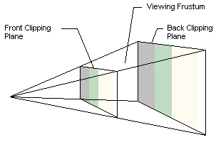
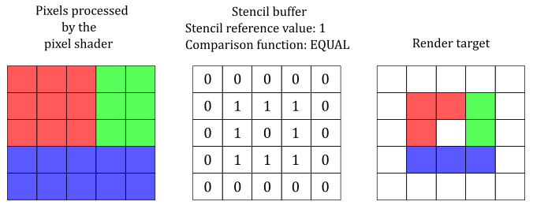

- [Introduce](#introduce)
- [bool InitD3D()](#bool-initd3d)
	- [1. Creating Device And DeviceContext](#1-creating-device-and-devicecontext)
		- [1.1. Feature Level](#11-feature-level)
		- [1.2. Check Device, DeviceContext And QueryInterface()](#12-check-device-devicecontext-and-queryinterface)
		- [1.3. COM interface와 Reference Count](#13-com-interface와-reference-count)
	- [2. Creating Swap Chain](#2-creating-swap-chain)
		- [2.1. CheckMultisampleQualityLevels() - MSAA](#21-checkmultisamplequalitylevels---msaa)
		- [2.2. IDXGIFactory::CreateSwapChain() vs D3D11CreateDevcieAndSwapChain()](#22-idxgifactorycreateswapchain-vs-d3d11createdevcieandswapchain)
	- [3. Creating Render Target View](#3-creating-render-target-view)
		- [3.1. GetBuffer()](#31-getbuffer)
		- [3.2. CreateRenderTargetView()](#32-createrendertargetview)
	- [4. Creating Viewport](#4-creating-viewport)
		- [4.1. RSSetViewports()](#41-rssetviewports)
	- [5. Rasterizer State](#5-rasterizer-state)
		- [5.1. Rasterizer Stage](#51-rasterizer-stage)
		- [5.2. D3D11\_RASTERIZER\_DESC](#52-d3d11_rasterizer_desc)
		- [5.3. CreateRasterizerState()](#53-createrasterizerstate)
	- [6. Creating Depth And Stencil Buffer](#6-creating-depth-and-stencil-buffer)
		- [6.1. View Frustum](#61-view-frustum)
		- [6.2. Stencil Buffer](#62-stencil-buffer)
		- [6.3. Depth Buffer( Z-Buffer )](#63-depth-buffer-z-buffer-)
		- [6.4. D3D11\_TEXTURE2D\_DESC](#64-d3d11_texture2d_desc)
		- [6.5. CreateTexture2D()](#65-createtexture2d)
		- [6.6. CreateDepthStencilView()](#66-createdepthstencilview)
		- [6.7. D3D11\_DEPTH\_STENCIL\_DESC](#67-d3d11_depth_stencil_desc)
		- [6.8. CreateDepthStencilState()](#68-createdepthstencilstate)

# Introduce
지금까진 2D 환경에서 삼각형을 그려봤다면, 이제는 3D 환경에서 육면체를 그려보면서 Direct3D를 초기화한다.   
나중에 클래스의 멤버 함수로 만들기 위해서 초기화에만 필요한 변수와 기능을 살펴본다.   

# bool InitD3D()
기존에는 **device, device_context, swap_chain, render_target_view, viewport**를 생성했다면, 여기서 **rasterizer_state, depth_stencil_buffer, depth_stencil_view, depth_stencil_state**를 추가로 생성한다.   
```cpp
// global variables
#define SCREEN_WIDTH 1280
#define SCREEN_HEIGHT 960
HWND g_mainWindow;

ID3D11Device* g_device;
ID3D11DeviceContext* g_devcon;
IDXGISwapChain* g_swapChain;
ID3D11RenderTargetView* g_renderTargetView;
ID3D11RasterizerState* g_rasterizerState;

// depth buffer
ID3D11Texture2D* g_depthStencilBuffer;
ID3D11DepthStencilView* g_depthStencilView;
ID3D11DepthStencilState* g_depthStencilState;

D3D11_VIEWPORT g_viewport;
```
Direct3D를 초기화하면서 생성하는 변수들이다.   

## 1. Creating Device And DeviceContext
먼저 device, device_context를 생성한다.   
```cpp
bool InitD3D () {
	// Creating [ device, device_context, swap_chain, render_target_view, viewport, rasterizer_state ]
	// Creating [ depth_stencil_buffer, depth_stencil_view, 

	UINT createDeviceFlags = 0;
#if defined(DEBUG) || defined(_DEBUG)
	createDeviceFlags |= D3D11_CREATE_DEVICE_DEBUG;
#endif

	const D3D_DRIVER_TYPE driverType = D3D_DRIVER_TYPE_HARDWARE;	// D3D_DRIVER_TYPE_WARP( Driver 호환성 문제가 발생하면 )
	const D3D_FEATURE_LEVEL featureLevels[ 2 ] = {
		D3D_FEATURE_LEVEL_11_0,
		D3D_FEATURE_LEVEL_9_3
	};

	ID3D11Device* device; 
	ID3D11DeviceContext* devcon;
	D3D_FEATURE_LEVEL featureLevel;

	if ( FAILED ( D3D11CreateDevice (
		nullptr ,
		driverType ,
		0 ,
		createDeviceFlags ,
		featureLevels ,
		ARRAYSIZE ( featureLevels ) ,
		D3D11_SDK_VERSION ,
		&device , // out
		&featureLevel , // out
		&devcon // out
	) ) ) {
		std::cout << "D3D11CreateDevice() failed" << std::endl;
		return false;
	}

	// version이 맞지 않으면 종료, 더 낮은 version으로 바꾸는 경우도 있음
	if ( featureLevel != D3D_FEATURE_LEVEL_11_0 ) {
		std::cout << "D3D Feature Level 11 unsupported" << std::endl;
		return false;
	}

	// ComPtr::AS()는 내부적으로 QueryInterface()를 호출해서 해당 interface로의 casting이 가능한지 여부를 HRESULT로 반환한다.
	// 이런 방식으로 device와 context에 문제가 없음을 알고 싶다면, QueryInterface()를 직접 호출한다.
	if ( FAILED ( device->QueryInterface ( __uuidof( ID3D11Device ) , ( void** ) &g_device ) ) ) {
		std::cout << "device->QueryInterface() failed" << std::endl;
		return false;
	}
	if ( FAILED ( devcon->QueryInterface ( __uuidof( ID3D11DeviceContext ) , ( void** ) &g_devcon ) ) ) {
		std::cout << "devcon->QueryInterface() failed" << std::endl;
		return false;
	}
	g_device = device;
	g_devcon = devcon;
	device->Release ();
	devcon->Release ();
```
원래는 device, device_context, swap_chain를 함께 생성했지만, 두 과정을 나누는 것도 가능하다는 것을 메모하기 위해서 분리했다.   
`driverType`, `createDeviceFlags`과 `featureLevel`을 변수로 관리한다.   

### 1.1. Feature Level
**프로그램이 지원하는 버전과 사용자 컴퓨터의 DX 버전이 맞지 않을 때**, 두 가지 방법으로 해결한다.   
첫 번째는 프로그램을 종료한다.   
두 번째는 프로그램이 지원하는 더 낮은 버전을 찾아서 이를 적용하여 device를 생성해본다. 이는 `featureLevels`에서 관리한다.   

### 1.2. Check Device, DeviceContext And QueryInterface()
**device, device_context가 잘 생성되는지 확인하기 위해서 지역 변수를 이용했으며, 정상적으로 생성됐음을 확인하면 이를 global variable로 저장**한다.   
그러기 위해서 **casting이 가능한지 파악**하는데, `ComPtr::AS()`는 내부적으로 `QueryInterface()`를 호출해서 해당 interface로 casting 작업이 가능한지 여부를 `HRESULT`로 반환한다.   
지금은 pointer를 사용하기 때문에 직접 `QueryInterface()`를 호출해서 casting이 가능한지 판단한 후, 가능하다면 global variable에 저장한다.   

### 1.3. COM interface와 Reference Count
**COM interface는 Reference Count 방식으로 관리**된다.   

`QueryInterface()`는 COM 객체로부터 요청한 Interface를 가진 pointer를 반환한다.   
이 함수를 호출하면 new interface pointer( `g_device` )를 얻는 것이다. 즉, **기존의 `device`가 가리키는 memory에 존재하는 동일한 COM 객체에 대한 또 다른 interface pointer를 획득하는 과정**이다.   
`device->QueryInterface ( __uuidof( ID3D11Device ) , ( void** ) &g_device )`를 풀어서 설명하면   
1. `device`는 `ID3D11Device`를 가리킨다.
2. `QueryInterface()`의 역할은 `device`가 `ID3D11Device`를 지원한다면, 그 interface pointer를 반환하여 `g_device`가 같은 객체를 가리킨다.
3. `g_device`는 새로운 reference count를 갖기 때문에 객체를 해제할 때, `Release()`를 통해 참조를 해제해야 한다.

따라서 **`device`, `devcon`는 더 이상 사용하지 않는다면 Reference Count를 정상적으로 감소시키기 위해서 `Release()` 해야 한다**. 그렇지 않으면 프로그램 종료 시까지 해당 resource가 해제되지 않기 때문에 system memory를 지속적으로 점유하는 memory leak가 발생하여 stability와 performance가 저하된다.   


## 2. Creating Swap Chain
```cpp
	// DirectX에서 지원하는 MSAA를 hardware가 지원하나?
	// swap chain과 depth buffer에서 MSAA 설정을 이용한다. 
	UINT numQualityLevels;
	g_device->CheckMultisampleQualityLevels ( DXGI_FORMAT_R8G8B8A8_UNORM , 4 , &numQualityLevels );
	if ( numQualityLevels <= 0 ) {
		std::cout << "MSAA not supported" << std::endl;
	}

	DXGI_SWAP_CHAIN_DESC scd;
	ZeroMemory ( &scd , sizeof ( scd ) );
	scd.BufferCount = 2;
	scd.BufferDesc.Format = DXGI_FORMAT_R8G8B8A8_UNORM;
	scd.BufferDesc.Width = SCREEN_WIDTH;
	scd.BufferDesc.Height = SCREEN_HEIGHT;
	scd.BufferDesc.RefreshRate.Numerator = 60;
	scd.BufferDesc.RefreshRate.Denominator = 1;
	scd.BufferUsage = DXGI_USAGE_RENDER_TARGET_OUTPUT;
	scd.OutputWindow = g_mainWindow;
	scd.Windowed = TRUE;
	scd.Flags = DXGI_SWAP_CHAIN_FLAG_ALLOW_MODE_SWITCH;
	scd.SwapEffect = DXGI_SWAP_EFFECT_DISCARD;
	if ( numQualityLevels > 0 ) {
		scd.SampleDesc.Count = 4;
		scd.SampleDesc.Quality = numQualityLevels - 1;
	}
	else {
		scd.SampleDesc.Count = 1;
		scd.SampleDesc.Quality = 0;
	}

	if ( FAILED ( D3D11CreateDeviceAndSwapChain (
		0,
		driverType ,
		0 ,
		createDeviceFlags ,
		featureLevels ,
		1 ,
		D3D11_SDK_VERSION ,
		&scd ,
		&g_swapChain ,
		&g_device ,
		&featureLevel ,
		&g_devcon ) ) ) {
		std::cout << "D3D11CreateDeviceAndSwapChain() failed." << std::endl;
		return false;
	}
```
### 2.1. CheckMultisampleQualityLevels() - MSAA
GPU Adapter에서 Multi-Sampling 중에 사용할 수 있는 quality level의 수를 가져와서 `&numQualityLevels`에 저장한다.   

texture를 MultiSampling할 때, GPU Adapter에서 사용할 수 있는 quality level의 수는 texture format과 요청된 sample 수에 따라 달라진다.   
**device에서 지원한다면 `numQualityLevels`는 `양수` 값을 가지며, 그렇지 않다면 `0` 또는 `음수`가 저장**된다.   

`DXGI_SWAP_CHAIN_DESC`에서 `DXGI_SAMPLE_DESC` 정보를 저장한다.   
아래는 [DXGI_SAMPLE_DESC - MSLearn](https://learn.microsoft.com/en-us/windows/win32/api/dxgicommon/ns-dxgicommon-dxgi_sample_desc) 해당 내용에 대한 설명이다.   
```cpp
typedef struct DXGI_SAMPLE_DESC {
  UINT Count;
  UINT Quality;
} DXGI_SAMPLE_DESC;
```
`Count`는 pixel 당 multisample의 수를 의미한다.   
이미지 품질 수준( `Quality` )의 유효한 범위는 Direct3D 11의 경우, `ID3D11Device::CheckMultisampleQualityLevels`가 반환하는 level보다 작아야 한다.
Anti-Aliasing이 없는 기본 sampler mode는 `Count`가 1이고, `Quality`가 0이다.   

만약 **Multi-Sample Anti Aliasing을 사용하는 경우, binding 된 모든 render target과 depth buffer는 동일한 Count와 Quality를 가져야 한다**.   


### 2.2. IDXGIFactory::CreateSwapChain() vs D3D11CreateDevcieAndSwapChain()
[IDXGIFactory::CreateSwapChain() vs D3D11CreateDevcieAndSwapChain()](https://gamedev.stackexchange.com/questions/211780/idxgifactorycreateswapchain-vs-d3d11createdeviceandswapchain-when-to-use-w)   
[D3D11CreateDeviceAndSwapChain() Usage Notes - MSLearn](https://learn.microsoft.com/en-us/windows/win32/api/d3d11/nf-d3d11-d3d11createdeviceandswapchain)   
에 따르면, `D3D11CreateDeviceAndSwapChain()`은 더 이상 최신 기능을 지원하는 업데이트를 적용 받을 수 없다. 때문에 최신 기능을 지원하는 `D3D11CreateDevice()`와 `IDXGIFactory2::CreateSwapChainForHwnd()`를 사용하는 것을 권장한다.   
하지만 **Windows App 출시를 목표로 하는 것이 아닌 DirectX 공부가 목적이기 때문에 가장 간단한 `D3D11CreateDeviceAndSwapChain()`을 사용**한다.   


## 3. Creating Render Target View
```cpp
	// Set the render target
	ID3D11Texture2D* pBackBuffer;
	g_swapChain->GetBuffer ( 0 , IID_PPV_ARGS(&pBackBuffer ));
	if ( pBackBuffer ) {
		g_device->CreateRenderTargetView ( pBackBuffer , NULL , &g_renderTargetView );
		pBackBuffer->Release ();
	}
	else {
		std::cout << "CreateRenderTargetView() failed." << std::endl;
		return false;
	}
```
### 3.1. GetBuffer()
[IDXGISwapChain::GetBuffer - MSLearn](https://learn.microsoft.com/en-us/windows/win32/api/dxgi/nf-dxgi-idxgiswapchain-getbuffer)   
이 함수는 **sawp chain의 back buffer 중 하나에 access한다**.   

첫 번째 인자는 buffer의 zero-based index를 나타낸다.   
만약 Swap Chain의 Swap Effect가 `DXGI_SWAP_EFFECT_DISCARD`인 경우, 오직 첫 번째 buffer에만 접근하며, 이 경우 index는 0으로 설정한다.   

### 3.2. CreateRenderTargetView()
Direct3D Shaders가 GPU resources의 render target view을 처리할 수 있도록 view를 생성한다.   
이러한 video resource는 `Texture2D` 또는 `Texture2DArray` 중 하나다. 

생성한 render target view는 `ID3D11DeviceContext::OMSetRenderTargets()`를 호출해서 ouput-merger stage에 binding 할 수 있다.   

## 4. Creating Viewport
```cpp
	// Set the viewport
	ZeroMemory ( &g_viewport , sizeof ( D3D11_VIEWPORT ) );
	g_viewport.TopLeftX = 0;
	g_viewport.TopLeftY = 0;
	g_viewport.Width = float(SCREEN_WIDTH);
	g_viewport.Height = float(SCREEN_HEIGHT);
	// Depth Buffering을 사용하기 위한 options
	g_viewport.MinDepth = 0.0f;
	g_viewport.MaxDepth = 1.0f;
	g_devcon->RSSetViewports ( 1 , &g_viewport );	// Rasterization Stage( 3D coordinates(world) -> 2D coordinates(screen) )
```
viewport의 depth는 0 ~ 1 값을 가진다.   

### 4.1. RSSetViewports()
**pipeline의 rasterizer stage에 viewport array를 binding** 한다.   
여기선 하나의 viewport를 사용한다. DX11은 배열의 주소를 받기 때문에 배열의 크기도 함께 인자로 받아야 한다.   

RS에 대한 내용은 `#5`에서 다룬다.   

## 5. Rasterizer State
```cpp
	// Create a rasterizer state
	D3D11_RASTERIZER_DESC rastDesc;
	ZeroMemory ( &rastDesc , sizeof ( D3D11_RASTERIZER_DESC ) );
	rastDesc.FillMode = D3D11_FILL_MODE::D3D11_FILL_SOLID;
	rastDesc.CullMode = D3D11_CULL_MODE::D3D11_CULL_NONE;
	rastDesc.FrontCounterClockwise = false;
	g_device->CreateRasterizerState ( &rastDesc , &g_rasterizerState );
```
### 5.1. Rasterizer Stage
[Rasterizer Stage - MSLearn](https://learn.microsoft.com/en-us/windows/win32/direct3d11/d3d10-graphics-programming-guide-rasterizer-stage)   
Rasterization Stage에서는 real-time 3D graphics를 보여주기 위해서 vector information( primitives 또는 shapes의 구성 요소 )를 raster image( pixels 구성 요소 )로 변환한다.   

[Rasterization Rules - MSLearn](https://learn.microsoft.com/en-us/windows/win32/direct3d11/d3d10-graphics-programming-guide-rasterizer-stage-rules)에서 자세한 Rasterizer에 대한 설명을 알 수 있다.   

### 5.2. D3D11_RASTERIZER_DESC
FillMode는 `D3D11_FILL_SOLID`와 `D3D11_FILL_WIREFRAME`가 존재한다. **삼각형을 채우는 방식과 선으로 그리는 방식**이다.   
CullMode는 `NONE`, `FRONT`, `BACK` options가 존재하는데, **모든 삼각형을 그리거나 삼각형의 앞면/뒷면을 그리지 않도록 설정**한다.   
**`FrontCounterClockwise`는 하나의 삼각형이 FRONT인지 BACK facing인지 결정**한다. `TRUE`라면, front-facing으로 간주하여 각 정점들은 render target에게 counter-clockwise라면 정면으로 간주하고, clockwise이면 후면으로 간주한다. `FALSE`라면, `TRUE`의 반대이다.   

### 5.3. CreateRasterizerState()
**Rasterizer Stage의 동작 방식을 알려주는 Rasterizer State Object를 생성**한다.   


## 6. Creating Depth And Stencil Buffer
```cpp
	// Create Depth Buffer & Stencil Buffer
	D3D11_TEXTURE2D_DESC depthStencilBufferDesc;
	depthStencilBufferDesc.Width = SCREEN_WIDTH;
	depthStencilBufferDesc.Height = SCREEN_HEIGHT;
	depthStencilBufferDesc.MipLevels = 1;
	depthStencilBufferDesc.ArraySize = 1;
	// Depth: unsigned normalized int 24bit, Stencil: unsigned int 8bit
	depthStencilBufferDesc.Format = DXGI_FORMAT_D24_UNORM_S8_UINT;	
	if ( numQualityLevels > 0 ) {
		depthStencilBufferDesc.SampleDesc.Count = 4;
		depthStencilBufferDesc.SampleDesc.Quality = numQualityLevels - 1;
	}
	else {
		depthStencilBufferDesc.SampleDesc.Count = 1;
		depthStencilBufferDesc.SampleDesc.Quality = 0;
	}
	depthStencilBufferDesc.Usage = D3D11_USAGE_DEFAULT;		// texture memory를 어떻게 사용할 것인가?
	depthStencilBufferDesc.BindFlags = D3D11_BIND_DEPTH_STENCIL;
	depthStencilBufferDesc.CPUAccessFlags = 0;
	depthStencilBufferDesc.MiscFlags = 0;

	if ( FAILED ( g_device->CreateTexture2D ( &depthStencilBufferDesc , 0 , &g_depthStencilBuffer ) ) ) {
		std::cout << "CreateTexture2D() failed" << std::endl;
	}
	// DepthStencilView를 이용해서 DepthStencilBuffer를 사용한다.
	if ( FAILED ( g_device->CreateDepthStencilView ( g_depthStencilBuffer , 0 , &g_depthStencilView ) ) ) {
		std::cout << "CreateDepthStencilView() failed" << std::endl;
	}

	// DepthStencilView를 어떤 상태로 사용하나?
	D3D11_DEPTH_STENCIL_DESC depthStencilDesc;
	ZeroMemory ( &depthStencilDesc , sizeof ( D3D11_DEPTH_STENCIL_DESC ) );
	depthStencilDesc.DepthEnable = true;
	depthStencilDesc.DepthWriteMask = D3D11_DEPTH_WRITE_MASK::D3D11_DEPTH_WRITE_MASK_ALL;
	depthStencilDesc.DepthFunc = D3D11_COMPARISON_FUNC::D3D11_COMPARISON_LESS_EQUAL;	// depth 값이 더 작거나 같으면 화면에 그린다.
	if ( FAILED ( g_device->CreateDepthStencilState ( &depthStencilDesc , &g_depthStencilState ) ) ) {
		std::cout << "CreateDepthStencilState() failed" << std::endl;
	}

	return true;
}
```
DepthStencilBuffer는 pipeline의 Output-Merger Stage에 해당한다.   
**depth stencil buffer는 render target과 같은 resolution을 가진다**.   

### 6.1. View Frustum
   
[What is a View Frustum? - MSLearn](https://learn.microsoft.com/en-us/previous-versions/windows/xna/ff634570(v=xnagamestudio.42))   
View Frustum은 model이 camera space에서 projection space로 투사되는 공간으로, model이 투사되는 방식을 정의하는 3D Volume이다.   
**object는 화면에 보여지기 위해선 3D Volume 내에 위치**해야 한다.   

### 6.2. Stencil Buffer
[Stenciling](https://paminerva.github.io/docs/LearnDirectX/02.B-Stenciling.html)   

   
Stencil Buffer는 복잡한 rendering을 수행할 수 있도록 **rendering 되는 pixel에 대한 제어 기능을 추가하는 pixel 별 int 데이터가 저장**된다.   
Depth Data가 어떤 pixel이 camera에 가까운지 결정하는 반면에, **Stencil Data는 일반적인 용도의 pixel 별 mask로 사용**할 수 있다.   
**mask를 이용해서 back buffer( render target )에 특정 pixels가 기록되지 않게 한다. 즉, rendering 되지 않도록 제어**한다.   

이러한 Stencil Test를 통해 각 pixel이 화면에 rendering 될 지에 대한 여부를 결정한다.   

### 6.3. Depth Buffer( Z-Buffer )
Stencil Test를 통과한 pixel에 대해서만 Depth Test를 실행한다.   

viewport에서 `MinDepth`를 0.0f, `MaxDepth`를 1.0f로 설정했다. 0에 가까울수록 View Frustum의 Front Clipping Plane과의 거리가 가깝다.   

DirectX에서 **한 object의 pixels가 다른 object보다 앞에 있는지 판정하기 위해서 Depth Buffering 또는 Z-Buffering 기법을 사용**한다.   
만약 depth 문제에 고민하고 싶지 않으면, 가장 먼 거리부터 가까운 거리 순으로 rendering 하면 된다.   

[What is a Depth Buffer? - MSLearn](https://learn.microsoft.com/en-us/previous-versions/windows/xna/bb976071(v=xnagamestudio.42))   
**Depth Buffer에는 rendering된 각 pixel의 z depth에 대한 float 값이 저장**된다.   
하나의 pixel이 rendering 될 때, color와 depth data를 저장할 수 있다. 두 object가 겹치는 경우처럼 pixel이 두 번 rendering 되는 경우, depth test를 통해서 어느 pixel이 camera에 더 가까운지 결정한다. 여기서 **더 가까운 pixel만이 depth buffer에 저장**된다.   

Depth Buffer에는 Stencil data도 존재할 수 있기 때문에 **Depth-Stencil Buffer라 불린다**.   
**Depth Buffer는 항상 32bit를 저장**하지만, 이러한 bit의 format은 다를 수 있다. **일반적으로 Depth24_Stencil8( `DXGI_FORMAT_D24_UNORM_S8_UINT` )로 구성**된다. 이는 24bit는 depth를 위해 사용되고 8bit는 stencil에 사용된다는 뜻이다.   

### 6.4. D3D11_TEXTURE2D_DESC
```cpp
// Create Depth Buffer & Stencil Buffer
D3D11_TEXTURE2D_DESC depthStencilBufferDesc;
depthStencilBufferDesc.Width = SCREEN_WIDTH;
depthStencilBufferDesc.Height = SCREEN_HEIGHT;
depthStencilBufferDesc.MipLevels = 1;
depthStencilBufferDesc.ArraySize = 1;
// Depth: unsigned normalized int 24bit, Stencil: unsigned int 8bit
depthStencilBufferDesc.Format = DXGI_FORMAT_D24_UNORM_S8_UINT;	
if ( numQualityLevels > 0 ) {
	depthStencilBufferDesc.SampleDesc.Count = 4;
	depthStencilBufferDesc.SampleDesc.Quality = numQualityLevels - 1;
}
else {
	depthStencilBufferDesc.SampleDesc.Count = 1;
	depthStencilBufferDesc.SampleDesc.Quality = 0;
}
depthStencilBufferDesc.Usage = D3D11_USAGE_DEFAULT;		// texture memory를 어떻게 사용할 것인가?
depthStencilBufferDesc.BindFlags = D3D11_BIND_DEPTH_STENCIL;
depthStencilBufferDesc.CPUAccessFlags = 0;
depthStencilBufferDesc.MiscFlags = 0;
```
**Depth Stencil Buffer는 화면( 2D )의 각 pixel에 대한 Depth와 Stencil 정보를 저장하기 때문에 `ID3D11Texture2D`가 적합**하다.   
즉, Depth Stencil Buffer는 Texture의 일종으로 구현되며, 주로 2D Texture 형태로 생성되어 Depth Stencil View를 통해 pipeline에 연결된다.   

Depth Stencil Buffer에서 `Width, Height`는 resolution과 같은 크기를 가진다. 왜냐하면 Depth와 Stencil data는 화면에 표시될 object를 결정하기 위한 pixels 데이터이기 때문이다.   
`MipLevels`는 texture의 mipmap levels의 최대 개수를 뜻하며, Multi-Sampled texture를 적용하려면 `1`을 넘겨 받는다.   
`ArraySize`에는 `D3D11_TEXTURE2D_DESC`를 하나의 값으로 생성했기 때문에 `1`을 넘겨준다.   
`Format`는 Buffer에 Depth와 Stencil data를 저장하기 위해서 32bit를 어떻게 사용할 것인지 정한다.   
`DXGI_SAMPLE_DESC`는 `numQualityLevels`를 따른다.   
`Usage`는 해당 texture data를 어떻게 읽고 쓸 것인지에 대한 사용법을 정한다. 주로 `D3D11_USAGE_DEFAULT`를 사용한다.   
`BindFlags`는 pipeline stages에 binding 하기 위한 flag 값이다. `D3D11_BIND_DEPTH_STENCIL`는 depth stencil target으로써 texture를 output-merger stage로 binding 한다.   
`CPUAccessFlags`는 허용되는 CPU access의 TYPE을 지정한다. CPU access가 필요하지 않으면 `0`을 지정한다.   

### 6.5. CreateTexture2D()
```cpp
if ( FAILED ( g_device->CreateTexture2D ( &depthStencilBufferDesc , 0 , &g_depthStencilBuffer ) ) ) {
	std::cout << "CreateTexture2D() failed" << std::endl;
}
```
**2D Texture 배열을 생성**한다.   

`D3D11_TEXTURE2D_DESC`를 이용해서 생성된 Texture의 `ID3D11Texture2D` interface에 대한 pointer 주소를 가진 buffer에 대한 pointer이다.   
`g_depthStencilBuffer`는 `ID3D11Texture2D*`이다.   

### 6.6. CreateDepthStencilView()
```cpp
// 이를 통해 생성한 DepthStencilView를 이용해서 DepthStencilBuffer를 사용한다.
if ( FAILED ( g_device->CreateDepthStencilView ( g_depthStencilBuffer , 0 , &g_depthStencilView ) ) ) {
	std::cout << "CreateDepthStencilView() failed" << std::endl;
}
```
**resource data( 여기선 TEXTURE2D[ DepthStencilBuffer ] )에 접근하기 위해 Depth Stencil View를 생성**한다.   

Depth Stencil Texture에 대한 정보를 저장하는 `ID3D11Resource`에 대한 주소를 받는다. 우리는 `ID3D11Resource`를 상속 받는 `ID3D11Texture2D( g_depthStencilBuffer )`를 넘겼으며, 해당 resource는 `D3D11_BIND_DEPTH_STENCIL` flag를 통해 생성됐기에 적합( 그 외의 flag는 에러를 발생 )하다.   
`ID3D11DepthStencilView`를 가리키는 pointer의 주소를 받아서 생성한 view 값을 저장한다.   

### 6.7. D3D11_DEPTH_STENCIL_DESC
```cpp
// DepthStencilView를 어떤 상태로 사용하나?
D3D11_DEPTH_STENCIL_DESC depthStencilDesc;
ZeroMemory ( &depthStencilDesc , sizeof ( D3D11_DEPTH_STENCIL_DESC ) );
depthStencilDesc.DepthEnable = true;
depthStencilDesc.DepthWriteMask = D3D11_DEPTH_WRITE_MASK::D3D11_DEPTH_WRITE_MASK_ALL;
// depth 값이 더 작거나 같으면 화면에 그린다.
depthStencilDesc.DepthFunc = D3D11_COMPARISON_FUNC::D3D11_COMPARISON_LESS_EQUAL;	
```
**Depth Stencil State를 생성하고 초기화**한다.   

`DepthEnable`은 Depth Test를 허용하는지 여부를 나타낸다.   
`DepthWriteMask`는 Depth Stencil Buffer에 쓰기 권한 여부를 나타낸다. `D3D11_DEPTH_WRITE_MASK_ALL`를 이용해서 권한을 허용했다.   
`DepthFunc`는 depth test에 대한 방법을 flag로 설정한다. `D3D11_COMPARISON_LESS_EQUAL`는 depth data를 비교하여, 기존 depth data보다 작거나 같으면 통과한다. 즉, 화면과 가까운 물체를 판별한다.   

### 6.8. CreateDepthStencilState()
```cpp
if ( FAILED ( g_device->CreateDepthStencilState ( &depthStencilDesc , &g_depthStencilState ) ) ) {
	std::cout << "CreateDepthStencilState() failed" << std::endl;
}
```
**output-merger stage에서 depth stencil test에 대한 정보를 가진 Depth Stencil State object를 생성**한다.   

Depth Stencil State에 대한 정보를 가진 구조체( `D3D11_DEPTH_STENCIL_DESC` )에 대한 주소를 받는다.   
생성된 Depth Stencil State object에 대한 pointer( `ID3D11DepthStencilState*` )에 대한 주소를 받는다.   
