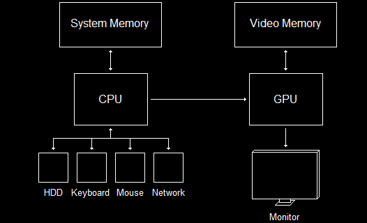

- [Introduce](#introduce)
- [Graphics Hardware](#graphics-hardware)

  

[Understanding Graphics Concepts - DirectXTutorial](http://www.directxtutorial.com/Lesson.aspx?lessonid=11-4-1)   

# Introduce
DirectX가 하는 일과 DirectX program을 만들기 위해 알아야 할 기초 지식을 알아본다.   

# Graphics Hardware
DirectX3D는 게임 플랫폼이 아니라 hardware interface이다. 즉, DirectX3D를 사용한다는 것은 Graphics hardware를 직접 조작하는 의미다.   
   
Graphics Programming에서 주로 다루는 hardware는 GPU 또는 graphics processing unit( 그래픽 처리 장치 )이다.   
CPU( central processing unit )는 계산을 수행하고 컴퓨터를 지휘한다. **GPU는 Graphics에 대한 계산을 수행하고 graphic 출력을 모니터로 전달**한다.   

   
graphic programming은 별도의 processor가 있을 뿐 아니라 video memory에서 작동한다.   
**video memory는** motherboard에 존재하지 않고 video card에 존재하기 때문에 **빠르게 GPU에 접근**할 수 있다. 그리고 **화면에 현재 image와 다음 image를 compile 하는데 사용되는 모든 데이터를 저장**한다.   

**DirectX는 data가 system memory 또는 video memory에 저장되는 시기를 관리**한다.   
