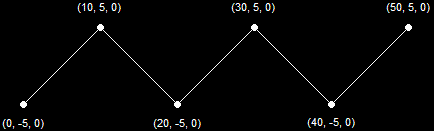

- [Introduce](#introduce)
- [Graphics APIs](#graphics-apis)
- [Graphics Hardware \& DirectX3D](#graphics-hardware--directx3d)
- [DirectX Graphics Infrastructure( DXGI )](#directx-graphics-infrastructure-dxgi-)
- [The Swap Chain](#the-swap-chain)
  - [GPU가 화면에 image를 표시하고 업데이트 하는 과정](#gpu가-화면에-image를-표시하고-업데이트-하는-과정)
  - [problem - tearing](#problem---tearing)
  - [solution 1 - swapping](#solution-1---swapping)
  - [solution 2 - Address swapping( swap chain )](#solution-2---address-swapping-swap-chain-)
- [Rendering Pipeline](#rendering-pipeline)
- [The Coordinate Systems](#the-coordinate-systems)
  - [The Cartesian Coordinates( 데카르트 좌표계 )](#the-cartesian-coordinates-데카르트-좌표계-)
  - [3D Coordinates](#3d-coordinates)
  - [Rendering Pipeline의 Coordinates Transformation 과정](#rendering-pipeline의-coordinates-transformation-과정)
- [3D Geometry](#3d-geometry)
  - [Primitives](#primitives)
  - [1. Point Lists](#1-point-lists)
  - [2. Line Lists](#2-line-lists)
  - [3. Line Strips](#3-line-strips)
  - [4. Triangle Lists](#4-triangle-lists)
  - [5. Triangle Strips](#5-triangle-strips)
  - [Backface culling](#backface-culling)

<br><br>

[Understanding Graphics Concepts - DirectXTutorial](http://www.directxtutorial.com/Lesson.aspx?lessonid=11-4-1)   

# Introduce
DirectX program을 만들기 위해 필요한 Graphics Concepts에 대해 알아본다.   

# Graphics APIs
   
게임 화면을 Display에 보여주기 위해서는 GPU hardware를 제어해야 한다.   
하지만 프로그래머가 GPU를 하나하나 제어하기는 매우 어렵기 때문에 GPU 제조사에서 Driver를 제공한다.   
Driver는 제조사 입장에서 특정 shape를 그리기 위해서 GPU를 어떻게 사용해야 하는지 알려주는 가이드다.   
이러한 가이드를 프로그래머 입장에서 잘 사용하기 위해서 정의한 것이 Graphics API( Application Programming Interface )이다.   

Graphics API( DirectX, OpenGL, Vulkan )가 필요한 이유는 GPU를 만드는 제조사가 다양하기 때문이다.   
각 GPU가 동작하는 방식에 대해 몰라도 프로그래밍 할 수 있도록 도와주기 때문이다.   

# Graphics Hardware & DirectX3D
DirectX3D는 게임 플랫폼이 아니라 hardware interface이다. 즉, DirectX3D를 사용한다는 것은 Graphics hardware를 직접 조작하는 의미다.   
   
Graphics Programming에서 주로 다루는 hardware는 GPU 또는 graphics processing unit( 그래픽 처리 장치 )이다.   
CPU( central processing unit )는 계산을 수행하고 컴퓨터를 지휘한다. **GPU는 Graphics에 대한 계산을 수행하고 graphic 출력을 모니터로 전달**한다.   

   
graphic programming은 별도의 processor가 있을 뿐 아니라 video memory에서 작동한다.   
**video memory는** motherboard에 존재하지 않고 video card에 존재하기 때문에 **빠르게 GPU에 접근**할 수 있다. 그리고 **화면에 현재 image와 다음 image를 compile 하는데 사용되는 모든 데이터를 저장**한다.   

**DirectX는 data가 system memory 또는 video memory에 저장되는 시기를 관리**한다.   

# DirectX Graphics Infrastructure( DXGI )
**DXGI는 여러 버전의 Direct3D가 공통적으로 사용할 수 있도록 display에 대한 저수준 제어 기능을 묶어놓은 것**이다.   
화면에 image를 보여주고, monitor와 video card가 처리할 수 있는 resolution( 해상도 )를 찾는 등 기본적인 작업을 처리하는 역할이다.   
   
또한 **Direct3D와 hardware 간의 interface 역할을 수행**한다.   

DXGI를 직접 다루는 방법은 넘어가고, **이러한 component가 존재한다는 사실만 인지**한다. 왜냐하면 Direct3D에는 DXGI만 처리하는 부분이 있기 때문이다.   

# The Swap Chain
## GPU가 화면에 image를 표시하고 업데이트 하는 과정
- GPU는 자신의 memory에 현재 화면에 올라온 image의 픽셀 buffer에 대한 pointer를 가지고 있다. 이러한 pixel buffer는 화면에 표시될 image의 각 pixel data를 저장하는 memory space이다. 이러한 buffer에 손쉽게 접근하기 위해서 pointer를 저장한다.
- 3D model이나 image를 rendering할 때, GPU는 그것에 대한 pixel buffer를 수정하고 이 정보를 monitor에 보낸다.
- monitor는 수신한 pixel data를 바탕으로 top에서 bottom으로 화면을 다시 그려서 old image를 new image로 교체한다.

## problem - tearing
하지만 위 과정은 **real-time rendering에 필요한 만큼 monitor가 빠르게 새로고침되지 않는 점이 문제**다.   
만약 monitor가 새로고침 되는 동안 다른 model 또는 image가 GPU에 rendering 되면, **monitor에 표시되는 image가 두 개로 잘려서 위쪽에는 previous image가, 아래쪽에는 new image가 표시**된다.   
이러한 현상을 **tearing**이라 부른다.   

## solution 1 - swapping
tearing을 피하기 위해서 DXGI는 **swapping**이라 부르는 기능을 제공한다.   
DXGI는 new image를 monitor에 직접 rendering하는 대신에 **back buffer**라 불리는 secondary( 보조 ) pixel buffer에 image를 그린다. 반대로 **front buffer**는 현재 monitor에 그려지는 pixel buffer다.   
**DXGI는 back buffer에 image가 모두 그려지면, 이를 front buffer로 업데이트하고 previous image를 삭제**한다.   

## solution 2 - Address swapping( swap chain )
swapping을 통해 new image를 back buffer에 올리고, previous image를 front buffer에서 관리함에도 여전히 tearing이 발생할 수 있다.   
왜냐하면 GPU가 monitor로 image를 전송하는 속도가 monitor의 새로고침 속도보다 훨씬 빠르기 때문이다. 즉, monitor가 새로고침하는 동안 image transfer( 전송 )이 계속 발생할 수 있기 때문이다.   

   
tearing을 피하기 위해서 더 빠른 속도가 필요하기 때문에 **DXGI는 각 buffer에 대한 pointer를 사용하여 간단하게 두 buffer의 값을 바꾼다**.   
   
back buffer를 더 추가해서 게임의 성능을 더 좋게 만들 수 있다.   
이러한 방법을 **swap chain**이라 부르며, **new frame이 rendering 될 때마다 위치를 교체하는 buffer chain**이다.   

# Rendering Pipeline
   
Rendering Pipeline은 화면에 rendered 3D image를 생성하는 process이다. Rendering Pipeline은 GPU에서 수행되며, 하나씩 처리해나간다.   
이해를 돕기 위한 핵심적인 단계만 살펴보고 넘어간다.   

**Input-Assembler Stage**는 pipeline의 첫 단계이다. Rendering 하려는 3D model에 대한 정보를 video memory에서 수집하고, 이러한 정보를 compile하고 rendering 할 수 있도록 준비한다.   

**Rasterizer Stage**는 back buffer의 image가 그려질 위치, 더 구체적으로 어떤 pixel이 그려지고 어떤 color로 그려지는지 결정하는 역할이다.   

**Output-Merger( 출력-병합 ) Stage**는 pipeline의 마지막 단계이다. 개별 model image를 하나의 image로 결합하고, 그 image를 back buffer에 배치하는 작업을 수행한다.   

# The Coordinate Systems

## The Cartesian Coordinates( 데카르트 좌표계 )
   
**2D coordinates**라고 부르는 것이 더 명확하다. 즉, **평평한 표면에서 정확한 point를 찾는 system**이다.   
horizontal axis( x-axis )는 1D Cooridnates에 속하며, origin( 0 )으로부터 얼만큼 이동했는지 distance를 나타낸다.   
vertical axis( y-axis )는 1D coordinates에서 다른 direction으로 이동할 수 있는 axis이다. 이 또한 origin( 0 )으로부터 얼만큼 이동했는지 나타낸다.   
즉, **각 axis는 origin을 가지고 이 origin에서 얼만큼 떨어졌는지 표현**한다.   
위 이미지는 어떠한 point가 origin으로부터 (12, 4)만큼 떨어진 위치에 있음을 나타낸다.   

## 3D Coordinates
2D Coordinates의 x, y-axis에 수직인 axis( z-axis )를 추가하면 3D Coordinates가 된다.   

## Rendering Pipeline의 Coordinates Transformation 과정
Model Space, World Space, View Space, Projection( Clip ) Space, NDC, Screen Coordinates 순서로 진행된다.   


# 3D Geometry
3D coordinates에서 한 point가 space 상의 한 지점을 나타낸다면, 우리는 3D model의 정확한 위치를 array로 구성할 수 있다.   
**이러한 작업은 매우 많은 points를 memory 공간에 할당한다. 때문에 더 쉽고 더 빠르게 표현하는 방법이 triangles**다.   

   
이처럼 triangles를 이용해서 다양한 polygon을 표현할 수 있기 때문이다.   
**DirectX는 삼각형과 삼각형이 결합하여 shapes를 만드는 데에만 초점을 맞춘다**. 이러한 삼각형을 만들기 위해서 vertices를 사용한다.   

**vertex는 3D space에서 point( x, y, z )로 정의되며, 이러한 point에는 다양한 properties가 포함**된다.   
이처럼 vertex에 대한 다양한 정보를 표현하기 위해서 struct를 생성한다.   

   
**하나의 triangle는 3개의 vertex로 만들어진다**. **각 vertex는 clock-wise order( 시계 방향 순서 )로 정의**한다.   
code에서 세 가지 vertices는 평면을 형성하며, 필요에 따라 회전, 텍스처링( 삼각형의 표면에 이미지나 패턴<텍스처>를 입힘 ), 위치 지정 및 수정할 수 있다.   

이러한 삼각형을 결합해서 3D object를 만든다. 예를 들면, 사각형의 한 면을 만들기 위해서 삼각형 2개를 이용한다.   
게임에서 모든 삼각형의 모서리를 정의하지 않고, a list of vertices를 생성하면 된다. **list에는 각 vertex의 좌표와 정보, 그리고 어떤 순서로 이동하는지가 포함**된다.   

## Primitives
3D 환경에서 primitive는 삼각형, 선, 점 등과 같은 **가장 기본적인 단일 요소를 의미**한다.   
이러한 primitive를 조합하여 복잡한 3D object나 model를 생성할 수 있다.   
예를 들면, **Point는 공간에서의 위치를 나타내는 가장 기본적인 요소**이며, **Line은 두 Point를 연결하여 만든 1차원적인 요소**이다. **Triangle은 세 point를 연결하여 만든 2차원적인 면으로, 3D modeling에서 가장 많이 사용되는 기본 단위**이다.   
```
1. Point Lists
2. Line Lists
3. Line Strips
4. Triangle Lists
5. Triangle Strips
```

## 1. Point Lists
Point List는 **화면에 존재하는 각각의 points를 보여주는 vertices를 저장**한다.   

   
위 Point List는 6 Primitives를 가진다.   

## 2. Line Lists
Line List는 **두 vertex를 이용하여 개별적인 line segment를 만드는 vertices를 저장**한다.   
이때, 두 vertex는 홀수 번호와 짝수 번호로 기준을 정하여 line segment를 생성한다. 예를 들면, 정점 1과 2를 연결하여 line1을, 정점 3과 4를 연결하여 line2를 생성하는 방식이다.   

   
위 Line List는 3 Primitives를 가진다.   

## 3. Line Strips
Line List와 비슷하지만 list의 모든 vertices가 line segment로 연결된다는 점이 다르다.   
첫 vertex부터 마지막 vertex까지 모든 vertices가 순서대로 line segment로 연결된다. 즉, **연속적인 line segment로 연결된 vertices의 목록을 의미**한다.   

wire-frame terrain( 와이어프레임 지형 )과 Blades of Grass( 풀잎 ), non-model-based objects( 비모델 기반 객체 )에 유용하다.   
자세히 설명하면, wire-frame terrain은 3D 지형을 line segment로만 표현하여 구조를 단순화시키며, Blades of Grass과 같은 가늘고 긴 객체를 표현할 때 사용하여 자연스럽게 묘사할 수 있다. 또한 modeling되지 않은 단순한 object나 effect를 표현할 때 유용하다.   

Debugging에도 도움된다. 객체의 구조나 배치를 확인하기 위해서 wire-frame mode로 시각화하는 경우, object의 형태를 단순한 line segment로 표현하여 오류를 쉽게 발견할 수 있게 해준다.   

   
위 Line Strip는 5 Primitives를 가진다.   
Line Strips는 연속된 선분을 그릴 때, 이전 선분의 끝 vertex가 다음 선분의 시작 vertex가 되므로, **vertex 데이터의 사용량을 줄일 수 있다**. 또한 연속적인 line segment를 한 번에 처리하기 때문에 **rendering 성능을 높일 수 있다**.   

## 4. Triangle Lists
**하나의 삼각형을 만들기 위해 사용되는 3개의 vertices 그룹을 모두 저장하는 vertices list**이다.   

   
위 Triangle Lists는 2 Primitives를 가진다.   

## 5. Triangle Strips
**여러 개의 triangles가 모여서 만들어진 하나의 series를 만들기 위한 vertices list**이다.   
게임에서 3D model을 사용하기 위해 가장 많이 사용되는 방법이다.   

   
위 Triangle Strips는 4 Primitives를 가진다.   
**첫 3개의 vertices로 하나의 삼각형을 만든 후, 다음 삼각형을 만들 때는 이전 삼각형의 두 vertex를 이용하여 생성**한다.   

## Backface culling
primitive를 그릴 때 primitive의 한쪽 면만 표시되는 특이점이 있다. 양면을 모두 표시할 수 있지만, 일반적으로 model은 완전히 둘러싸여 있어서 내부를 볼 수 없다. 예를 들면, model이 완전히 둘러싸인 경우, 각 삼각형의 한쪽 면만 그린다.   
두 면을 모두 그리는 경우에는 두 배의 시간이 소요된다.   

   
하나의 triangle primitive는 clockwise order로 주어진 vertices가 있을 때만 그려지며, counter-clockwise order는 보여지지 않는다.   

삼각형의 정점들이 clockwise order로 나열되면, Graphics Engine은 이를 Face Front( 전면 )으로 인식하고 rendering 한다.   
반대로 counter-clockwise order로 나열되면, 이 면을 Face Back( 후면 )으로 인식하여 rendering 하지 않는다.   
이를 **Backface Culling 기법**이라 한다.   
정확히 말하면, Graphic Engine에서 **카메라를 향하지 않는 면( 뒷면 )을 rendering 하지 않도록 하는 최적화 기술**이다.   
surface의 방향과 camera의 위치에 따라 backface culling이 적용되어 rendering 한다.   

   
양면( 앞뒷면 )을 보여주기 위한 간단한 방법은 primitive를 두 번 그리는 것이다.   
하나는 clockwise( CW ), 다른 하나는 counter-clockwise( CCW )로 삼각형을 그리면 된다. 하지만 backface culling에 의해 뒷면은 보이지 않는데, **카메라가 삼각형의 뒷면을 볼 때 이 삼각형은 앞면으로 간주되어 rendering** 된다.   
따라서 삼각형의 **양쪽 면에 각각 하나의 삼각형이 위치**한다.   
종이, 잎사귀 등 양면이 모두 보이는 얇은 object를 rendering할 때 고려한다.   