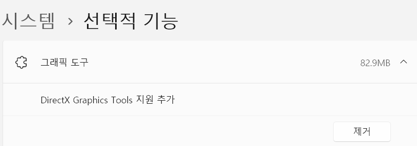
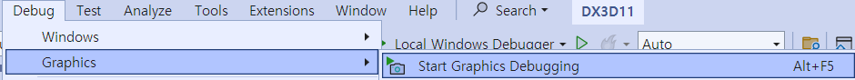
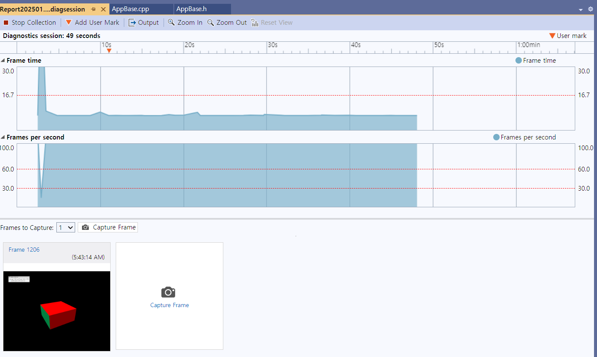
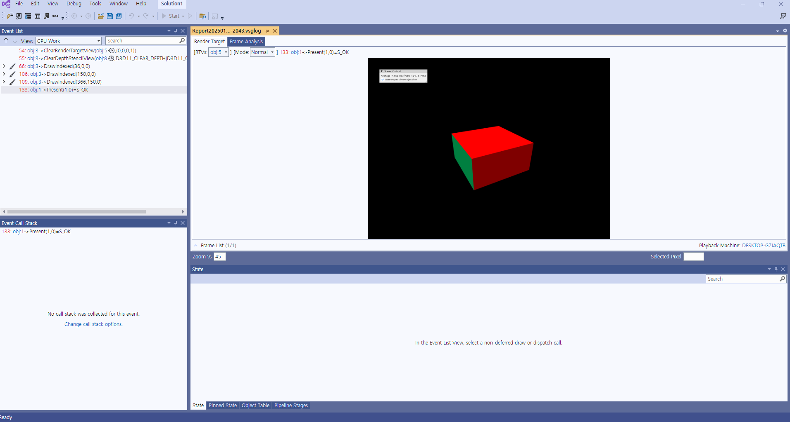
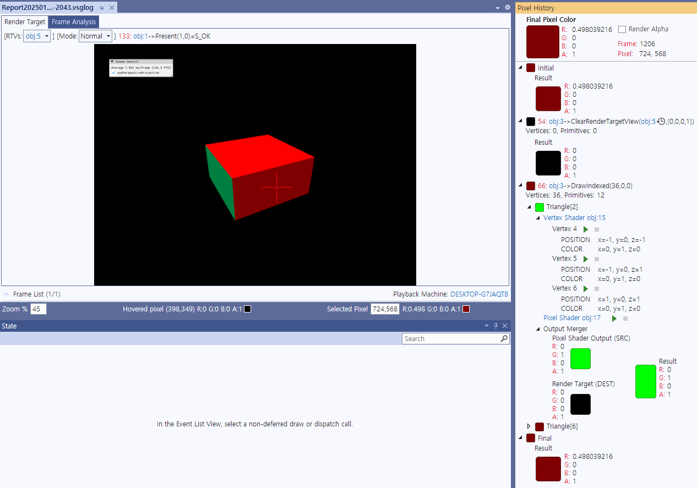
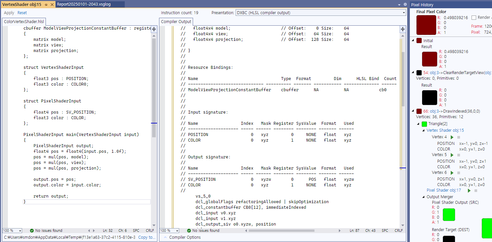
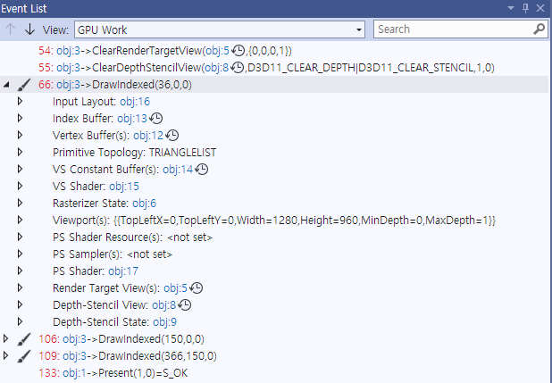
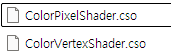
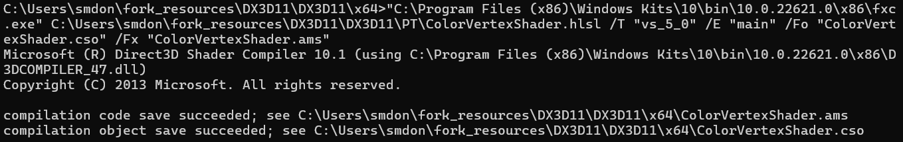

- [Introduce](#introduce)
- [Shader Program](#shader-program)
  - [1. Compile and Create Shaders](#1-compile-and-create-shaders)
  - [2. Set Shader into GPU](#2-set-shader-into-gpu)
  - [3. Vertex Shader](#3-vertex-shader)
    - [3.1. matrix와 곱하기 위해 float4로 확장](#31-matrix와-곱하기-위해-float4로-확장)
  - [4. Pixel Shader](#4-pixel-shader)
- [Grammar](#grammar)
  - [1. Data Types과 Swizzling](#1-data-types과-swizzling)
  - [2. Semantics](#2-semantics)
    - [2.1. object space](#21-object-space)
  - [3. Intrinsic Functions](#3-intrinsic-functions)
- [Shader Debugger in Visual Studio](#shader-debugger-in-visual-studio)
  - [1. Windows Setting](#1-windows-setting)
  - [2. cpp Setting](#2-cpp-setting)
  - [3. Visual Studio Graphics Debugging](#3-visual-studio-graphics-debugging)
- [Shader Debugging from .cso .asm](#shader-debugging-from-cso-asm)
  - [1. cmd](#1-cmd)
  - [2. load file and create shader](#2-load-file-and-create-shader)

[RenderDoc](https://renderdoc.org/)은 실무에서도 많이 사용하는 Graphics Debugger다.   
NVidia 그래픽스 카드를 사용하면 NVidia에서 제공하는 [Nsight]()를 VS에 설치해서 더 자세한 디버깅 정보를 볼 수 있다.


# Introduce
Shader Programming을 하기 위해서 **High-Level Shader Language( HLSL )를 사용**한다.   
Shader program을 만드는 방법과 각 Shader에 대한 간략한 내용을 알아본다.   
HLSL의 문법을 알아본다.   
Shader Debugging 방법을 알아본다.   

# Shader Program
Shader Program을 만들기 위한 절차를 알아본다.   

## 1. Compile and Create Shaders
```cpp
D3DCompileFromFile();
```
먼저 **shader file을 compile해서 shader program을 만든다**.   

```cpp
// creating vertex shader and input layout
device->CreateVertexShader();
device->CreateInputLayout();

// creating pixel shader
device->CreatePixelShader();
```
vertex shader는 input-assembler stage 다음에 존재한다.   
때문에 **vertex shader를 compile하고 프로그램으로 만들면서, input( vertices, indices, constant 등 ) 값을 어떻게 판단하고 사용하는지에 대한 설명이 존재하는 input layout도 같이 만든다**.   

## 2. Set Shader into GPU
GPU에게 어떤 shaders를 사용할지 알려준다.   
```cpp
// MainLoop-Render()
devcon->VSSetShader();
devcon->VSSetConstantBuffers();
devcon->PSSetShader();
```
`VSSetConstantBuffers()`으로 앞서 세팅한 vertex shader가 실행될 때, 각 vertex에 적용할 constant buffer를 지정한다.   
```cpp
// source code
struct ConstantBufferData {
  Matrix model;
};

// vertex shader code
cbuffer ConstantBuffer : register(b0) {
  matrix model;
};
```
**constant buffer를 GPU로 보낼 때, buffer의 struct 구조와 shader의 cbuffer 구조가 일치**해야 한다.   
model의 vertex에 적용하는 다양한 변환을 미리 계산해서 하나의 model matrix( translate, rotate, scale )에 담아 GPU로 보내는 것이 일반적이다.   
model, view, projection은 나눠서 보내는 것이 일반적이다.   
```cpp
// source code
vector<D3D11_INPUT_ELEMENT_DESC> inputElements = {
  {"POSITION", 0, DXGI_FORMAT_R32G32B32_FLOAT, ... },
  {"COLOR", 0, DXGI_FORMAT_R32G32B32_FLOAT, ... },
};

// vertex shader code
struct VertexInput {
  float3 pos : POSITION;
  float3 color : COLOR0;
};
```
**vertex shader로 보내는 input layout( POSITION, COLOR 등 )의 구조와 shader의 struct 구조가 일치**해야 한다.   

## 3. Vertex Shader
GPU에서 Rendering 할 때, vertex shader가 한 번만 호출되지 않는다.   
하지만 GPU는 효율적으로 작업을 수행하기 때문에 하나의 vertex에 대해 shader를 적용하고 다음 vertex로 넘어가는 것이 아니라, **여러 vertex를 동시에 하나의 shader로 처리**한다.   

vertex shader는 **하나의 vertex에 대해 model, view를 적용해서 world 좌표계를 수정하고, projection을 통해 screen 좌표계로 변환**한다.   
```cpp
cbuffer ConstantBuffer : register(b0) {
    matrix model; // matrix 대신에 float4x4를 사용할 수 있음
    matrix view;
    matrix projection;
};

struct VertexInput {
  float3 pos : POSITION;
};

PixelInput main(VertexInput input) {
  float4 pos = float4(input.pos, 1.0f);  // 1.0f는 point를 의미한다.
  pos = mul(pos, model);
  pos = mul(pos, view);
  pos = mul(pos, projection);
}
```
### 3.1. matrix와 곱하기 위해 float4로 확장
**vector 또는 point와 matrix를 곱하기 위해서는 row 또는 column을 맞춰야 한다**.   
`float3`로 받은 position 정보와 constant buffer의 matrix를 곱하기 위해선 `float4`로 맞춘다.   

## 4. Pixel Shader
Pixel Shader는 **vertex shader의 결과값( screen 좌표계 )을 받아서 각 pixel에 대해 색깔을 적용**한다.   
```cpp
struct PixelInput {
  float4 pos : SV_POSITOIN;
  float3 color : COLOR;
};

float4 main(PixelInput input) : SV_TARGET {
  return float4(input.color, 1.0f);
}
```
이때 적용한 결과를 render target에 저장하기 위해서 `SV_TARGET`이라는 semantics를 사용한다.   
```cpp
// Render()
devon->OMSetRenderTargets(1, renderTargetView.GetAddressOf(), depthStencilView.GET());
```
이러한 render target은 Rendering을 준비할 때 미리 지정한다.   


# Grammar
## 1. Data Types과 Swizzling
[Data Types( HLSL ) - MSLearn](https://learn.microsoft.com/en-us/windows/win32/direct3dhlsl/dx-graphics-hlsl-data-types)   
[Per-Component Math Operations - MSLearn](https://learn.microsoft.com/en-us/windows/win32/direct3dhlsl/dx-graphics-hlsl-per-component-math)   
[Shader Constants (HLSL) - MSLearn](https://learn.microsoft.com/en-us/windows/win32/direct3dhlsl/dx-graphics-hlsl-constants)   
[register - MSLearn](https://learn.microsoft.com/en-us/windows/win32/direct3dhlsl/dx-graphics-hlsl-variable-register)   
`float4`는 vertex의 position( x, y, z, w ) 또는 color( r, g, b, a )를 표현하는 데 사용한다.   
```cpp
// Given
float4 pos = float4(0, 0, 2, 1);
float2 temp;

temp = pos.xy;

temp = pos.xg;  // NOT VALID
```
`.xy`처럼 두 개의 값을 묶어서 반환할 수 있지만, `.xg`처럼 position과 color 데이터를 섞어서 사용할 수 없다.   
이처럼 **component를 읽을 때, 하나 또는 그 이상의 vector components를 지정하는 것**을 **swizzling** 이라 부른다.   
```cpp
float4 f_4D;
f_4D.zx = pos.xz;  // change the write order
f_4D.xzyw = pos.w;  // write one component value
```
내부적으로 component의 순서를 바꿔서 저장하거나 하나의 component 값으로 모든 component의 값을 초기화 할 수 있다.   
```cpp
cbuffer ConstantBuffer : register(b0) {
  matrix model;
  matrix view;
  matrix projection;
};
```
`cbuffer`와 register의 `b`는 constant buffer를 의미한다.   

## 2. Semantics
[semantics - MSLearn](https://learn.microsoft.com/en-us/windows/win32/direct3dhlsl/dx-graphics-hlsl-semantics)   
**어떤 변수를 어떻게 사용할 것인지에 대한 의미를 부여**한다.   
```cpp
struct VertexInput {
  float3 pos : POSITION
};
```
`POSITION[n]`에서 n은 index를 의미하며, optional한 정보다.   
0부터 지원하는 resource의 수까지 지정할 수 있다.   

### 2.1. object space
POSITION은 "Vertex position in object space."라고 정의됐다.   
여기서 **object space는 물체가 정의된 공간을 의미**한다.   
예를 들면, **Cube를 정의할 때 (0, 0, 0)인 원점에 대해 물체의 좌표를 정의하고, world 좌표로 변환**한다.   
이러한 **변환 과정을 shader에서 수행**하기 때문에 **shader에 들어오기 전의 좌표 정보는 변환 전의 좌표**임을 뜻한다.   
**변환 전 좌표를 object space**라 부른다.   

## 3. Intrinsic Functions
[Intrinsic Functions - MSLearn](https://learn.microsoft.com/en-us/windows/win32/direct3dhlsl/dx-graphics-hlsl-intrinsic-functions)   
HLSL의 내장 함수를 뜻한다.   
```cpp
pos = mul(pos, model); // 예시
```

# Shader Debugger in Visual Studio
## 1. Windows Setting


```
윈도우 설정 -> 시스템 -> 선택적 기능 -> 그래픽 진단 도구 추가
```
Graphics Debugger가 작동하지 않을 때는 windows의 추가 기능( optional features )에 그래픽 진단 도구( graphics tools )가 설치됐는지 확인한다.   

## 2. cpp Setting
```cpp
void AppBase::CreateVertexShaderAndInputLayout (
  const wstring& filename , const vector<D3D11_INPUT_ELEMENT_DESC>& inputElements ,
  ComPtr<ID3D11VertexShader>& vertexShader , ComPtr<ID3D11InputLayout>& inputLayout
) {
  ComPtr<ID3DBlob> shaderBlob;
  ComPtr<ID3DBlob> errorBlob;

  UINT compileFlags = 0;
#if defined(DEBUG) || defined(_DEBUG)
  compileFlags = D3DCOMPILE_DEBUG | D3DCOMPILE_SKIP_OPTIMIZATION;
#endif

  HRESULT hr = D3DCompileFromFile ( filename.c_str () , 0 , 0 , "main" , "vs_5_0" , compileFlags , 0 , &shaderBlob , &errorBlob );
  CheckResult ( hr , errorBlob.Get () );
  m_device->CreateVertexShader ( shaderBlob->GetBufferPointer () , shaderBlob->GetBufferSize () , NULL , &vertexShader );
  m_device->CreateInputLayout ( inputElements.data () , UINT ( inputElements.size () ) ,
    shaderBlob->GetBufferPointer () , shaderBlob->GetBufferSize () , &inputLayout );
}
```
**shader를 생성하는 코드에서 compile mode로 실행하는 코드를 추가**해야 한다.   
여기서 Compiler의 Optimization option을 꺼주는 것이 Debugging에 유리하다.   
`D3DCompileFromFile()`에 우리가 설정한 `compileFlags`를 넣어준다.   
**이러한 작업은 vertex shader 뿐만 아니라 pixel shader에도 구현**한다.   

## 3. Visual Studio Graphics Debugging
   
그래픽 디버깅 모드 시작하는 방법   




그래픽 디버깅 모드 중에 현재 화면을 F12 또는 UI click으로 capture할 수 있다. **capture만 하는 것이 아니라 디버깅에 필요한 정보도 함께 저장**된다.   
디버깅 모드를 종료하고 capture한 frame을 더블 클릭하면 Analyzer 창이 뜬다.   



analyzer는 화면 중 원하는 pixel을 클릭하여 해당 pixel이 어떤 과정을 거쳐서 만들어졌는지 추적할 수 있다.   



Vertex Shader object 하이퍼링크 또는 디버깅 아이콘을 클릭하면, 해당 vertex가 어떻게 변환되는지 확인할 수 있으며, Presentation의 option을 변경하여 각 shader 코드의 내부 동작을 자세히 살펴볼 수 있다.   
디버깅 아이콘을 클릭하면 visual studio의 디버깅 모드처럼 f10을 이용하여 코드 한 줄씩 살펴볼 수 있다.   



Event List에서 `DrawIndexed`를 통해 Rendering 과정을 살펴볼 수 있다.   

# Shader Debugging from .cso .asm
cmd를 이용하여 .cso 파일을 생성하고, 이를 load하여 VS에서 compile 하는 방법을 알아본다.   

**Compiled Shader Object**   
   
visual studio 프로젝트에 shader file이 존재하면, Debug 또는 Release mode에서 build를 끝내면 bytecode로 작성된 `.cso` 파일을 `x64\Debug` 폴더에 별도로 생성한다.   
```cpp
D3DCompileFromFile(filename.c_str(), 0, 0, "main", "vs_5_0", compileFlags, 0, &shaderBlob, &errorBlob);
```
`D3DCompileFromFile()`를 호출하면, 전달된 hlsl source file을 compile해서 bytecode 형태의 shader program이 `shaderBlob`에 저장된다. 즉, **memory에 compile된 shader를 담은 `shaderBlob`을 반환**한다.   

**실무에서는 다양한 shader를 사용하고, 이러한 shader는 compile 시간이 오래 걸릴 수 있다**.   
이 경우에는 매번 shader file을 compile 하는 것이 아니라 **`.cso` 파일을 미리 만들고, 이를 불러들여서 shader를 초기화하는 방법**도 존재한다.   
## 1. cmd
**cmd를 이용하여 cso와 ams 파일을 생성**한다.   
   
`.cso` 파일이 저장되는 경로에서 cmd를 띄운다.   
```
"C:\Program Files (x86)\Windows Kits\10\bin\10.0.22621.0\x86\fxc.exe"
 C:\Users\smdon\fork_resources\DX3D11\DX3D11\PT\ColorVertexShader.hlsl
 /T "vs_5_0"
 /E "main"
 /Fo "ColorVertexShader.cso"
 /Fx "ColorVertexShader.ams"
```
해당 명령어를 사용하여 `.cso`와 `.ams` 파일을 생성할 수 있다.   
이때 fxc.exe 파일이 존재하는 위치와 shader file이 존재하는 위치는 다를 수 있다.   
`/T`는 shader profile( version ), `/E`는 entry point, `/Fo`는 cso 파일 출력 경로에 컴파일된 shader object( bytecode )를 저장, `/Fx`는 assembly 파일 출력 경로에 shader assembly code를 저장한다.   

이러한 cso, ams 파일은 Debug 또는 Release 폴더에 존재하는 것이 일반적이다.   

## 2. load file and create shader
```cpp
ifstream input("ColorVertexShader.cso", ios::binary);
vector<unsigned char> buffer(istreambuf_iterator<char>(input), {});
device->CreateVertexShader(buffer.data(), buffer.size(), NULL, &vertexShader);
device->CreateInputLayout(inputElements.data(), UINT(inputElements.size()), buffer.data(), buffer.size(), &inputLayout);
```