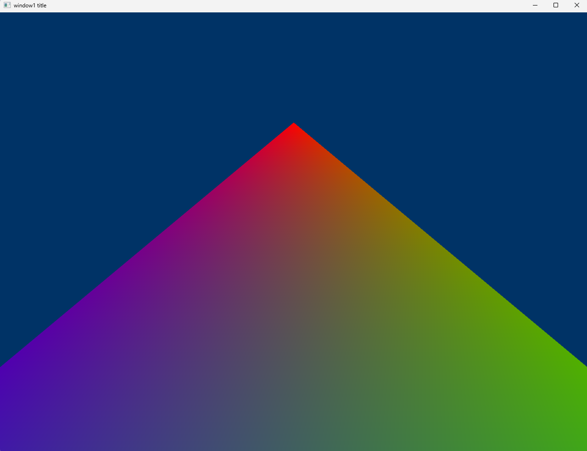
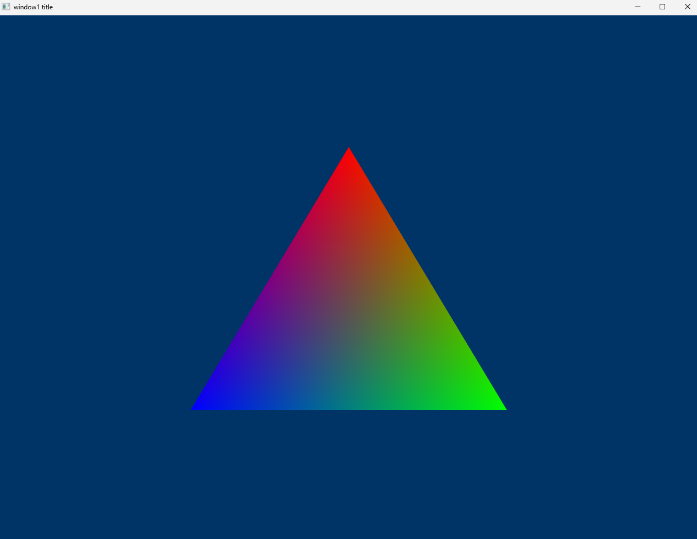
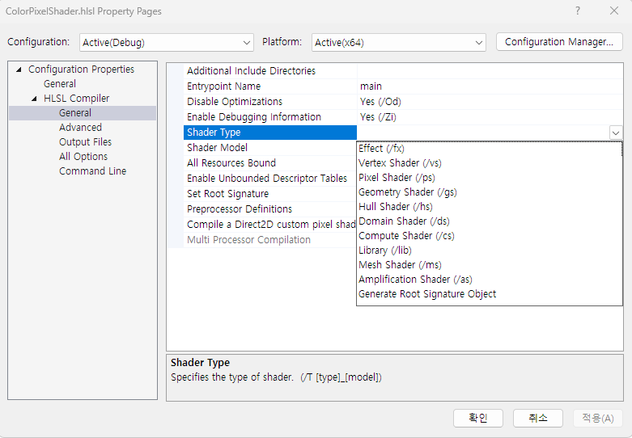
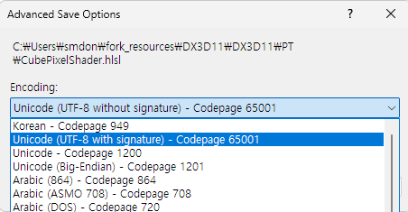

- [삼각형이 잘리는 경우( Clipping )](#삼각형이-잘리는-경우-clipping-)
	- [ME](#me)
	- [GPT](#gpt)
	- [Summary](#summary)
- [Pixel Shader를 Vertex Shader로 인식하는 경우](#pixel-shader를-vertex-shader로-인식하는-경우)
- [vertice의 indices 공유로 나타나는 색깔 문제](#vertice의-indices-공유로-나타나는-색깔-문제)
- [precompiled header 방식에서 unexpected end of file error](#precompiled-header-방식에서-unexpected-end-of-file-error)
	- [1. pch.h 포함](#1-pchh-포함)
	- [2. 개별적인 파일에 precompiled header 끄기](#2-개별적인-파일에-precompiled-header-끄기)
- [.hlsl의 Encoding Error](#hlsl의-encoding-error)
	- [1. BOM( Byte Order Mark ) ?](#1-bom-byte-order-mark--)
	- [2. 왜 문제가 되나?](#2-왜-문제가-되나)
	- [3. Solution](#3-solution)

<br>

# 삼각형이 잘리는 경우( Clipping )

<div>
	
	
</div>

**[ before | after ]**   

[DrawingTriangle.md - Final Code](DirectXFramework/4_DrawingTriangle.md/#final-code)를 참고한다.   
삼각형이 화면에 짤려서 나오는 경우가 있었다.   

## ME
해당 문제가 발생했을 때, NDC 좌표에서 pixel coordinates로 변환하는 과정에서 viewport 설정에 문제가 없는지 살펴봤다.   
```cpp
VERTEX OurVertices[] = {
	{ 0.0f, 0.5f, 0.0f, D3D11_VIDEO_COLOR_RGBA ( 1.0f, 0.0f, 0.0f, 1.0f ) },
	{ 0.45f, -0.5f, 0.0f, D3D11_VIDEO_COLOR_RGBA ( 0.0f, 1.0f, 0.0f, 1.0f ) },
	{ -0.45f, -0.5f, 0.0f, D3D11_VIDEO_COLOR_RGBA ( 0.0f, 0.0f, 1.0f, 1.0f ) }
};
```
삼각형의 좌표는 NDC를 기준( -1, 1 )으로 작성됐기 때문이다.   
이러한 좌표계라면 이론적으로 삼각형이 Clipping 없이 화면에 잘 나타나야 한다.   
그래서 viewport 코드를 살펴봤다.   
```cpp
// Set the viewport
D3D11_VIEWPORT viewPort;
ZeroMemory ( &viewPort , sizeof ( D3D11_VIEWPORT ) );
viewPort.TopLeftX = 0;
viewPort.TopLeftY = 0;
viewPort.Width = SCREEN_WIDTH;
viewPort.Height = SCREEN_HEIGHT;
devcon->RSSetViewports ( 1 , &viewPort );
```
하지만 해당 코드에서는 문제가 없다.   

## GPT
GPT는 input layout과 vertex data의 정의가 불일치함을 지적했다.   
```cpp
// create the input layout object
D3D11_INPUT_ELEMENT_DESC ied[] = {
	{ "POSITION", 0, DXGI_FORMAT_R32G32B32A32_FLOAT, 0, 0, D3D11_INPUT_PER_VERTEX_DATA, 0 },
	{ "COLOR", 0, DXGI_FORMAT_R32G32B32A32_FLOAT, 0, 12, D3D11_INPUT_PER_VERTEX_DATA, 0 },
};
```
삼각형의 좌표( POSITION )은 (X, Y, Z)인 3개의 float만 가지지만, input layout은 4개의 float를 가지고 있기 때문이다.   
즉, 4개의 float를 읽어들이는 `R32G32B32A32_FLOAT`는 실제 데이터가 3개의 float로 정의된 경우, 데이터 해석이 잘못될 가능성이 있다.   
```cpp
// create the input layout object
D3D11_INPUT_ELEMENT_DESC ied[] = {
	{ "POSITION", 0, DXGI_FORMAT_R32G32B32_FLOAT, 0, 0, D3D11_INPUT_PER_VERTEX_DATA, 0 },
	{ "COLOR", 0, DXGI_FORMAT_R32G32B32A32_FLOAT, 0, 12, D3D11_INPUT_PER_VERTEX_DATA, 0 },
};
```
POSITION 속성을 3개의 float로 읽어들이도록 설정하니 해결됐다.   

## Summary
```
[ 문제 원인 ]
input layout과 vertex data의 불일치로 인해 정점 데이터가 잘못 해석되어 그려진 삼각형에 Clipping이 발생했다.

[ 해결 방법 ]
input layout의 POSITION property를 DXGI_FORMAT_R32G32B32_FLOAT로 수정하여 두 정의를 일치시켰다.
```

# Pixel Shader를 Vertex Shader로 인식하는 경우
compiler가 pixel shader file을 vertex shader file로 인식하여 `Invalid vs_2_0 output semantic SV_Target` 에러가 발생했다.   

   

[참고 자료](https://stackoverflow.com/questions/45422730/error-invalid-vs-2-0-output-semantic)   
**pixel shader file의 properties를 수정**한다.   

# vertice의 indices 공유로 나타나는 색깔 문제
[Initialization.md - AppFramework](AppFramework/1_Initialization.md/#13-vertex의-index-정보를-공유하는-경우-발생하는-문제점)   

# precompiled header 방식에서 unexpected end of file error
Precompiled Header 방식을 사용하는 프로젝트에서 발생하는 unexpected end of file error를 해결하는 방법을 알아본다.   
```
error C1010: unexpected end of file while looking for precompiled header. Did you forget to add '#include "pch.h"' to your source?
```
header file에서 `#include "pch.h"`를 포함하고 있더라도, **.cpp에서도 `#include "pch.h"`를 가장 먼저 포함하지 않으면 compile 과정에서 파일의 예기치 않은 끝( unexpected end of file error ) 오류가 발생**할 수 있다.   

## 1. pch.h 포함
```cpp
#include "pch.h"
#include "Base.h"
```
현재 프로젝트가 precompiled header 방식을 사용 중이라면, 모든 source file은 compile time에 가장 먼저 해당 header( pch.h )를 포함해야 한다.   

## 2. 개별적인 파일에 precompiled header 끄기
```
1. .cpp 파일의 properties
2. C/C++
3. Precompiled Headers
4. Not Using Precompiled Headers
```
만약 일부 .cpp 파일에서 precompiled header가 필요 없을 수 있기 때문에, 해당 source file만 개별적으로 해당 옵션을 꺼준다.   
그러면 **`#include "pch.h"`를 포함하지 않아도 에러가 발생하지 않는다**.   

# .hlsl의 Encoding Error
```
???.hlsl(1,1): error X3000: Illegal character in shader file
```
visual studio 2022에서 HLSL 파일을 컴파일 할 때 발생하며, 파일의 첫 번째 줄 첫 번째 문자에 컴파일러가 인식할 수 없는 잘못된 문자가 포함되어 있음을 알려준다.   
이는 **Encoding 방식과 BOM( Byte Order Mark )와 관련**이 있다.   

## 1. BOM( Byte Order Mark ) ?
**BOM은 파일 시작 부분에 위치하는 특수한 문자로서, 파일의 Encoding 방식을 명시하는 역할**이다.   
   
visual studio에서 signature는 BOM을 의미하며, UTF-8 파일을 저장할 때 BOM을 포함할지 여부를 선택할 수 있다.   
이러한 UTF-8 파일은 기본적으로 byte 순서에 의존하지 않는 Encoding 방식이므로 BOM이 필수가 아니다.   

## 2. 왜 문제가 되나?
HLSL 파일을 컴파일 할 때, compiler는 파일의 시작 부분에서 예상치 못한 문자를 만날 수 있다.   
**BOM은 Encoding을 나타내는 특수 문자이므로, HLSL compiler는 이를 Illegal character( HLSL 구문이 아님 )로 인식**한다.   

## 3. Solution
**파일 Encoding을 변경할 때, signature( BOM ) 없이 UTF-8로 저장**한다.   