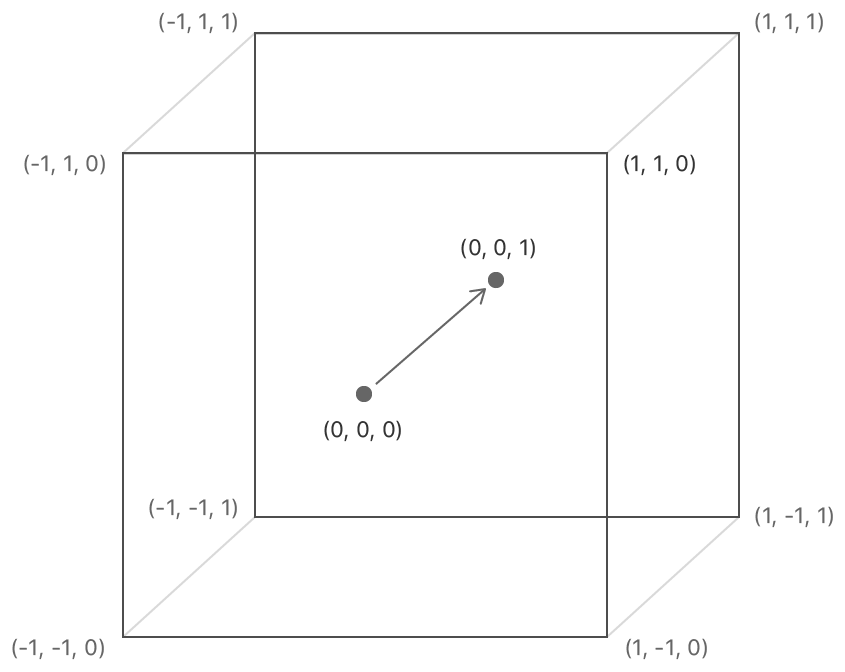

- [Introduce](#introduce)
- [Setting the Render Target](#setting-the-render-target)
  - [Render Target을 Setting하는 이유](#render-target을-setting하는-이유)
- [Setting the Viewport](#setting-the-viewport)
- [Rendering Frames](#rendering-frames)
- [Obligatory Cleanup](#obligatory-cleanup)
- [Final Code](#final-code)


[Rendering Frames - DirectXTutorial](http://www.directxtutorial.com/Lesson.aspx?lessonid=11-4-3)   
[Metal Coordinate System - stackoverflow](https://stackoverflow.com/questions/58702023/what-is-the-coordinate-system-used-in-metal)   

# Introduce
Direct3D가 초기화되면 rendering을 시작한다. 따라서 rendering하기 위해 몇 가지 준비 작업이 필요하다.   
GPU가 최종 이미지를 생성할 memory 위치( back buffer )와 back buffer에 그릴 위치를 지정하는 작업이다.   

# Setting the Render Target
**rendering을 시작하는 곳을 우리는 back buffer로 알고 있지만, Direct3D는 알지 못한다**. 또한 **back buffer에 즉시 rendering 하는 것을 원치 않을 수 있다**.   
예를 들면, **많은 게임들은 model의 surface에 rendering 한 다음, 그 model을 back buffer에 rendering 한다**. 이러한 기술은 다양한 효과를 만들 수 있다. "포탈" 게임에서는 포탈에 먼저 rendering 한 다음, 포탈 이미지가 포함된 전체 장면을 rendering 한다.   
즉, **back buffer에 직접 rendering 하지 않고 중간 단계의 surface에 rendering 함으로써 다양한 graphic 효과를 구현하고, 최종적으로 완성된 이미지를 화면에 출력**한다.   

Direct3D에서 rendering을 하기 위해선 반드시 **render target을 지정**한다.   
대부분의 경우 **이러한 render target은 back buffer를 의미**하고, 이는 rendering 할 video memory의 위치를 유지하는 간단한 **COM object**이다.   
즉, **Render Target은 Graphics Pipeline이 최종적으로 image를 출력하는 surface를 말한다**. 

즉, **video memory에 texture를 rendering하기 위해서 Render Target을 지정하는 방법**을 알아본다.   
```cpp
ID3D11RenderTargetView* backBuffer;

bool InitD3D( HWND hWnd ) {
  // Direct3D Initialization
  // ...

  // get the address of the back buffer
  ID3D11Texture2D* pBackBuffer;
  swapChain->GetBuffer(0, __uuidof(ID3D11Texture2D), (LPVOID*)&pBackBuffer);

  // use the back buffer address to create the render target
  dev->CreateRenderTargetView(pBackBuffer, NULL, &backBuffer);
  pBackBuffer->Release();

  // set the render target as the back buffer
  devcon->OMSetRenderTargets(1, &backBuffer, NULL);
}
```
위 코드는 **render target을 설정하는 3단계 과정**을 나타낸다.   
첫째, back buffer의 주소 얻기: `swapChain->GetBuffer()`를 사용해서 swap chain에서 back buffer의 texture를 가져온다.    
둘째, 그 주소를 사용해서 render target view를 나타내는 COM object를 생성한다. `dev->CreateRenderTargetView()`를 사용하여 back buffer texture를 기반으로 render target view를 생성한다.   
셋째, `pBackBuffer->Release()`를 호출하여 texture object를 해제한다.   
넷째, `devcon->OMSetRenderTargets()`를 사용해서 생성된 render target view를 현재 render target으로 설정한다.   

`ID3D11RenderTargetView*`는 **render target에 대한 모든 정보를 가진 object를 가리키는 pointer**다. back buffer에 rendering 할 것이기 때문에 해당 변수를 `backBuffer`로 부른다.   

**3D Rendering에서 texture의 또 다른 이름은 image이다**. `ID3D11Texture2D*`는 **image를 저장하는 COM object를 가리키는 pointer**다. 다른 COM object 처럼 먼저 pointer를 정의하고, 나중에 function으로 object를 생성한다.   

`swapChain->GetBuffer()` 는 **swap chain에서 back buffer를 찾고, `pBackBuffer` texture object를 생성하기 위해 사용**한다.   
**첫 번째 인자는 back buffer의 번호**를 나타낸다. 하나의 back buffer를 사용하기 때문에 `#0`으로 지정했다.   
**두 번째 인자는 `ID3D11Texture2D` COM object의 ID를 가져온다**. COM object의 각 TYPE은 자신만의 ID가 존재한다. 이러한 ID를 가져오기 위해서 `__uuidof` operator를 사용한다. 이를 통해 `GetBuffer()`가 어떤 TYPE의 COM object를 생성해야 하는지 알 수 있다.   
세 번째 인자를 설명하기 전, 기본 지식을 알아본다. **`void*` 포인터는 특정 TYPE의 변수를 가리키지 않는다. 또한 `void*`는 어떠한 type으로도 casting 될 수 있다**. 이처럼 **세 번째 인자는 `ID3D11Texture2D` Object의 주소를 가리키며**, 다른 type이 있을 수 있기에 `void*`을 사용한다.   
```cpp
#define IID_PPV_ARGS(ppType) __uuidof(**(ppType))

GetBuffer(0, IID_PPV_ARGS(&pBackBuffer));
```
참고로 `GetBuffer`의 2, 3번째 인자는 `IID_PPV_ARGS()`로 대체할 수 있다.   

**`dev->CreateRenderTargetView()` 함수는 render target object를 생성**한다. 생성된 객체를 가리키기 위해 `ID3D11RenderTargetView*`를 정의했다.   
다시 한 번 말하지만, COM object는 직접 다루는 것이 아니라 interface로 간접적으로 접근하여 다룬다.   
**첫 번째 인자는 `ID3D11Texture2D`를 가리키는 pointer**다.   
**두 번째 인자는 render target을 설명하는 struct**이다. back buffer는 기본 설정을 사용하기 때문에 `NULL`로 설정한다.   
**세 번째 인자는 생성된 render target view object를 받을 pointer 주소를 지정**한다.   

`devcon->OMSetRenderTargets()`는 여러 개의 render target을 지정한다.   
첫 번째 인자는 render target의 수를 나타낸다.   
두 번째 인자는 render target view object의 list를 가리키는 pointer다. 하나만 가지기 때문에 render target object의 주소만 넘겨줬다.   
세 번째 인자는 `... 나중에 알아봄!`   

## Render Target을 Setting하는 이유
이 작업을 통해 **back buffer를 render target으로 설정하여, 우리가 그리는 모든 것이 back buffer에 rendering 되고, 나중에 화면에 표시**될 수 있게 한다.   

# Setting the Viewport
[normalized device coordinates - stackoverflow](https://stackoverflow.com/questions/58702023/what-is-the-coordinate-system-used-in-metal)   

   
**viewport는 normalized device coordinates( NDC )를 pixel coordinates로 변환하는 하나의 방법**이다.   
viewport는 render target 내에서 graphic이 rendering 되는 영역을 정의한다. 이는 3D rendering된 contents가 실제로 화면에 표시되는 영역을 정의한다.   
즉, **3D world에서 camera를 통해 capture된 장면이 screen 상의 어느 부분에 보여질 것인지를 결정**한다.   

**pixel coordinates는 the upper-left corner의 (0, 0)에서 시작하고, 한 칸에 한 pixel이 존재**한다.   
**NDC는 (-1, 1)에서 시작하고, back buffer의 크기에 상관없이 (1, -1)까지 늘어난다**.   
여기서 normalized라는 용어는 값이 1이 될 때까지 조정된다는 의미다.   

**(-1, 1)과 (1, -1)이 무엇인지는 viewport에 따라 결정**된다. viewport는 pixel coordinates에서 (-1, 1)과 (1, -1)의 위치를 설정할 수 있는 struct이다.   
즉, **normalized device coordinates( NDC )를 pixel coordinates로 변환하는 역할**이다.   
NDC는 viewport transformation을 통해 이 좌표들이 실제 pixel coordinates로 매핑된다.   
```cpp
bool InitD3D( HWND hWnd ) {
  // Direct3D Initialization
  // ...

  // Set the render target
  // ...

  // Set the viewport
  D3D11_VIEWPORT viewPort;
  ZeroMmeory( &viewPort, sizeof(D3D11_VIEWPORT) );

  viewPort.TopLeftX = 0;
  viewPort.TopLeftY = 0;
  viewPort.Width = 1280;
  viewPort.Height = 960;

  devcon->RSSetViewports(1, &viewPort);
}
```
`RRSetViewports()`는 viewport struct를 활성화하는 함수다.   
첫 번째 인자는 사용하는 viewport의 번호를 나타내며, 두 번째 인자는 viewport struct의 pointers list를 가리키는 주소를 의미한다.   

viewport의 `Width`와 `Height`는 render target( back buffer ) 내에서 rendering 되는 영역을 정의한다. 이러한 **두 멤버 변수는 NDC를 pixel coordinates로 변환할 때 사용**한다.   
만약 swap chain의 back buffer의 크기와 viewport의 크기가 일치하지 않으면, rendering 된 이미지는 swap chain에 설정된 window size에 맞게 scaling 되거나 잘릴 수 있다.   

# Rendering Frames
이제 간단한 frame을 rendering하는 함수를 생성한다.   
```cpp
// this is the function used to render a single frame
void RenderFrame() {
  // clear the back buffer to a deep blue
  float clearColor[4] = { 0.0f, 0.2f, 0.4f, 1.0f };
  devcon->ClearRenderTargetView(backBuffer, clearColor);

  // do 3D rendering on the back buffer here

  // switch the back buffer and the front buffer
  swapChain->Present(0, 0);
}
```
`devcon->ClearRenderTargetView`는 render target buffer를 특정한 color로 채운다.   
**첫 인자는 render target object의 주소**를 원하기 때문에 `backBuffer`를 넘긴다.   
**두 번째 인자는 back buffer를 어떤 color로 채울지 결정**한다. 이를 위해 `D3DXCOLOR`를 사용하여 color를 생성하며, RGBA를 의미한다.   

`swapChain->Present`는 기본적으로 **back buffer가 front buffer가 되도록 swap chain의 "swap"을 담당**한다.   

# Obligatory Cleanup
사용한 COM object는 반드시 `Release`한다.   
```cpp
void CleanD3D() {
  swapChain->Release();
  backBuffer->Release();
  dev->Release();
  devcon->Release();
}
```

# Final Code
```cpp
#include "pch.h"

#pragma comment (lib, "d3d11.lib")

IDXGISwapChain* swapChain;					// the pointer to the swap chain interface
ID3D11Device* dev;									// the pointer to our Direct3D device interface
ID3D11DeviceContext* devcon;				// the pointer to our Direct3D device context
ID3D11RenderTargetView* backBuffer;	// the pointer to our back buffer

bool InitD3D ( HWND hWnd );
void RenderFrame ();
void CleanD3D ();
LRESULT CALLBACK WndProc ( HWND hwnd , UINT msg , WPARAM wParam , LPARAM lParam );

int main ()
{
	WNDCLASSEX wc;
	ZeroMemory ( &wc , sizeof ( WNDCLASSEX ) );

	wc.cbSize = sizeof ( WNDCLASSEX );
	wc.style = CS_CLASSDC;
	wc.lpfnWndProc = WndProc;
	wc.hCursor = LoadCursor ( NULL , IDC_ARROW );
	wc.hbrBackground = ( HBRUSH ) COLOR_WINDOW;
	wc.lpszClassName = L"WindowClass1";

	if ( !RegisterClassEx ( &wc ) ) {
		std::cout << "RegisterClassEx() failed." << std::endl;
		return -1;
	}

	int screenWidth = 1280;
	int screenHeight = 960;
	RECT wr = { 0, 0, screenWidth, screenHeight };
	AdjustWindowRect ( &wr , WS_OVERLAPPEDWINDOW , FALSE );

	HWND mainWindow = CreateWindowEx ( 
		NULL ,
		wc.lpszClassName ,     // name of the window class
		L"window1 title" ,     // title of the window
		WS_OVERLAPPEDWINDOW ,  // window style
		0 ,                    // x-position of the window
		0 ,                    // y-position of the window
		wr.right - wr.left ,   // width of the window
		wr.bottom - wr.top ,   // height of the window
		NULL ,                 // we have no parent window
		NULL ,                 // we aren't using menus
		wc.hInstance ,         // apllication handle
		NULL									 // used with multiple windows
	);

	if ( !mainWindow ) {
		std::cout << "CreateWindow() failed." << std::endl;
		return -1;
	}

	ShowWindow ( mainWindow , SW_SHOWDEFAULT );
	UpdateWindow ( mainWindow );

	if ( !InitD3D ( mainWindow ) ) {
		std::cout << "InitD3D() failed." << std::endl;
		return -1;
	}

	MSG msg = { 0 };
	// check to see if it is time to quit
	while ( WM_QUIT != msg.message ) {
		// check to see if any messages are waiting in the queue
		if ( PeekMessage ( &msg , NULL , 0 , 0 , PM_REMOVE ) ) {
			TranslateMessage ( &msg );
			DispatchMessage ( &msg );
		}
		else {
			RenderFrame ();
		}
	}

	CleanD3D ();

	return 0;
}

bool InitD3D ( HWND hWnd ) {

	// Init Direct3D
	DXGI_SWAP_CHAIN_DESC scd;
	ZeroMemory ( &scd , sizeof ( scd ) );
	scd.BufferCount = 1;
	scd.BufferDesc.Format = DXGI_FORMAT_R8G8B8A8_UNORM;
	scd.BufferUsage = DXGI_USAGE_RENDER_TARGET_OUTPUT;
	scd.OutputWindow = hWnd;
	scd.SampleDesc.Count = 4;
	scd.Windowed = TRUE;

	if ( FAILED ( D3D11CreateDeviceAndSwapChain ( NULL ,
		D3D_DRIVER_TYPE_HARDWARE ,
		NULL ,
		NULL ,
		NULL ,
		NULL ,
		D3D11_SDK_VERSION ,
		&scd ,
		&swapChain ,
		&dev ,
		NULL ,
		&devcon ) ) ) {
		std::cout << "D3D11CreateDeviceAndSwapChain() failed." << std::endl;
		return false;
	}

	// Set the render target
	ID3D11Texture2D* pBackBuffer;
	swapChain->GetBuffer ( 0 , __uuidof( ID3D11Texture2D ) , ( LPVOID* ) &pBackBuffer );
	if ( pBackBuffer ) {
		dev->CreateRenderTargetView ( pBackBuffer , NULL , &backBuffer );
		pBackBuffer->Release ();
	}
	else {
		std::cout << "CreateRenderTargetView() failed." << std::endl;
		return false;
	}
	devcon->OMSetRenderTargets ( 1 , &backBuffer , NULL );

	// Set the viewport
	D3D11_VIEWPORT viewPort;
	ZeroMemory ( &viewPort , sizeof ( D3D11_VIEWPORT ) );
	viewPort.TopLeftX = 0;
	viewPort.TopLeftY = 0;
	viewPort.Width = 1280;
	viewPort.Height = 960;
	devcon->RSSetViewports ( 1 , &viewPort );

	return true;
}

void RenderFrame () {
	// clear the back buffer to a deep blue
	float clearColor[ 4 ] = { 0.0f, 0.2f, 0.4f, 1.0f };
	devcon->ClearRenderTargetView ( backBuffer , clearColor);

	// switch the back buffer and the front buffer
	swapChain->Present ( 0 , 0 );

	std::cout << "Rendering..." << std::endl;
}

void CleanD3D () {
	swapChain->Release ();
	backBuffer->Release ();
	dev->Release ();
	devcon->Release ();
}

LRESULT CALLBACK WndProc ( HWND hwnd , UINT msg , WPARAM wParam , LPARAM lParam ) {
	switch ( msg ) {
	case WM_SIZE:
		// Reset and resize swapchain
		break;
	case WM_SYSCOMMAND:
		if ( ( wParam & 0xfff0 ) == SC_KEYMENU ) // Disable ALT application menu
			return 0;
		break;
	case WM_MOUSEMOVE:
		// cout << "Mouse " << LOWORD(lParam) << " " << HIWORD(lParam) << endl;
		break;
	case WM_LBUTTONUP:
		// cout << "WM_LBUTTONUP Left mouse button" << endl;
		break;
	case WM_RBUTTONUP:
		// cout << "WM_RBUTTONUP Right mouse button" << endl;
		break;
	case WM_KEYDOWN:
		// cout << "WM_KEYDOWN " << (int)wParam << endl;
		break;
	case WM_DESTROY:
		::PostQuitMessage ( 0 );
		return 0;
	}

	return DefWindowProc ( hwnd , msg , wParam , lParam );
}
```