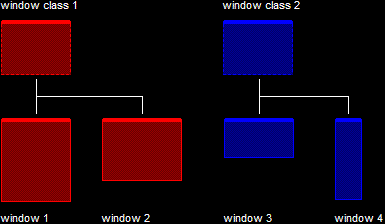
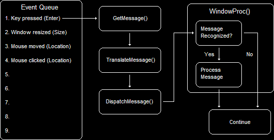

- [Introduce](#introduce)
- [Building the Window](#building-the-window)
  - [1. Registering the Window Class](#1-registering-the-window-class)
  - [2. Create the Window](#2-create-the-window)
  - [3. Show the Window](#3-show-the-window)
- [Handling Windows Events and Messages](#handling-windows-events-and-messages)
  - [1. The Main Loop](#1-the-main-loop)
  - [2. Window Procedures](#2-window-procedures)
- [Final Code](#final-code)

<br><br>

[ Creating a Window - DirectXtutorial ](http://www.directxtutorial.com/Lesson.aspx?lessonid=9-1-3)   

# Introduce
window 창을 띄우는 과정을 살펴본다.   

Window를 만들기 위해 호출할 수 있는 함수가 하나도 없다.   
왜냐하면 Window는 단일 함수 호출에 비해 너무 많은 데이터를 요구한다. 또한 Window는 event 기반이며, 이러한 event는 handle을 위해 추가적인 코드를 요구한다.   
여기서 event는 button click, window resize, key-press 등 window에서 발생하는 동작을 말한다.   
이러한 event가 발생하면 window는 WndProc()가 처리하는 프로그램에 message를 보낸다.   


# Building the Window
Window를 생성하기 위해서 3단계를 거친다.   
```
1. Register the window class. "RegisterClassEx()"
2. Create the window.         "CreateWindowEx()"
3. Show the window.           "ShowWindow()"
```

## 1. Registering the Window Class
```cpp
typedef struct tagWNDCLASSEXW { params } WNDCLASSEXW, ... ;
typedef WNDCLASSEXW WNDCLASSEX;
```
Window Class는 다양한 window의 properties와 actions를 처리하는데 기본적으로 사용하는 struct이다.   
즉, window class는 특정 window properties에 대한 하나의 template이다.   

   
Window Class 1은 window1과 window2의 properties를 정의하기 위해 사용한다.   
Window Class 2는 window3와 window4의 properties를 정의하기 위해 사용한다.   

각 window의 properties에는 window size, position, contents 등이 존재한다.   

이제 우리가 제공한 데이터에 기반하여 window class를 만들어본다.   
```cpp
// this struct holds information for the window class.
WNDCLASSEX wc;
```
`WNDCLASSEX` struct에서 Game Programming에 필요 없는 정보들은 채우지 않는다.   

```cpp
// clear out the window class for use
ZeroMemory(&wc, sizeof(WNDCLASSEX));
```
`ZeroMemory()`는 전체 memory block을 NULL로 초기화한다. 첫 인자에는 memory block address의 시작점을 넘겨주고, 두 번째 인자에는 block의 길이를 가리킨다.   
`wc`에서 game programming에 필요 없는 정보들을 `NULL`로 초기화하는데 사용한다.   
```cpp
// https://learn.microsoft.com/en-us/windows/win32/api/winuser/ns-winuser-wndclassexw
// fill in the struct with the needed information
wc.cbSize = sizeof(WNDCLASSEX);
wc.style = CS_CLASSDC;
wc.lpfnWndProc = WndProc;
// wc.hInstance = hInstance;
wc.hCursor = LoadCursor(NULL, IDC_ARROW);
wc.hbrBackground = (HBRUSH) COLOR_WINDOW;
wc.lpszClassName = L"WindowClass1";
```
`wc`의 각 member에 대해 알아본다.   
`cbSize`는 `wc` struct의 크기를 나타낸다.   
`style`은 [Window Class Styles](https://learn.microsoft.com/en-us/windows/win32/winmsg/window-class-styles)을 저장한다. 게임에 적합한 style을 지정할 예정이다.   
`lpfnWndProc`은 Windows가 보내는 message를 어떻게 처리할 것인지 정한다. message를 다루기 때문에 `CALLBACK` 함수를 사용한다.   
`hInstance`는 "handle to an instance"의 약자이며, 여기서 instance는 application의 복제본이다. application의 각 instance에는 handle 또는 ID를 부여하여 Windows는 program을 추적한다. Program이 시작되면 Windows는 program에 ID를 부여한다.   
`hCursor`는 window class에 대한 기본 마우스 이미지를 세팅한다. `LoadCursor()`의 반환값으로 정해진다.   
`hbrBackground`는 window의 배경을 나타낸다.   
`lpszClassName`은 window 이름을 세팅한다. `L`은 compiler가 해당 문자열을 16bit unicode로 인식하게 한다. 일반적인 string은 8bit의 ANSI 문자다.   
```cpp
// register the window class
if ( !RegisterClassEx(&wc) ) {
  std::cout << "RegisterClassEx() failed." << std::endl;
  return -1;
};
```
값을 세팅한 `wc`( window class )를 등록한다.

## 2. Create the Window
하나의 window만 만들 예정이다.   
```cpp
// the handle for the window, filled by a function
HWND mainWindow;

// create the window and use the result as the handle
mainWindow = CreateWindowEx(NULL,
                            wc.lpszClassName,     // name of the window class
                            L"window1 title",     // title of the window
                            WS_OVERLAPPEDWINDOW,  // window style
                            0,                    // x-position of the window
                            0,                    // y-position of the window
                            1280,                 // width of the window
                            960,                  // height of the window
                            NULL,                 // we have no parent window
                            NULL,                 // we aren't using menus
                            wc.hInstance,         // apllication handle
                            NULL);                // used with multiple windows

if ( !mainWindow ) {
  std::cout << "CreateWindow() failed." << std::endl;
  return -1;
}
```
x-position과 y-position은 screen coordinates를 나타낸다.   
여기서 window class의 이름은 `wc.lpszClassName`과 동일하지 않으면 window가 생성되지 않는다. 지정된 클래스 이름을 가진 window class를 찾지 못하면 실패하기 때문이다.   
`CreateWindowEx()`의 반환값은 Windows가 window에 지정한 handle( ID )다.   

## 3. Show the Window
```cpp
ShowWindow( mainWindow, SW_SHOWDEFAULT );
```
첫 인자로 HWND가 요구되며, 우리가 생성한 window에 대한 handle을 지정한다.   
두 번째 인자로 nCmdShow가 요구되며, window가 어떻게 표시될지 결정하는 역할이다. `SW_SHOWDEFAULT`는 program이 시작될 때, OS가 설정한 기본 창 표시 방식을 따르도록 지시한다.   


# Handling Windows Events and Messages
window program은 항상 Windows가 전달하는 event message를 기다린다.   

   
이러한 message는 event queue에 저장되어 순차적으로 처리되며, `GetMessage()`로 message를 가져온다.
`TranslateMessage()`는 특정한 message 형식을 다루기 위해 사용하며, `DispatchMessage()`는 `WndProc()`에 대해 동작한다.   

## 1. The Main Loop
Main Loop는 `GetMessage(), TranslateMessage(), DispatchMessage()` 함수로 구성된다.   
```cpp
// this struct holds Windows event messages.
MSG msg = { 0 };
```
`MSG`는 single event message가 다루는 모든 데이터를 포함하는 struct다.   
game programming에서 기본적으로 이러한 struct를 직접 다루지 않을 예정이다.   
```cpp
// wait for the next message in the queue, store the result in 'msg'
while ( GetMessage(&msg, NULL, 0, 0) ) {
  // translate keystroke( 한 번 입력 ) messages into the right format
  TranslateMessage( &msg );

  // send the message to the WndProc function
  DispatchMessage( &msg );
}
```
`GetMessage()`는 기본적으로 `TRUE`를 반환하지만, 만약 `msg.message`가 `WM_QUIT`( 프로그램 종료 )라면, `FALSE`를 반환한다.   
첫 인자는 `LPMSG`를 받으며, 이는 message struct의 pointer( `&msg` )다.   
두 번째 인자는 `HWND hWnd`이며, 다음 messge를 받아들이는 window에 대한 handle이다. 여기서 NULL을 넣었다는 것은 모든 window에 대해 message를 받는다는 것이며, 우리는 Multiple Window를 사용하지 않고 Single Window를 사용하기 때문에 상관없다.   
나머지 인자는 message queue에서 가져오는 message의 type을 제한한다. 각 값을 0으로 세팅하면, `GetMessage()`는 type에 관계없이 모든 message를 수집한다.   

`TranslateMessage()`는 어떤 key-presses를 적절한 format으로 변환하는 함수다. 간단히 `&msg`를 넘겨주고 끝낸다.   
`DispatchMessage()`는 message를 `WndProc` function으로 dispatch( 보내다 )한다.   


## 2. Window Procedures
`GetMessage()`가 보낸 message를 어떻게 처리하는지, 처리된 message를 어떻게 `DispatchMessage()`를 통해 보내는지 간단히 살펴본다.   

WndProc()는 프로그램이 동작하는 동안 Windows가 보낸 event message를 handling 한다.   
```cpp
// this is the main message handler for the program
LRESULT CALLBACK WndProc( HWND hwnd , UINT msg , WPARAM wParam , LPARAM lParam ) {
  switch ( msg ) {
    // this message is read when the window is closed.
    case WM_DESTROY: {
      PostQuitMessage(0);
      return 0;
    }
  }
  // Handle any messages the switch statement didn't
  return DefWindowProc ( hwnd , msg , wParam , lParam );
}
```
`MSG` struct에 대한 4가지 인자를 받는다. 자세히 다루지 않는다.   
`WndProc`가 message를 받았다면, 해당 message가 무엇인지 결정하기 위해서 많은 프로그래머들이 switch()를 사용한다.   

**`WndProc`이 `0`을 반환하면, 일반적으로 Windows OS에게 현재 message를 처리 완료했다는 의미로 사용**한다.   
`PostQuitMessage()`는 Window Event Queue에 `WM_QUIT`를 Post하는 역할이다. 이때, argument `0`은 `WM_QUIT` message의 `wParam` 값으로써, 일반적으로 app 종료 코드를 나타낸다. Event Queue에서 `PostQuitMessage()`로 전달한 `WM_QUIT`가 꺼내질 때, `GetMessage()` 함수는 0을 반환하여 main loop가 종료된다.   

`DefWindowProc()`는 우리가 다루지 않는 message를 handling 한다.   

# Final Code
```cpp
#include "pch.h"

LRESULT CALLBACK WindowProc ( HWND hWnd, UINT message, WPARAM wParam, LPARAM lParam );

int main () {
  // the handle for the window, filled by a function
  HWND hWnd;
  // this struct holds information for the window class
  WNDCLASSEX wc;

  // clear out the window class for use
  ZeroMemory ( &wc , sizeof ( WNDCLASSEX ) );

  // fill in the struct with the needed information
  wc.cbSize = sizeof ( WNDCLASSEX );
  wc.style = CS_HREDRAW | CS_VREDRAW;
  wc.lpfnWndProc = WindowProc;
  wc.hCursor = LoadCursor ( NULL , IDC_ARROW );
  wc.hbrBackground = ( HBRUSH ) COLOR_WINDOW;
  wc.lpszClassName = L"WindowClass1";

  // register the window class
  if ( !RegisterClassEx ( &wc ) ) {
	  std::cout << "RegisterClassEx() failed." << std::endl;
	  return -1;
  }

  // create the window and use the result as the handle
  hWnd = CreateWindowEx ( NULL ,
                        wc.lpszClassName ,    // name of the window class
                        L"Our First Windowed Program" ,   // title of the window
                        WS_OVERLAPPEDWINDOW ,    // window style
                        0 ,    // x-position of the window
                        0 ,    // y-position of the window
                        1280 ,    // width of the window
                        960 ,    // height of the window
                        NULL ,    // we have no parent window, NULL
                        NULL ,    // we aren't using menus, NULL
                        wc.hInstance ,    // application handle
                        NULL );    // used with multiple windows, NULL

  if ( !mainWindow ) {
	  std::cout << "CreateWindow() failed." << std::endl;
	  return -1;
  }

  // display the window on the screen
  ShowWindow ( hWnd, SW_SHOWDEFAULT );

  // enter the main loop:

  // this struct holds Windows event messages
  MSG msg = { 0 };

  // wait for the next message in the queue, store the result in 'msg'
  while ( GetMessage ( &msg , NULL , 0 , 0 ) )
  {
    // translate keystroke messages into the right format
    TranslateMessage ( &msg );

    // send the message to the WindowProc function
    DispatchMessage ( &msg );
  }

  return 0;
}

// this is the main message handler for the program
LRESULT CALLBACK WindowProc ( HWND hWnd , UINT message , WPARAM wParam , LPARAM lParam )
{
  // sort through and find what code to run for the message given
  switch ( message )
  {
    // this message is read when the window is closed
  case WM_DESTROY:
    // close the application entirely
    PostQuitMessage ( 0 );
    return 0;
  }

  // Handle any messages the switch statement didn't
  return DefWindowProc ( hWnd , message , wParam , lParam );
}
```