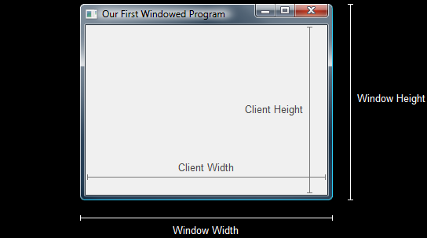

- [Introduce](#introduce)
- [Window Size vs Client Size](#window-size-vs-client-size)
- [The `AdjustWindowRect()` Function](#the-adjustwindowrect-function)
- [Final Code](#final-code)

<br><br>

[Window Size and Client Size - DirectXTutorial](http://www.directxtutorial.com/Lesson.aspx?lessonid=11-1-4)   

# Introduce
window창의 크기가 아닌 DirectX를 그리는 창의 크기를 정확하게 설정하는 함수를 알아본다.   

# Window Size vs Client Size
`CreatingWindowEx()`에서 window size를 1280 x 960으로 저장했다.   
하지만 client size는 window의 일부이다.   
   
여기서 알 수 있듯이 window size는 border( 테두리 ) 가장자리에서 확장되는 반면, client size는 border 안쪽에서 확장된다.   

Rendering을 할 때는 client에서만 그리기 때문에 정확한 client size를 알아야 한다.   
그렇지 않으면 client area와 다른 크기를 가진 image를 그릴 때, client size와 맞추기 위해 image가 stretched( 늘어난 ) 또는 shrunk( 축소된 )되어 그려진다.   

# The `AdjustWindowRect()` Function
Rather than setting the window size and then determining the client size, it is ideal to determine the client size in advance, and then calculate the appropriate window size.   
To do this we will use the function `AdjustWindowRect()` before creating the window.   
```cpp
typedef struct RECT {
  LONG left;
  LONG top;
  LONG right;
  LONG bottom;
};

BOOL AdjustWindowRect( LPRECT lpRect, DWORD dwStyle, BOOL bMenu );
```
첫 번째 인자로 `RECT` struct의 pointer를 받는다. 이 pointer가 가리키는 `RECT`에는 원하는 client area의 좌표를 포함하고 있다. 함수가 호출되면, `RECT` struct는 window area 좌표를 포함하도록 수정된다.   
즉, **우리가 원하는 client size를 `RECT`에 지정하고, 이를 `AdjustWindowRect` 함수가 client area에 맞추어 window size를 조정**한다.   

두 번째 인자는 window sytle이다. window border의 크기를 결정하기 위해서 이 데이터를 사용한다.   

세 번째 인자는 menu를 사용할지 말지를 결정하는 BOOL 값이다.   
```cpp
RECT wr = { 0, 0, 1280, 960 };    // set the size, but not the position
AdjustWindowRect( &wr, WS_OVERLAPPEDWINDOW, FALSE );    // adjust the size

mainWindow = CreatingWindowEx( NULL, 
                               wc.lpszClassName,
                               L"window1 title",
                               WS_OVERLAPPEDWINDOW,
                               0,
                               0,
                               wr.right - wr.left,  // width of the window
                               wr.bottom - wr.top,  // height of the window
                               NULL,
                               NULL,
                               wc.hInstance,
                               NULL
);
```
`RECT wr`라는 사각형을 생성하고, 원하는 client area 크기로 초기화한다.   
`wr.right - wr.left`와 `wr.bottom - wr.top`는 window의 width와 height size를 결정한다.   


# Final Code
```cpp
// Creating Window의 Final Code와 같음
...

int screenWidth = 1280;
int screenHeight = 960;
RECT wr = { 0, 0, screenWidth, screenHeight };
AdjustWindowRect ( &wr , WS_OVERLAPPEDWINDOW , FALSE );

HWND mainWindow = CreateWindowEx ( 
	NULL ,
	wc.lpszClassName ,     // name of the window class
	L"window1 title" ,     // title of the window
	WS_OVERLAPPEDWINDOW ,  // window style
	0 ,                    // x-position of the window
	0 ,                    // y-position of the window
	wr.right - wr.left ,   // width of the window
	wr.bottom - wr.top ,   // height of the window
	NULL ,                 // we have no parent window
	NULL ,                 // we aren't using menus
	wc.hInstance ,         // apllication handle
	NULL				   // used with multiple windows
);

// Creating Window의 Final Code와 같음
...
```