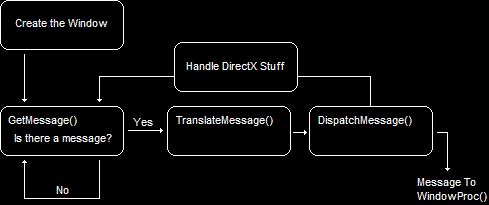
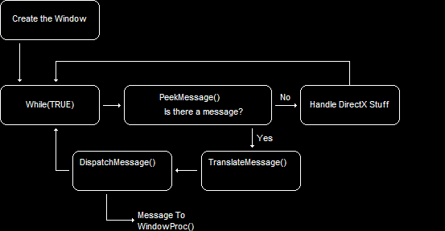

- [Introduce](#introduce)
- [The Structure of the GetMessage() Loop](#the-structure-of-the-getmessage-loop)
- [`PeekMessage()`](#peekmessage)

<br><br>

[The Real-Time Message Loop - DirectXTutorial](http://www.directxtutorial.com/Lesson.aspx?lessonid=11-1-5)   

# Introduce
`GetMessage()` 함수의 동작 방식이 게임과 맞지 않기 때문에 이를 대체하는 `PeekMessage()` 함수에 대해 알아본다.   

# The Structure of the GetMessage() Loop
   
`GetMessage()` loop의 구조를 나타낸 이미지다.   
window를 만들고 event loop에 진입하면, `GetMessage()`는 message를 기다린다. 그리고 하나의 message를 받고나면, `TranslateMessage()`로 message를 보낸다.   
이러한 Logic은 Windows Applications에서 완벽하다. 예를 들면, Word 프로그램은 사용자가 움직이기 전까지 아무것도 하지 않기 때문이다.   
즉, **`GetMessage()`는 사용자로부터 message를 받을 때까지 아무런 동작을 하지 않는다**.   

**게임은 사용자가 가만히 있어도 초당 30 ~ 60개의 rendered images를 생성하여 지연 없이 화면에 표시**해야 한다. 하지만 **Windows는 초당 30개의 message를 보내지 않기 때문에 문제가 발생**한다.   

# `PeekMessage()`
이를 해결하는 방법은 `GetMessage()` 함수 대신에 `PeekMessage()` 함수를 사용하는 것이다.   
   
`PeekMessage()`는 본질적으로 `GetMessage()`와 같은 일을 수행한다. 하지만 이 함수는 아무것도 기다리지 않는다.   
단지 **message queue를 살펴보고 대기 중인 message가 있는지 확인**하기만 한다. 만약에 **대기 중인 message가 없다면, 프로그램은 계속 진행되어 필요한 작업을 수행**할 수 있다.   
```cpp
BOOL PeekMessage( LPMSG lpMsg, HWND hWnd, UINT wMsgFilterMin, UINT wMsgFilterMax, UINT wRemoveMsg );
```
첫 4개의 인자는 `GetMessage()` 인자와 같다. `wRemoveMsg`만 다르다.   
What it does is indicate whether or not the message retrieved from the event queue should stay on the event queue or come off. 이 기능은 event queue에서 검색된 message를 event queue에 유지할지 아니면 해제할지 여부를 나타낸다.   
We can put either `PM_REMOVE` or `PM_NOREMOVE`.   
The first one takes the messages off the queue when they are read, while the second one leaves the messages there for later retrieval. 첫 번째는 message를 읽으면 queue에서 message를 삭제하고, 두 번째는 나중에 검색할 수 있도록 message를 queue에 남긴다.   
```cpp
// check to see if it is time to quit
while ( WM_QUIT != msg.message ) {
  // check to see if any messages are waiting in the queue
  if ( PeekMessage( &msg, NULL, 0, 0, PM_REMOVE ) ) {
    TranslateMessage( &msg );
    DispatchMessage( &msg );
  }
  else {
    // Run game code here
  }
}
```
이 코드로 인해서 Windows가 message를 보내기 전까지 기다리지 않고도 다른 작업을 수행할 수 있다.   

`WM_QUIT != msg.message`는 window가 종료될 때까지 loop를 유지한다.   
`if ( PeekMessage( &msg, NULL, 0, 0, PM_REMOVE ) )`로 인해 더이상 message를 기다리지 않는다. `PeekMessage()`가 `TRUE`라면 message가 queue에 존재하는 것이며, `FALSE`면 없음을 의미한다.   