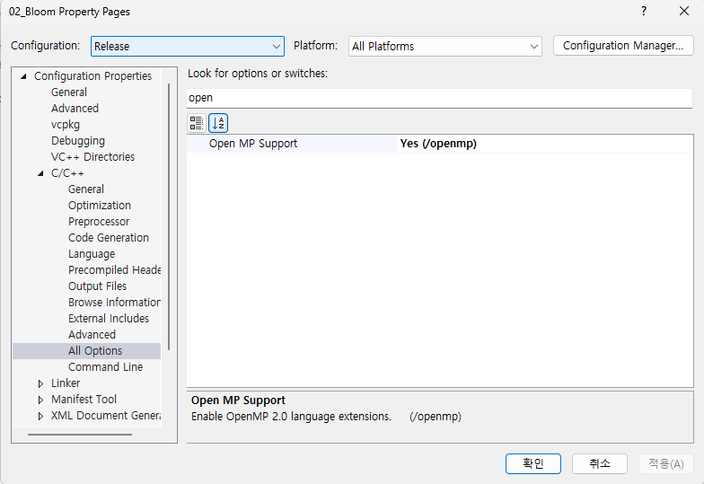

- [vcpkg](#vcpkg)
  - [1. vcpkg 설치](#1-vcpkg-설치)
  - [2. library 설치](#2-library-설치)
    - [IMGUI](#imgui)
    - [Math](#math)
    - [STB](#stb)
    - [Integrate](#integrate)
- [visual studio 2022](#visual-studio-2022)
  - [1. 멀티쓰레드 이용을 위한 open MP 사용](#1-멀티쓰레드-이용을-위한-open-mp-사용)
- [DirectX project](#directx-project)
  - [1. Create `DirectX` Project](#1-create-directx-project)
  - [2. Create `Windows Desktop App` Project](#2-create-windows-desktop-app-project)
    - [1. UTF-8](#1-utf-8)
    - [2. pch.h 세팅](#2-pchh-세팅)
    - [3. wWinMain() to main() - optional](#3-wwinmain-to-main---optional)

<br><br>

# vcpkg
## 1. vcpkg 설치
1. `CMD에서 실행`
2. [vcpkg 개요 - MS](https://learn.microsoft.com/en-us/vcpkg/get_started/overview#get-started-with-vcpkg)에서 `Get started with vcpkg`의 `Package a library with vcpkg`로 이동
3. Terminal Options를 `CMD`로 수정 후, `vcpkg clone`
```
git clone https://github.com/microsoft/vcpkg.git
```
4. 설치가 끝나면 `cd vcpkg`
```
cd vcpkg
```
5. dir 명령어를 통해 vcpkg 내부의 파일을 볼 수 있으며, `bootstrap-vcpkg.bat`
```
bootstrap-vcpkg.bat
```

## 2. library 설치
vcpkg 경로 내부에서 명령어를 수행한다.   
### IMGUI
`GUI`   
어떤 종류의 imgui가 있는지 확인( window32bit, directx11 환경설정 ) 후 설치   
```
vcpkg search imgui
vcpkg install imgui[win32-binding,dx11-binding]:x64-windows
```
### Math
`GLM`, `SimpleMath`
```
vcpkg install glm:x64-windows
vcpkg install directxtk:x64-windows
```
### STB
`Image Processing`   
```
vcpkg install stb:x64-windows
```

### Integrate
library를 설치하고 `항상 마지막엔 아래의 명령어를 수행`   
```
vcpkg integrate install
```

<br><br>

# visual studio 2022

## 1. 멀티쓰레드 이용을 위한 open MP 사용
   

1. 프로젝트의 properties로 이동
2. C/C++ -> All Options -> open 검색
3. Configuration을 Release로 변경
4. Open MP Support를 YES로 세팅

<br><br>

# DirectX project
학습을 위해서 Windows Desktop Application으로 프로젝트를 생성한다.   

## 1. Create `DirectX` Project
   
DirectX11 App Project를 만들기 위해서는 `C++를 사용한 데스크톱 개발`, `Windows 애플리케이션 개발`과 `C++를 사용한 게임 개발`에서 SDK를 다운받는다.   
1. Desktop: `Windows 앱 SDK C++ 템플릿`
2. check App
   - [Universal Windows 필요](https://learn.microsoft.com/en-us/windows/uwp/gaming/user-interface#choosing-a-template)
   - [Universal Windows 필요](https://github.com/microsoft/DirectXTK/wiki/The-basic-game-loop#setup)
3. check Game
4. Create DirectX11 App

DX11을 사용하기 위한 기본 설정과 초기화 코드를 자동으로 생성해서 핵심 로직에 집중할 수 있다.   
하지만 템플릿이 제공하는 구조와 설정에 맞춰 개발해야 하므로 유연성이 떨어지며, DX11 초기화 과정과 설정을 직접 구현하는 학습 기회를 놓칠 수 있다.   

## 2. Create `Windows Desktop App` Project
   

프로젝트 구조와 설정을 자유롭게 할 수 있으며, DX11을 학습하기 용이하다.   
처음부터 끝까지 모든 것을 직접 세팅하기 때문에 시간 소모가 크다.   

### 1. UTF-8
git에 올리는 경우, UTF-8로 파일을 저장해야 한글이 깨지지 않는다.   
[UTF-8 ENCODING 설정](https://artiper.tistory.com/204)   
   
```
[*]
charset = utf-8
```
기존 파일들은 `다른 이름으로 저장`을 이용해서 utf-8로 다시 저장한다.   

### 2. pch.h 세팅
Precompiled Header의 약자   
compile time을 단축하기 위해 사용되며, 자주 변경되지 않는 library header를 관리한다.   
프로젝트에서 해당 파일을 미리 컴파일( pre-compile )하여 저장하기 때문에, pch.h가 관리하는 header를 다시 compile 할 필요가 없기 때문에 compile time이 크게 단축된다.   
```cpp
// pch.h
#pragma once
// common

// std
#include <iostream>

// dx
#include <d3d11.h>
#include <d3dcompiler.h>

// windows
#include <windows.h>
```
```cpp
// pch.cpp
#include "pch.h"
```
이제 `pch.cpp의 properties`를 열고   
   
Precompiled Header 옵션을 `Create`, Precompiled Header File 옵션을 `pch.h`로 지정한다.   

문제는 모든 프로젝트에 적용한 것이 아니기 때문에 `프로젝트의 전체적인 precompiled headers 설정을 확인`한다.   
   
Precompiled Header를 사용하기 때문에 `Use`, 지정 File을 `pch.h`로 설정한다.   
여기서 build를 수행하면 failed가 발생하며, 이는 wWinMain()이 존재하는 .cpp 파일에 `#include "pch.h"`를 추가하면 해결된다.   
해당 header는 각 cpp 파일의 첫 번째로 위치해야 한다.   

만약 다른 cpp 파일에도 precompiled header를 사용하려면, `Use` 옵션을 켜야한다.   

### 3. wWinMain() to main() - optional
DX project는 main()에서 시작하기 때문에 Entry Point를 wWinMain()에서 main()으로 변경했다.   
   
project의 properties - Linker에서 system을 변경한다.   
기본값은 Windows(/SUBSYSTEM:WINDOWS)이며, 이를 Console로 변경한다.   
그러면 프로그램 진입점을 `main()`으로 사용할 수 있다.   

   
Linker - Advanced의 Entry Point( 진입점 )이 비어있다면 기본 Entry Point가 사용되며, 이는 main()이다.   